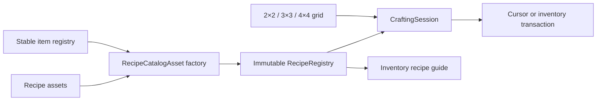

# Modular crafting implementation

Implemented under the user's explicit crafting request on 2026-09-08. The same core supports square 2×2, 3×3 and 4×4 grids; the personal 2×2 inventory and placed 3×3 workbench are playable interfaces. [GAMEPLAY.md section 16](GAMEPLAY.md#16-modular-grid-crafting) owns interaction rules, [ECONOMY.md](ECONOMY.md#current-survival-recipes-and-tiers) owns the progression recipes, and [verification](verification/CRAFTING_RESULTS.md) records measured evidence.

## Author or change a recipe

1. In Unity's Project window, create **Rivet Reach → Crafting → Recipe**, preferably under `Assets/RivetReach/Resources/Definitions/Recipes/`. Each recipe is an independent ScriptableObject asset.
2. Set a unique, stable recipe ID such as `rivet:craft_wood_axe`. Select shaped or shapeless matching and the minimum grid size.
3. For a shaped recipe, set width/height from 1 to 4 and edit the visible grid with item dropdowns and counts. Rows run left to right, top to bottom. A width change reinterprets the serialized row-major cells; review the layout afterwards. Empty cells have blank IDs and zero count. Horizontal mirroring is opt-in. For shapeless recipes, edit the ingredient list using the stable IDs in `Definitions/Items.asset`; each entry represents one occupied slot.
4. Select the output item and quantity. Ingredients and one recipe's output must each fit their item's stack limit.
5. Add the recipe asset to the explicit list in [`Definitions/Recipes.asset`](../Assets/RivetReach/Resources/Definitions/Recipes.asset). Duplicating an existing asset also requires changing its stable ID and layout before registering it.
6. Click **Validate active recipe catalog**, or run **Rivet Reach → Validate crafting and benchmark** for the full crafting suite. A build also validates the catalog and runs the suite. Start a new Play session to use edited definitions.

The recipe assets and their `.meta` identities are versioned. Normal builds do not regenerate or overwrite authored recipes. An invalid catalog fails initialization/build with the offending recipe ID; there is no silent fallback to hard-coded recipes. Live editing an already-running session is deliberately unsupported: the session owns its compiled definition snapshot. No dependencies or third-party content were added for this feature.

## Architecture and extension points

- [`RecipeAsset`](../Assets/RivetReach/Code/Crafting/RecipeAsset.cs) adapts Unity authoring data to plain C# `RecipeSpec`. A future JSON/content adapter can feed the same compiler; there is no class per recipe and no UI recipe switch statement.
- [`RecipeRegistry.Compile`](../Assets/RivetReach/Code/Crafting/RecipeRegistry.cs) resolves stable item IDs once, validates all definitions, copies their contents and publishes an immutable registry. Read-only `RecipeInfo` exposes canonical ingredient layouts, quantities, output and station requirements to consumers such as the current recipe guide. Item and recipe identities are separate.
- Shaped lookup removes blank outer borders and uses the complete normalized item pattern, including internal holes. Optional mirrors compile into a second index entry. There is no implicit rotation.
- Shapeless lookup sorts the occupied cells by item ID and then count, carrying the source indices along. Repeated ingredients require separate cells. Counts are per-cell requirements, not an aggregate across arbitrarily arranged stacks. Sorting pairs smaller stacks with smaller requirements deterministically.
- A key contains all sixteen possible runtime item IDs in two 64-bit words plus dimensions. Dictionary hash collisions still compare the full key. There is no recipe-list scan on the hot path. Matching examines at most sixteen cells; shapeless insertion sort is bounded by that same limit. Runtime item IDs retain the existing byte representation, so the game still has 255 usable IDs. Expanding the world/item representation is a separate migration; stable asset IDs do not depend on those numeric assignments.
- [`CraftingSession`](../Assets/RivetReach/Code/Crafting/CraftingSession.cs) caches a preview and consumption plan against its grid's revision. An unchanged preview requires no matching. Every craft refreshes this state before committing; the UI never provides an authoritative output or cached match token. The workbench creates `new CraftingSession(registry, 3, stackLimit)`; future stations may use size `4` and binds its slots to `Grid`.
- [`ItemContainer`](../Assets/RivetReach/Code/Core/ItemContainer.cs) supplies the shared inventory/grid move, split, merge, take, capacity and exact-insert operations. Its backing array is private; public slot reads return value copies through a read-only view. Mutations advance a revision. `Inventory` adds the existing hotbar/main quick-transfer behavior.

The factory is a useful boundary for definition sources; the shared service owns crafting behavior. A proxy or per-recipe subclass would add indirection without helping this bounded matching workload.

## Validation and ambiguity policy

Compilation rejects missing assets, unknown items, blank/duplicate recipe IDs, unsupported sizes/kinds, inconsistent dimensions, empty/free recipes, malformed blank cells and nonpositive or over-limit quantities. Null catalogs/entries fail explicitly.

Two recipes cannot claim the same canonical input pattern, even when their quantities, outputs or minimum-grid gates differ. The same rule covers mirrors and permuted shapeless lists. A shapeless recipe cannot use the same occupied-item multiset as any shaped recipe. A symmetric mirrored layout with differing count requirements is also rejected. These conservative rules eliminate load-order precedence: resolving a conflict means changing its inputs or expressing it in a later explicitly designed processing system. Multiple nonoverlapping shaped layouts may use the same materials.

Each output is a single item type and bundle. Ingredient alternatives/tags, catalysts, reusable containers/byproducts, durability/metadata-sensitive matching, powered/fluid machine recipes, mod hot reload and a full recipe/uses graph are future extensions. The present compiler rejects ambiguity instead of pretending those semantics already exist.

## Transactions and performance boundaries

The single local authority executes synchronously. Container stack-limit providers must be pure lookups, and runtime item definitions remain fixed throughout a session. It revalidates ingredients and destination capacity, commits only complete output bundles and consumes the corresponding source quantities in one call without intervening callbacks. `TryAddExact` validates capacity with one captured stack limit before any output write. Shift crafting computes a batch mathematically from the limiting ingredient, requested count and destination capacity; it does not replay one command per crafted item. Cursor crafting checks identity and capacity before writing either side. Closing or quick-return moves what fits and leaves each remainder in its original grid slot.

The immutable registry may be shared by independent sessions; mutable grids/inventories belong to one authority thread. This is not a concurrent inventory transaction system or a durable journal. Future multiplayer commands must run on the authority and validate access to the relevant station/session. The UI currently guards inventory-mode access. Durable saves remain unimplemented, as in the existing POC.

Compilation allocates once per session catalog. Matching uses fixed stack buffers, cached consumption storage and exact dictionary lookups. Performance claims apply only to measured workloads in [CRAFTING_RESULTS.md](verification/CRAFTING_RESULTS.md), not to total frame time or an untested machine system.

## Reproduce checks

- **Rivet Reach → Validate crafting and benchmark** runs layout, quantity, validation, stale-preview, output-capacity, return, randomized-conservation and scaling checks. It writes `Logs/crafting-checks.txt`.
- `Tools/Build-Windows.ps1` runs the existing domain suite plus crafting checks and builds the Windows player.
- `Tools/Verify-POC.ps1 -Crafting -OutputDirectory <path>` runs the actual input-system pointer, drag, output, batching, full-inventory and close/reopen checks, with screenshots and `runtime-report.json`.

Catalog build checks derive their cases from every registered recipe asset. The focused pointer scenario exercises the current personal layouts; deliberately rebalancing those layouts also requires updating that scenario’s input fixtures.

Test fixtures are enabled only by the existing explicit verification mode. Ordinary sessions begin empty-handed; ingredients and tool progression must be gathered/crafted in play.

## Survival progression extension — 2026-09-09

The user subsequently selected familiar basic grid recipes, five tool tiers, furnaces, farming, hunger, health and armor. The personal grid and placed workbench now share the compiled registry: **53 active grid recipes**, including the subsequently authorized [three-iron bucket](FLUIDS.md#playable-water-rules), each an independent asset. Ordinary sessions start with empty inventories; obsolete stone/log starter-tool layouts are not registered. [ECONOMY.md](ECONOMY.md#current-survival-recipes-and-tiers) owns quantities and progression. Larger 4×4 interfaces remain future content; the engine still supports them.

### Stations and processing authoring

`StationState` composes one 3×3 crafting session, a three-slot furnace or a 27-slot chest. `WorldSurvival` stores those instances by `BlockPos` within the owning world/session. A streamed chunk renderer does not own or reset them. Opening validates range and residency, and losing access closes the interface. Station removal closes its open interface before draining contents, drops each remaining stack once and removes the block entity. Workbench leftovers that cannot return to inventory stay with that workbench.

Create **Rivet Reach → Crafting → Furnace recipe**, set a unique stable ID, ingredient/output bundles and duration in **20 Hz ticks**, then register the asset in `Definitions/Processing.asset`. That catalog also authors fuel item IDs and burn durations. Six initial processing recipes cover three metals, charcoal, stone and baked potatoes. A new Play session compiles an immutable `ProcessingRegistry`: stable IDs resolve once; direct input and fuel indices provide bounded lookup. Duplicate inputs, duplicate fuels, missing entries, zero duration and invalid quantities fail compilation. Authored catalogs are not regenerated by normal builds.

`FurnaceState` owns slot filtering and transactions. UI callers can put valid ingredients into slot 0, valid fuel into slot 1 and only extract from slot 2. One synchronous operation validates the complete output bundle before consuming its ingredient. Time advancement jumps between fuel and recipe boundaries; subdividing an interval produces the same result as advancing it together. Already lit fuel continues burning while idle or output-blocked. A blocked output does not ignite another fuel item. Changing/removing the ingredient resets its partial work; an unchanged ingredient keeps paid work when fuel runs out or output blocks.

Only furnaces with remaining burn time or immediately actionable input/fuel enter the active set. Unloaded furnaces retain contents and paid progress but pause processing; no wall-clock catch-up is granted. Idle furnaces have no per-frame simulation callback or GameObject. Item edits through the interface wake an eligible furnace. Future automation must use the same authority methods and wake the station after changes.

### Verification

`SurvivalChecks.Run` validates the registered recipe dependency graph from gathered resources, all pickaxe tiers, processing boundaries, filters, output blocking, fuel accounting, randomized time partition equivalence, food, health and equipment. It measures 1,000 active furnace instances over 200 reference ticks separately from whole-game frame timing. `DomainChecks.Run` includes this suite, and the existing crafting suite still validates every active recipe plus matching/conservation/scaling.

`Tools/Verify-POC.ps1 -Survival` exercises pointer crafting, a placed workbench, furnace inputs/results, farming, eating, armor slots and death/respawn. `-Crafting` now exercises the actual log/plank/workbench recipes. [Survival verification](verification/SURVIVAL_RESULTS.md) distinguishes measured checks from limitations.

## Starter recipe and block-interaction acceptance

The user explicitly requires the implemented beginning recipes to use Minecraft's ingredient positions and output quantities. `StarterRecipeChecks` defines independent acceptance fixtures for all 53 current recipes, including translations, permitted mirrors and exact consumption/output. The catalog-driven compiler checks still validate arbitrary authored content. Deliberately changing this baseline requires updating the acceptance contract, not silently accepting a newly authored layout as its own expected result.

`Expedition.TryInteractTarget` resolves the currently aimed voxel within five blocks. The bound **Interact** key (default E) and mouse Use open a workbench, furnace or chest through the same station authority. Direct station-open commands also validate visibility and reach. Crouch + mouse Use bypasses opening for placement against a station; keyboard Interact explicitly opens it. The HUD displays the actual controls after rebinding. `Verify-POC.ps1 -StarterCrafting` exercises crafting a workbench, placing it and opening its nine-slot UI with keyboard/mouse input, plus occlusion, reach and rebinding. [Current evidence](verification/CRAFTING_RESULTS.md) includes the actual screenshots and Minecraft reference links.
