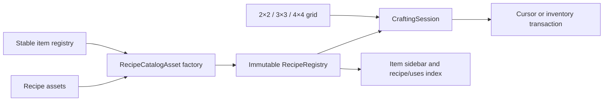

# Modular crafting implementation

Player reference: [crafting guide](wiki/Crafting-Recipes.md) and [visual item catalog](wiki/Items.md). Each item page shows its actual inventory icon, acquisition, registered recipes and uses. [Wiki authoring](WIKI_AUTHORING.md) owns the export/generation/publishing workflow; this document owns the game recipe authoring contract.

> **2026-09-11 persistence extension:** [SAVES.md](SAVES.md) owns the implemented Save Game, Load Game and Continue Latest Save behavior. Its bounded surface-world persistence supersedes earlier session-only/durable-save exclusions below; older verification retains its original artifact identity.

Implemented under the user's explicit crafting request on 2026-09-08. The same core supports square 2×2, 3×3 and 4×4 grids; the personal 2×2 inventory and placed 3×3 workbench are playable interfaces. [GAMEPLAY.md section 16](GAMEPLAY.md#16-modular-grid-crafting) owns interaction rules, [ECONOMY.md](ECONOMY.md#current-survival-recipes-and-tiers) owns the progression recipes, and [verification](verification/CRAFTING_RESULTS.md) records measured evidence.

## Author or change a recipe

1. In Unity's Project window, create **Rivet Reach → Crafting → Recipe**, preferably under `Assets/RivetReach/Resources/Definitions/Recipes/`. Each recipe is an independent ScriptableObject asset.
2. Set a unique, stable recipe ID such as `rivet:craft_wood_axe`. Select shaped or shapeless matching and the minimum grid size.
3. For a shaped recipe, set width/height from 1 to 4 and edit the visible grid with item dropdowns and counts. Rows run left to right, top to bottom. A width change reinterprets the serialized row-major cells; review the layout afterwards. Empty cells have blank IDs and zero count. Horizontal mirroring is opt-in. For shapeless recipes, edit the ingredient list using the stable IDs in `Definitions/Items.asset`; each entry represents one occupied slot.
4. Select the output item and quantity. Ingredients and one recipe's output must each fit their item's stack limit.
5. Add the recipe asset to the explicit list in [`Definitions/Recipes.asset`](../Assets/RivetReach/Resources/Definitions/Recipes.asset). Duplicating an existing asset also requires changing its stable ID and layout before registering it.
6. Click **Validate active recipe catalog**, or run **Rivet Reach → Validate crafting and benchmark** for the full crafting suite. A build also validates the catalog and runs the suite. Start a new Play session to use edited definitions.

The recipe assets and their `.meta` identities are versioned. Normal builds do not regenerate or overwrite authored recipes. An invalid catalog fails initialization/build with the offending recipe ID; there is no silent fallback to hard-coded recipes. Live editing an already-running session is deliberately unsupported: the session owns its compiled definition snapshot. No dependencies or third-party content were added for this feature.

## Architecture and extension points

- [`RecipeAsset`](../Assets/RivetReach/Code/Crafting/RecipeAsset.cs) adapts Unity authoring data to plain C# `RecipeSpec`. A future JSON/content adapter can feed the same compiler; there is no class per recipe and no UI recipe switch statement.
- [`RecipeRegistry.Compile`](../Assets/RivetReach/Code/Crafting/RecipeRegistry.cs) resolves stable item IDs once, validates all definitions, copies their contents and publishes an immutable registry. Read-only `RecipeInfo` exposes canonical ingredient layouts, quantities, output and station requirements to consumers such as the current recipe guide. Item and recipe identities are separate.
- Shaped lookup removes blank outer borders and uses the complete normalized item pattern, including internal holes. Optional mirrors compile into a second index entry. There is no implicit rotation.
- Shapeless lookup sorts the occupied cells by item ID and then count, carrying the source indices along. Repeated ingredients require separate cells. Counts are per-cell requirements, not an aggregate across arbitrarily arranged stacks. Sorting pairs smaller stacks with smaller requirements deterministically.
- A key contains all sixteen possible runtime item IDs in two 64-bit words plus dimensions. Dictionary hash collisions still compare the full key. There is no recipe-list scan on the hot path. Matching examines at most sixteen cells; shapeless insertion sort is bounded by that same limit. Runtime item IDs retain the existing byte representation, so the game still has 255 usable IDs. Expanding the world/item representation is a separate migration; stable asset IDs do not depend on those numeric assignments.
- [`CraftingSession`](../Assets/RivetReach/Code/Crafting/CraftingSession.cs) caches a preview and consumption plan against its grid's revision. An unchanged preview requires no matching. Every craft refreshes this state before committing; the UI never provides an authoritative output or cached match token. The workbench creates `new CraftingSession(registry, 3, stackLimit)`; future stations may use size `4` and binds its slots to `Grid`.
- [`ItemContainer`](../Assets/RivetReach/Code/Core/ItemContainer.cs) supplies the shared inventory/grid move, split, merge, take, capacity and exact-insert operations. Its backing array is private; public slot reads return value copies through a read-only view. Mutations advance a revision. `Inventory` adds the existing hotbar/main quick-transfer behavior.

The factory is a useful boundary for definition sources; the shared service owns crafting behavior. A proxy or per-recipe subclass would add indirection without helping this bounded matching workload.

## Validation and ambiguity policy

Compilation rejects missing assets, unknown items, blank/duplicate recipe IDs, unsupported sizes/kinds, inconsistent dimensions, empty/free recipes, malformed blank cells and nonpositive or over-limit quantities. Null catalogs/entries fail explicitly.

Two recipes cannot claim the same canonical input pattern, even when their quantities, outputs or minimum-grid gates differ. The same rule covers mirrors and permuted shapeless lists. A shapeless recipe cannot use the same occupied-item multiset as any shaped recipe. A symmetric mirrored layout with differing count requirements is also rejected. These conservative rules eliminate load-order precedence: resolving a conflict means changing its inputs or expressing it in a later explicitly designed processing system. Multiple nonoverlapping shaped layouts may use the same materials.

Each output is a single item type and bundle. Ingredient alternatives/tags, catalysts, reusable containers/byproducts, durability/metadata-sensitive matching, powered/fluid machine recipes and mod hot reload are future extensions. The present compiler rejects ambiguity instead of pretending those semantics already exist.

## Transactions and performance boundaries

The single local authority executes synchronously. Container stack-limit providers must be pure lookups, and runtime item definitions remain fixed throughout a session. It revalidates ingredients and destination capacity, commits only complete output bundles and consumes the corresponding source quantities in one call without intervening callbacks. `TryAddExact` validates capacity with one captured stack limit before any output write. Shift crafting computes a batch mathematically from the limiting ingredient, requested count and destination capacity; it does not replay one command per crafted item. Cursor crafting checks identity and capacity before writing either side. Closing or quick-return moves what fits and leaves each remainder in its original grid slot.

The immutable registry may be shared by independent sessions; mutable grids/inventories belong to one authority thread. This is not a concurrent inventory transaction system or a durable journal. Future multiplayer commands must run on the authority and validate access to the relevant station/session. The UI currently guards inventory-mode access. Durable saves remain unimplemented, as in the existing POC.

Compilation allocates once per session catalog. Matching uses fixed stack buffers, cached consumption storage and exact dictionary lookups. Performance claims apply only to measured workloads in [CRAFTING_RESULTS.md](verification/CRAFTING_RESULTS.md), not to total frame time or an untested machine system.

## Reproduce checks

- **Rivet Reach → Validate crafting and benchmark** runs layout, quantity, validation, stale-preview, output-capacity, return, randomized-conservation and scaling checks. It writes `Logs/crafting-checks.txt`.
- `Tools/Build-Windows.ps1` runs the existing domain suite plus crafting checks and builds the Windows player.
- `Tools/Verify-POC.ps1 -Crafting -OutputDirectory <path>` runs the actual input-system pointer, drag, output, batching, full-inventory and close/reopen checks, with screenshots and `runtime-report.json`.

Catalog build checks derive their cases from every registered recipe asset. The focused pointer scenario exercises the current personal layouts; deliberately rebalancing those layouts also requires updating that scenario’s input fixtures.

Test fixtures are enabled only by the existing explicit verification mode. Ordinary sessions begin empty-handed; ingredients and tool progression must be gathered/crafted in play.

## Survival progression extension — 2026-09-09

The user subsequently selected familiar basic grid recipes, five tool tiers, furnaces, farming, hunger, health and armor. The personal grid and placed workbench now share the compiled registry: **56 survival grid recipes**, including the subsequently authorized [three-iron bucket](FLUIDS.md#playable-water-rules) and the [coal/charcoal torch variants](GAMEPLAY.md#torches), each an independent asset. Ordinary sessions start with empty inventories; obsolete stone/log starter-tool layouts are not registered. [ECONOMY.md](ECONOMY.md#current-survival-recipes-and-tiers) owns quantities and progression. Larger 4×4 interfaces remain future content; the engine still supports them.

### Stations and processing authoring

`StationState` composes one 3×3 crafting session, a three-slot furnace or a 27-slot chest. `WorldSurvival` stores those instances by `BlockPos` within the owning world/session. A streamed chunk renderer does not own or reset them. Opening validates range and residency, and losing access closes the interface. Station removal closes its open interface before draining contents, drops each remaining stack once and removes the block entity. Workbench leftovers that cannot return to inventory stay with that workbench.

Create **Rivet Reach → Crafting → Furnace recipe**, set a unique stable ID, ingredient/output bundles and duration in **20 Hz ticks**, then register the asset in `Definitions/Processing.asset`. That catalog also authors fuel item IDs and burn durations. Six initial processing recipes cover three metals, charcoal, stone and baked potatoes. A new Play session compiles an immutable `ProcessingRegistry`: stable IDs resolve once; direct input and fuel indices provide bounded lookup. Duplicate inputs, duplicate fuels, missing entries, zero duration and invalid quantities fail compilation. Authored catalogs are not regenerated by normal builds.

`FurnaceState` owns slot filtering and transactions. UI and [item-pipe](INDUSTRY.md#furnace-pipes-and-compatible-cargo--2026-09-12) callers can put valid ingredients into slot 0, valid fuel into slot 1 and only extract from slot 2. One synchronous operation validates the complete output bundle before consuming its ingredient. Time advancement jumps between fuel and recipe boundaries; subdividing an interval produces the same result as advancing it together. Already lit fuel continues burning while idle or output-blocked. A blocked output does not ignite another fuel item. Changing/removing the ingredient resets its partial work; an unchanged ingredient keeps paid work when fuel runs out or output blocks.

Only furnaces with remaining burn time or immediately actionable input/fuel enter the active set. Unloaded furnaces retain contents and paid progress but pause processing; no wall-clock catch-up is granted. Idle furnaces have no per-frame simulation callback or GameObject. Item edits through the interface wake an eligible furnace. Future automation must use the same authority methods and wake the station after changes.

### Verification

`SurvivalChecks.Run` validates the registered recipe dependency graph from gathered resources, all pickaxe tiers, processing boundaries, filters, output blocking, fuel accounting, randomized time partition equivalence, food, health and equipment. It measures 1,000 active furnace instances over 200 reference ticks separately from whole-game frame timing. `DomainChecks.Run` includes this suite, and the existing crafting suite still validates every active recipe plus matching/conservation/scaling.

`Tools/Verify-POC.ps1 -Survival` exercises pointer crafting, a placed workbench, furnace inputs/results, farming, eating, armor slots and death/respawn. `-Crafting` now exercises the actual log/plank/workbench recipes. [Survival verification](verification/SURVIVAL_RESULTS.md) distinguishes measured checks from limitations.

## Starter recipe and block-interaction acceptance

The user explicitly requires the implemented beginning recipes to use Minecraft's ingredient positions and output quantities. `StarterRecipeChecks` defines independent acceptance fixtures for all 56 starter recipes, including translations, permitted mirrors and exact consumption/output. The catalog-driven compiler checks still validate arbitrary authored content. Deliberately changing this baseline requires updating the acceptance contract, not silently accepting a newly authored layout as its own expected result.

`Expedition.TryInteractTarget` resolves the currently aimed voxel within five blocks. The bound **Interact** key (default E) and mouse Use open a workbench, furnace or chest through the same station authority. Direct station-open commands also validate visibility and reach. Crouch + mouse Use bypasses opening for placement against a station; keyboard Interact explicitly opens it. The HUD displays the actual controls after rebinding. `Verify-POC.ps1 -StarterCrafting` exercises crafting a workbench, placing it and opening its nine-slot UI with keyboard/mouse input, plus occlusion, reach and rebinding. [Current evidence](verification/CRAFTING_RESULTS.md) includes the actual screenshots and Minecraft reference links.

## Authorized industrial extension — 2026-09-10

The user selected implementation of [GitHub issue #2](https://github.com/Starbugstone/Rivet-Reach/issues/2), including original Blender machines, animated operating states, matching interfaces and stability/performance checks. [INDUSTRY.md](INDUSTRY.md) owns the current Azure/Copper unlock, 4×4 Machinist’s Bench, separate signal/power/item/fluid graphs, steam/electrical bootstrap, crusher/pump/drill and fixed sensor/relay behavior. This supersedes earlier statements excluding this bounded industrial content; hybrid transport/control variants, advanced logic and durable saves remain later extensions. [Industry verification](verification/INDUSTRY_RESULTS.md) owns evidence and remaining limits.

## Item sidebar and recipe discovery — 2026-09-10

The user selected a JEI/NEI-style item browser while retaining the actual crafting transactions. The current interaction maps **click → recipes**, **right-click → uses**, **Shift-click → fill one recipe**, and **Ctrl+Shift-click → fill maximum** on browser icons (updated by the user’s 2026-09-11 crafting request). Inventory, crafting, equipment and station slots keep their stack gestures; hover and press **R** for recipes or **U** for uses. **Ctrl-click** remains an alias for filling one recipe. On a recipe output, the fill shortcuts select that exact shown recipe. **Fill grid** fills it once; **Shift-click Fill grid** fills the maximum complete batch into the active crafting grid using the player's inventory and existing grid ingredients (2026-09-12 user request). These shortcuts do not run while typing in a text field, and typing the bound Inventory key into search does not close the screen.

The sidebar is visible alongside personal crafting, workbenches, the Machinist's Bench, furnaces, chests, machines and Creative inventory. It includes every registered item, with case-insensitive multiword search, explicit empty results, wheel/button paging and 60 reusable icon cells. Search and the selected item-list page survive interface rebuilds during the session. Creative's existing grant catalog remains separately available. Sidebar clicks retain recipe navigation; in Creative, dragging a sidebar icon into inventory grants a legal stack under the [Creative rules](GAMEPLAY.md#creative-testing-mode).

Recipe details expose the canonical shaped layout (including holes and mirror permission) or shapeless ingredients, bundle output, aggregated material counts, and the required station. Ingredients, outputs and station icons can be followed recursively; Back restores the previous lookup and recipe page, and Done restores the inventory. Alternative recipes have their own previous/next controls. All grid tiers are discoverable from any station. Recipe/uses lookup never moves stacks. Explicit recipe placement fills one craft, or the maximum complete batch with Ctrl+Shift, using inventory and existing grid ingredients; it does not craft the output or bypass station access. The cursor stack stays untouched. Single-fill leaves an already matching, ready grid unchanged; maximum-fill can top it up from available materials. A furnace, chest, machine control screen or Creative grant catalog is not a crafting grid. The personal grid supports compatible 2×2 recipes; placed workbenches and the Machinist’s Bench support their respective sizes.

`RecipeBrowserIndex` compiles direct production/usage indices once from the live session's crafting and furnace registries and the crusher's shared input mapping. Uses include consumed ingredients, furnace fuels and stations that perform a process; the detail view labels the latter two roles. Furnace recipes show their authored time and alternative fuel quantities for one craft starting unlit (ceiling of recipe ticks / fuel burn ticks). Residual fuel, shared batches and idle burn can change actual fuel use. Crusher recipes show its shared cycle duration and definition's full-power requirement. Gathering, pump/drill extraction, boiler fluid/energy conversion and other world interactions are not invented as item recipes; items without a production recipe say so explicitly.

### Edit browser content and presentation

- Add/edit an item through `Definitions/Items.asset`; it appears automatically with the existing game icon. Recipe changes follow the normal grid/furnace authoring workflow above. Restart Play to compile changed definitions.
- [`Definitions/ItemBrowser.asset`](../Assets/RivetReach/Resources/Definitions/ItemBrowser.asset) provides optional presentation overrides: stable item ID, replacement icon texture, extra search keywords and sort order. Lower sort orders appear first, followed by display name and stable ID. Unlisted items still appear. The default asset needs no per-item bookkeeping. Unity's **Rivet Reach → Interface → Item browser settings** Create menu can create this asset if rebuilding a content package; the active Resources path is `Definitions/ItemBrowser`.
- [`GameUIBrowser.cs`](../Assets/RivetReach/Code/UI/GameUIBrowser.cs) owns layout and navigation; [`RecipeBrowserIndex.cs`](../Assets/RivetReach/Code/Crafting/RecipeBrowserIndex.cs) owns recipe adaptation and lookup. The immutable recipe registry and `CraftingSession` still own matching and transactions.

The interaction reference is [JEI's published controls](https://www.curseforge.com/minecraft/mc-mods/jei); Rivet Reach uses original code and its existing original icons. No mod code, assets or dependency were imported. [Recipe-browser verification](verification/RECIPE_BROWSER_RESULTS.md) records the tested build, pointer coverage and visual evidence.

## Interface performance

The HUD and common inventory shell are retained. Each view owns its widget references and displayed revisions; switching views binds the current backpack, crafting session, station/machine identity and address before enabling its Canvas. Hiding disables its rendering, raycasting and Selectable components, clears focus and cancels gestures. Only the published view receives `GameUI` refreshes; `VisibleRoot` identifies that view for input/layout verification.

The shared inventory shell contains the backpack, hotbar, armor, portrait and 60 sidebar cells. Station panels are cached by finite layout/type, never by placed station instance. Machine buttons resolve the current validated machine when invoked, and refresh their labels locally. A same-type replacement station is rebound even if its container revision matches the previous one. Recipe details reuse a bounded grid, ingredient totals and fuel widgets; binding clears unused icons, counts, recipe IDs, feedback and scroll movement before showing the new recipe. Search/page preferences survive reopening, while selected recipe history and in-progress input do not.

Pointer presses carry a binding version. Releases/clicks/drags from an older screen, recipe, search/page binding or session are rejected. Hidden controls also fail active-view checks. UI caches contain presentation and current bindings, never independent item storage or output claims. New-session input is discarded deliberately; successful save replacement cannot return an old cursor/grid into a new session. Existing item/container transactions remain authoritative.

Preparation is staged over title/terrain-loading frames: common shell, sidebar, cursor, recipe widgets, initial recipe binding and personal station panel. If the player opens early, remaining shell work completes before publication. The unchanged portrait model/animation graph is reused; model or skin changes still rebuild it. [Retained-screen verification](verification/SCREEN_REUSE_RESULTS.md) records measured opening costs, bounded widget checks and stale-state/conservation coverage. [Earlier performance verification](verification/PERFORMANCE_RESULTS.md) retains its original broader runtime measurements.

### Pointer feedback and moving UI

Menu buttons, settings sliders and browser item highlights change colour immediately when pointer state changes. Inventory station controls, the item sidebar and hover text use separate child canvases so a changing tooltip or craft result does not rebatch the whole backpack. All retained child canvases and their raycasters are disabled on hide and restored on publication through the same binding guards.

The held-stack image and count update in `LateUpdate`, after the EventSystem handles the frame’s clicks and drags, using the current pointer position without interpolation. This avoids an extra rendered frame before a pickup/deposit becomes visible when the UI’s `Update` runs before input dispatch. The system cursor and direct mouse-look sensitivity remain unchanged. [Pointer verification](verification/POINTER_RESULTS.md) records the comparison workload, conservation checks and remaining playfeel limits.

### Recipe placement transaction

`CraftingSession.FillRecipe` accepts a stable recipe ID and resolves it from its own compiled registry. Single-fill prepares one recipe’s authored per-cell quantities. Maximum-fill divides the combined grid/source materials by aggregated ingredient requirements and caps the batch at every ingredient cell’s stack limit. It fills whole batches, leaves unmatched remainders in inventory, and does not limit batches by output stack size or claim output. Repeating maximum-fill without a material change is a no-op. It rejects an unknown recipe, an undersized grid, missing ingredients or insufficient inventory space for displaced ingredients. Planning reserves materials from the existing grid first, then inventory, and returns surplus grid contents into the planned inventory. Reserving first allows the operation to use slots freed by the selected ingredients. All final containers are validated and materialized before a grouped publish; failure leaves their contents and revisions unchanged. The cursor, output claims and station access remain outside this container transaction and under their existing UI/authority guards.

From the sidebar, Shift-click (or Ctrl-click) and Ctrl+Shift-click try compatible grid variants in catalog order until one can be filled without partial changes. In a recipe detail view, the same output shortcuts or Fill grid always select that exact variant; it never silently substitutes another fuel/layout. Processing outputs direct the player to their machine instead of loading an unrelated grid recipe. Missing resources and wrong-station requests show a reason. Fuel options in processing views are alternatives, not cumulative ingredients.

Opening any recipe immediately shows red borders on every preview occurrence of each under-supplied ingredient type and its materials-total icon; no fill click is needed. The materials list also reports the missing quantity for one operation. Availability includes the backpack and existing crafting grid, excludes the cursor, and aggregates repeated ingredient cells. Maximum-fill failures use the same one-craft minimum. Borders update on inventory/grid revisions and recompute on recipe navigation. Processing fuel choices remain alternatives and are not treated as cumulative requirements. Sidebar failures open the exact failed variant being diagnosed. Wrong-station and inventory-space failures retain their distinct messages. [Missing-ingredient verification](verification/MISSING_INGREDIENT_RESULTS.md) records the runtime checks and current capture.

`RecipeTransferChecks` exercises every current recipe in every supported larger grid, canonical preview, conservation, repeated placement, wrong station, unknown identity, missing materials, a blocked return, an exchange that frees the required inventory space, reuse of existing grid materials, and repeated shapeless inputs. `Tools/Verify-RecipeBrowser.ps1 -Build` snapshots the project into its own ignored verification project, builds the review player, and runs native pointer/keyboard checks including Ctrl-click and Fill grid on actual personal, 3×3 and 4×4 grids.

### Right-drag placement and future ingredient sources — 2026-09-11

Holding the right mouse button deposits one held item into each newly crossed inventory/crafting cell. Each slot is visited once per gesture: dwelling or crossing back does not repeat placement. Releasing, closing/rebuilding the interface or losing focus ends the gesture. An exhausted cursor cannot pick items back up. Full or incompatible cells reject the deposit; recipe outputs and filtered station slots keep their existing actions. Starting on an inventory/crafting stack with an empty cursor splits it, then permits painting the picked-up half into other cells. Left-drag and Shift-result batching retain their existing behavior.

The fill service has an ordered `IReadOnlyList<ItemContainer>` source overload. Today the UI supplies only the player backpack; grid ingredients are reserved first, then sources in order. The first source receives displaced grid contents. Every source and the grid are planned on snapshots and published together after complete validation; aliasing sources or supplying the grid as an external source is rejected. **Adjacent/attached inventory discovery is WIP and is not connected in play.** A future station authority must resolve current access/residency, provide the ordered sources and wake any changed automation storage on its authority thread. The UI does not scan world blocks or bypass station access.

[Crafting interaction verification](verification/CRAFTING_UX_RESULTS.md) records pointer acceptance, source/batch checks and the measured interface bottleneck.

### Wooden doors

[Wooden Door](DOORS.md) uses a shaped 2-column × 3-row plank recipe at a workbench, consuming six planks for three doors. `WoodenDoor.asset` is the shared crafting/browser definition; the internal upper terrain cell has no recipe or catalog item.

## Wrench — 2026-09-12

The [all-face connection rules](INDUSTRY.md#wrench-and-configurable-pipe-ends--2026-09-12) add the reusable `rivet:wrench` tool. Its working shaped recipe yields one from three iron ingots (`iron iron / empty iron`), with horizontal mirroring and translation, minimum grid size 3. This adds a workbench recipe without changing the reviewed survival layouts or giving the personal 2×2 grid access. The [player item page](wiki/Item-wrench.md) shows the registered recipe; [connection verification](verification/CONNECTION_RESULTS.md) checks exact consumption and the selected-tool interaction requirement.

## Electric furnace — 2026-09-13

[Electric furnace](ELECTRIC_FURNACE.md) upgrades one normal furnace with a machine casing and four copper wire at the 4×4 Machinist’s Bench. Its processing recipes share the normal furnace registry and appear separately in the browser with electricity requirements.
