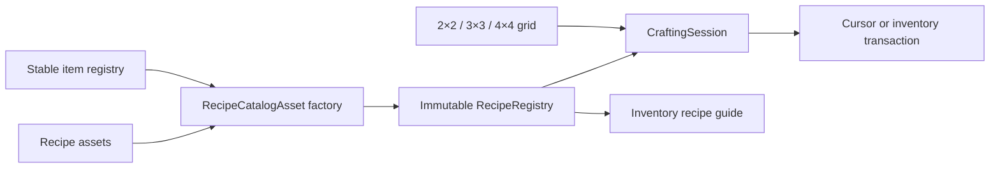

# Modular crafting implementation

Implemented under the user's explicit crafting request on 2026-09-08. The same core supports square 2×2, 3×3 and 4×4 grids; the personal 2×2 inventory is the currently playable interface. [GAMEPLAY.md section 16](GAMEPLAY.md#16-modular-grid-crafting) owns interaction rules, [ECONOMY.md](ECONOMY.md#current-playable-starter-recipes) owns the starter recipes, and [verification](verification/CRAFTING_RESULTS.md) records measured evidence.

## Author or change a recipe

1. In Unity's Project window, create **Rivet Reach → Crafting → Recipe**, preferably under `Assets/RivetReach/Resources/Definitions/Recipes/`. Each recipe is an independent ScriptableObject asset.
2. Set a unique, stable recipe ID such as `rivet:craft_starter_axe`. Select shaped or shapeless matching and the minimum grid size.
3. For a shaped recipe, set width/height from 1 to 4 and edit the visible grid with item dropdowns and counts. Rows run left to right, top to bottom. A width change reinterprets the serialized row-major cells; review the layout afterwards. Empty cells have blank IDs and zero count. Horizontal mirroring is opt-in. For shapeless recipes, edit the ingredient list using the stable IDs in `Definitions/Items.asset`; each entry represents one occupied slot.
4. Select the output item and quantity. Ingredients and one recipe's output must each fit their item's stack limit.
5. Add the recipe asset to the explicit list in [`Definitions/Recipes.asset`](../Assets/RivetReach/Resources/Definitions/Recipes.asset). Duplicating an existing asset also requires changing its stable ID and layout before registering it.
6. Click **Validate active recipe catalog**, or run **Rivet Reach → Validate crafting and benchmark** for the full crafting suite. A build also validates the catalog and runs the suite. Start a new Play session to use edited definitions.

The recipe assets and their `.meta` identities are versioned. Normal builds do not regenerate or overwrite authored recipes. An invalid catalog fails initialization/build with the offending recipe ID; there is no silent fallback to hard-coded recipes. Live editing an already-running session is deliberately unsupported: the session owns its compiled definition snapshot. No dependencies or third-party content were added for this feature.

## Architecture and extension points

- [`RecipeAsset`](../Assets/RivetReach/Code/Crafting/RecipeAsset.cs) adapts Unity authoring data to plain C# `RecipeSpec`. A future JSON/content adapter can feed the same compiler; there is no class per recipe and no UI recipe switch statement.
- [`RecipeRegistry.Compile`](../Assets/RivetReach/Code/Crafting/RecipeRegistry.cs) resolves stable item IDs once, validates all definitions, copies their contents and publishes an immutable registry. Read-only `RecipeInfo` exposes canonical ingredient layouts, quantities, output and station requirements to consumers such as the current recipe guide. Item and recipe identities are separate.
- Shaped lookup removes blank outer borders and uses the complete normalized item pattern, including internal holes. Optional mirrors compile into a second index entry. There is no implicit rotation.
- Shapeless lookup sorts the occupied cells by item ID and then count, carrying the source indices along. Repeated ingredients require separate cells. Counts are per-cell requirements, not an aggregate across arbitrarily arranged stacks. Sorting pairs smaller stacks with smaller requirements deterministically.
- A key contains all sixteen possible runtime item IDs in two 64-bit words plus dimensions. Dictionary hash collisions still compare the full key. There is no recipe-list scan on the hot path. Matching examines at most sixteen cells; shapeless insertion sort is bounded by that same limit. Runtime item IDs retain the existing byte representation, so the game still has 255 usable IDs. Expanding the world/item representation is a separate migration; stable asset IDs do not depend on those numeric assignments.
- [`CraftingSession`](../Assets/RivetReach/Code/Crafting/CraftingSession.cs) caches a preview and consumption plan against its grid's revision. An unchanged preview requires no matching. Every craft refreshes this state before committing; the UI never provides an authoritative output or cached match token. A future station creates `new CraftingSession(registry, 3, stackLimit)` or size `4` and binds its slots to `Grid`.
- [`ItemContainer`](../Assets/RivetReach/Code/Core/ItemContainer.cs) supplies the shared inventory/grid move, split, merge, take, capacity and exact-insert operations. Its backing array is private; public slot reads return value copies through a read-only view. Mutations advance a revision. `Inventory` adds the existing hotbar/main quick-transfer behavior.

The factory is a useful boundary for definition sources; the shared service owns crafting behavior. A proxy or per-recipe subclass would add indirection without helping this bounded matching workload.

## Validation and ambiguity policy

Compilation rejects missing assets, unknown items, blank/duplicate recipe IDs, unsupported sizes/kinds, inconsistent dimensions, empty/free recipes, malformed blank cells and nonpositive or over-limit quantities. Null catalogs/entries fail explicitly.

Two recipes cannot claim the same canonical input pattern, even when their quantities, outputs or minimum-grid gates differ. The same rule covers mirrors and permuted shapeless lists. A shapeless recipe cannot use the same occupied-item multiset as any shaped recipe. A symmetric mirrored layout with differing count requirements is also rejected. These conservative rules eliminate load-order precedence: resolving a conflict means changing its inputs or expressing it in a later explicitly designed processing system. Multiple nonoverlapping shaped layouts may use the same materials.

Each output is a single item type and bundle. Ingredient alternatives/tags, catalysts, reusable containers/byproducts, durability/metadata-sensitive matching, machine time/power/fluid recipes, mod hot reload and a full recipe/uses graph are future extensions. The present compiler rejects ambiguity instead of pretending those semantics already exist.

## Transactions and performance boundaries

The single local authority executes synchronously. Container stack-limit providers must be pure lookups, and runtime item definitions remain fixed throughout a session. It revalidates ingredients and destination capacity, commits only complete output bundles and consumes the corresponding source quantities in one call without intervening callbacks. `TryAddExact` validates capacity with one captured stack limit before any output write. Shift crafting computes a batch mathematically from the limiting ingredient, requested count and destination capacity; it does not replay one command per crafted item. Cursor crafting checks identity and capacity before writing either side. Closing or quick-return moves what fits and leaves each remainder in its original grid slot.

The immutable registry may be shared by independent sessions; mutable grids/inventories belong to one authority thread. This is not a concurrent inventory transaction system or a durable journal. Future multiplayer commands must run on the authority and validate access to the relevant station/session. The UI currently guards inventory-mode access. Durable saves remain unimplemented, as in the existing POC.

Compilation allocates once per session catalog. Matching uses fixed stack buffers, cached consumption storage and exact dictionary lookups. Performance claims apply only to measured workloads in [CRAFTING_RESULTS.md](verification/CRAFTING_RESULTS.md), not to total frame time or an untested machine system.

## Reproduce checks

- **Rivet Reach → Validate crafting and benchmark** runs layout, quantity, validation, stale-preview, output-capacity, return, randomized-conservation and scaling checks. It writes `Logs/crafting-checks.txt`.
- `Tools/Build-Windows.ps1` runs the existing domain suite plus crafting checks and builds the Windows player.
- `Tools/Verify-POC.ps1 -Crafting -OutputDirectory <path>` runs the actual input-system pointer, drag, output, batching, full-inventory and close/reopen checks, with screenshots and `runtime-report.json`.

Catalog build checks derive their cases from every registered recipe asset. The focused pointer scenario exercises the current starter layouts; deliberately rebalancing those layouts also requires updating that scenario’s input fixtures.

Test fixtures are enabled only by the existing explicit verification mode. Ordinary sessions receive only the normal starter hotbar items; ingredients must be gathered in play.
