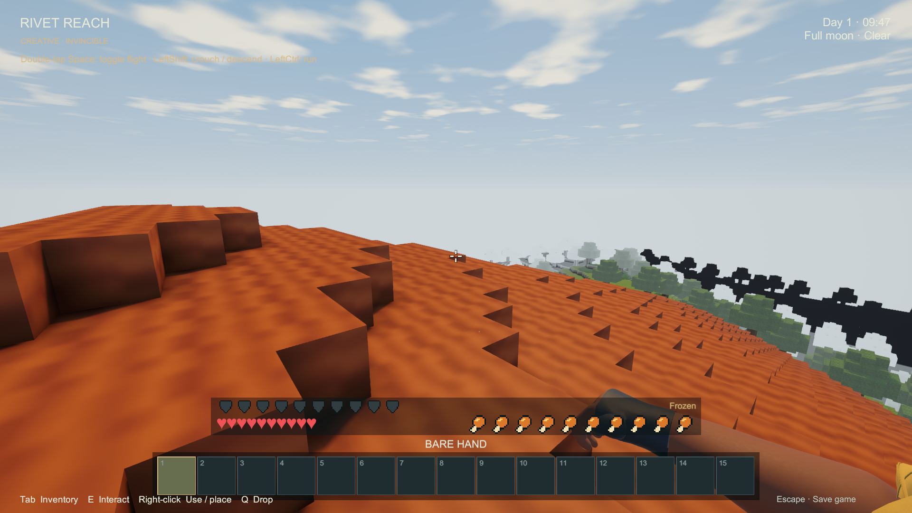
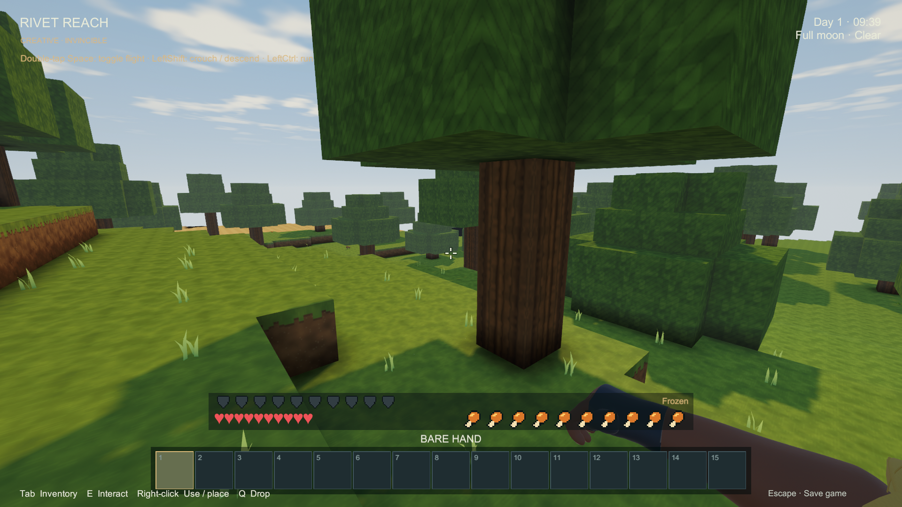

# Alpha 0.1.0 gameplay and code review — October 2, 2026

**Decision: hold the release, but keep the current survival/factory foundation.** The implemented recipes and resources support the requested progression. The remaining work is chiefly performance, teaching that progression, encounter/reward balance, visual consistency and release validation. The user selected **one play session, roughly 1–2 hours, to the first automated production line**. This review does not rebalance recipes, alter generation, add features or publish a release.

This is a risk-focused review across survival, tools, crafting/discovery, generation, mobs/passives, industry/logistics, lighting/presentation and saves, combined with a complete exported recipe audit and new generator/native population surveys. It is not a line-by-line certification of every source file or a completed two-hour human playtest. All proposed adjustments below remain review recommendations.

**Evidence and build identity**

- Reviewed gameplay source: `5082f141dd3f0a50b2c89cfc2aeec549a000c954`. The isolated candidate matched **985 tracked Code, Editor, Definitions and mob-definition paths at the initial comparison**. Concurrent appearance/UI changes appeared later and were preserved; they are not part of this native candidate. The additional [review probe](../../Tools/AlphaReview/ReadinessSurvey.cs) is not installed in the main game's Assets tree. [Build identity](alpha-gameplay-review-2026-10-02/build-identity.json) records source/assembly hashes; the Windows non-Development D3D11 build succeeded with **0 errors and 0 warnings** under Unity 6000.4.4f1. The candidate uses committed artwork; unrelated modified artwork in the main workspace is excluded.
- Fresh [catalog analysis](alpha-gameplay-review-2026-10-02/catalog-review.json): **195 items, 112 grid recipes, 199 total recipe/processing entries; no unreachable grid recipe** under the explicit natural-resource, mining-tier, station, fuel and power assumptions. This establishes constructive recipe feasibility, not acquisition time or seed-wide guarantees.
- Fresh [actual-generator survey](alpha-gameplay-review-2026-10-02/readiness-worlds.json): **12 seeds**, complete 129×129 spawn-area food samples, ore-centre searches within horizontal ±128, all seven biomes sampled within ±768, and **192 structure regions**. This calls the game's generator; it does not approximate it in a separate terrain implementation.
- Existing **October 2** [native Survival/crafting evidence](CRAFTING_IDENTITY_RESULTS.md) includes the five-minute empty-handed, resource-paid workshop/pickaxe route. [Factory visibility verification](FACTORY_VISIBILITY_RESULTS.md) includes the 1,518-assembly factory, 64 persistent animals, conservation, unload/return and exact save restoration. Those factories are supplied fixtures and cannot prove a resource-paid first factory or natural mob balance. Earlier historical-save/feature reports retain their own build dates.
- Native natural-spawn measurements and scenery findings are recorded below. [Reproduction instructions](../../Tools/AlphaReview/README.md) explain the observer, sampling bounds and exclusions.

**What is already good**

| Area | Assessment |
| --- | --- |
| Survival foundation | Empty-handed gathering, five tool tiers with wear, cooking/farming, hunger/health, armor, shelter, doors, torches, beds/home respawn and named saves form an actual playable loop. Food has renewable routes through crops, orchard growth, fishing and persistent chickens. |
| Resource availability | Every surveyed seed has **25–63 trees** in the 129×129 square, with its nearest trunk **7.2–30.4 horizontal blocks** away. Harvesting the currently generated crop stages would yield **64–118 directly edible items** in that square. These are potential harvests, not food already collected or a guaranteed walking route. |
| Bootstrap | Every sample contains surviving coal, copper and iron veins. Nearest surviving vein-centre distance from the spawn surface is **7.8–27.7 coal, 11.0–30.1 copper and 11.7–28.9 iron blocks**, measured in a straight line through terrain. The workshop does not require a late resource that only its own machines could produce. |
| Crafting integrity | Starter layouts/quantities remain intact. The approved industrial components are **1 Iron Ingot → 1 Cog** and **1 Iron Plate → 4 Rivets**. Recipes, ingredient accounting and the searchable recipe/uses browser share the real registry. |
| Deeper progression | Rarity changes through both smaller/lower-chance veins and vertical bands. Copper-grade access gives Azure; iron-grade access gives gold/diamond; diamond allows Lava Rock recovery. Gold, diamond and Floater Rocks already have meaningful advanced-machine uses. |
| Factory systems | Separate power, signal, item and liquid networks; a pump that starts without electricity; rear-only fuel inputs; wrench-controlled pipe ends; proportional powered work; shared allocation; backpressure; batteries; storage; bridges and explicit chunk loaders provide substantial automation choices. |
| Saves and conservation | Atomic saves, previous-checkpoint recovery, failed-load rollback, historical compatibility, exact carried contents and generated-chunk history are substantial strengths. Existing terrain is preserved when future generation changes. Machines freeze correctly when dormant unless explicit residency applies. |
| World variety | Grassland, forest, dunes, badlands, alpine, sea and river all appeared in every seed's coarse survey. Caves, deep lava, weather and day/night give the factory a surrounding world rather than an empty construction plane. |
| Creature architecture | Hostiles and persistent animals share habitat/light/support validation while retaining separate lifecycles. Hostile spawning rejects unloaded, blocked, occupied and sufficiently lit sites. Floater deaths have exactly-once loot; ambient despawning is not a loot source. |

**The 1–2 hour first-factory target**

Use a concrete first milestone: **ore chest → powered crusher → fuel furnace → output chest**, with automatic item transfer and water supplied to a boiler/alternator. Refilling ore and coal is acceptable for this first production line. A drill is the next extraction milestone. A hand crank or one manually fed machine alone is a weaker milestone than the user's requested factory loop.

The [batch ledger](alpha-gameplay-review-2026-10-02/catalog-review.json) includes a retained workbench, wooden/stone/iron picks, stone axe, furnace and eight torches. Industrial examples add a Machinist's Bench, wrench and two chests; the powered line adds boiler, alternator, pump, crusher, bucket, four fluid pipes, four power cables and eight item pipes. Actual recipe batch rounding and leftovers are retained.

| Cumulative illustrative setup | Iron ingots | Copper ingots | Logs | Cobblestone | Extra coal for bootstrap ingot smelting | Single-furnace ingot work |
| --- | ---: | ---: | ---: | ---: | ---: | ---: |
| Starter workshop and iron pick | 3 | 0 | 4 | 14 | 1 | 30 seconds |
| Automatically piped fuel furnace | 16 | 3 | 9 | 14 | 3 | 3 min 10 sec |
| Powered crusher processing line | **50** | **16** | **9** | **14** | **9** | **11 minutes** |
| Above, with drill and extra connections | **61** | **19** | **9** | **14** | **10** | **13 min 20 sec** |

All rows also consume two coal for eight torches. Coal figures are ideal fuel-use minima; they exclude operating fuel and burn wasted between loads. Bills exclude food, shelter, armor, replacement tools, excavation, site-dependent extra pipe lengths and reserve stock. Ingots use ordinary 1:1 raw-ore smelting before the first crusher; no free doubling is assumed. Furnace work can overlap exploration/construction and is not total elapsed playtime.

**Assessment:** the material bill is plausible within 1–2 hours for a knowledgeable player. It has not been timed with a new player. The main risks are finding a workable mine, learning intermediate components and diagnosing water/shaft/power/pipe direction errors. Do not change starter recipes to solve an onboarding problem.

There is already a useful expansion problem: a crusher produces two crushed-metal items per five seconds, while one furnace smelts one item per ten seconds. **Four furnaces match a continuously fed crusher's metal-output capacity.** A single furnace is a valid first line and will create backpressure. Four electric furnaces plus crusher/drill require 1,200 W against one boiler/alternator pair's 800 W. Explain these bottlenecks in the UI/guide before rebalancing them. The enabled boiler also consumes fuel/water while idling without useful electrical demand; teach storage, fuel reserves and signal control so this is understandable.

A proposed playtest route is 0–15 minutes for food/tools/shelter, 15–40 for an iron/copper mine and food reserve, 40–75 for workshop/components and basic pipes, and 75–120 for a running, restartable powered line. These intervals are **review targets**, not measured completion times. Record first food, first iron, first automated transfer, first doubled ore and first stable powered output. Run at least three unfamiliar seeds with players who have not memorized the catalog, without Creative, supplied resources, teleportation or external setup instructions. Count deaths and unsuccessful setup time. Inspect saves after reloading the finished line.

**Depth and discovery**

| Resource | Generated Y band; peak | Access and purpose |
| --- | --- | --- |
| Coal | 0…80; 40 | Wooden pick; light and early processing fuel. Charcoal provides a renewable alternative. |
| Copper | −48…64; 16 | Stone pick; wiring, plates and workshop bootstrap. Copper tools also unlock Azure. |
| Iron | −160…48; −48 | Stone pick; casings, tools and most first machinery. |
| Azure | −96…8; −40 | Copper pick or better; Blue Signal, controllers and chunk-loader components. Basic electricity does not depend on it. |
| Gold | −240…−64; −160 | Iron pick; warehouse/autocomposter/ranged-pump upgrades, bridges and renewables. |
| Diamond | −255…−160; −224 | Iron pick; durable equipment, bridge pairs and renewables. Lava below −240 adds danger near the bottom. |
| Floater Rock | Combat in qualifying dark caves | One per defeated Floater; ranged liquid pump, bridges and chunk loaders. |

The surveyed nearest gold centres were **103.7–153.8** blocks from spawn and diamond centres **209.2–229.5**, in straight-line distance. This supports a real depth separation. However, some seeds had **no air-exposed vein among the nearest 16** for a resource. A nearby buried deposit is not automatically a discovery a beginner will make. Add understandable depth/ore hints and navigation before making ore rarer.

Gold directly participates in eight advanced construction recipes, excluding its storage block. Diamond contributes to bridges and renewables as well as equipment. Floater Rocks are a real capability material rather than a cosmetic drop. Conversely, **Feathers have no current recipe**, and **Lava Rock is a diamond-gated building block with no manufacturing use**. These are unfinished reward branches, not missing ingredients that block today's factory.

The current drill costs ordinary iron/copper and mines at iron-grade capability down a finite resident column, stopping at bedrock or an unsupported material such as Lava Rock. That is a useful automation reward, but there is no multi-stage drill-head progression yet. It need not be added just to ship 0.1.0; first verify whether the existing manual exploration, narrow drilling and advanced logistics give enough reason to return underground.

**The current automation boundary matters:** extraction, processing, cooking/composting, storage and transport can be automated, but Plates, Cogs, Rivets, Casings and machine construction remain manual crafting. Workbenches are not pipe endpoints and there is no automatic assembler. The existing game can demonstrate a first processing factory. If 0.1.0 must demonstrate an automatically manufactured component, a powered assembler is an actual missing feature, not a pipe configuration problem. Treat that as an explicit scope choice after the first-line trial.

**Mob population, combat and drops**

The corrected native survey completed **six 120-second observations**, with **no recorded runtime errors**, using normal spawn cadence and live AI. These were fresh generated worlds, stationary invincible observers and no supplied/killed/bred creatures. The observer's view radius was four, sufficient for the 48 m spawn shell. This measures accumulation, not Survival combat or performance. [Raw report](alpha-gameplay-review-2026-10-02/natural-spawns.json), [validated summary and capture hashes](alpha-gameplay-review-2026-10-02/survey-summary.json).

| Seed / observation | Beetles | Prowlers | Floaters | Chickens after two minutes | Native capture |
| --- | ---: | ---: | ---: | ---: | --- |
| 246813, surface day | 0 | 0 | 4 | **18** | [Day shore](alpha-gameplay-review-2026-10-02/246813-surface-day.png) |
| 246813, surface night | **8** | **6** | 0 | 0 | [Night shore](alpha-gameplay-review-2026-10-02/246813-surface-night.png) |
| 246813, deep cave day | 0 | 0 | **4** | 0 | [Cave](alpha-gameplay-review-2026-10-02/246813-deep-cave-day.png) |
| 777, surface day | 0 | 0 | 1 | **24** | [Day surface](alpha-gameplay-review-2026-10-02/777-surface-day.png) |
| 777, surface night | **8** | **6** | 0 | 0 | [Night surface](alpha-gameplay-review-2026-10-02/777-surface-night.png) |
| 777, deep cave day | 0 | 0 | **4** | 0 | [Cave](alpha-gameplay-review-2026-10-02/777-deep-cave-day.png) |

Both night populations reached the natural cap: first sampled at **31.0 and 27.0 seconds**. Both cave samples reached four Floaters at **17.0 and 11.0 seconds**. No cage-origin creatures appeared. The counters include creatures outside the camera view and in surrounding cave pockets; the surface-day Floaters are consistent with the cave-only profile, not evidence that they spawned on grass. A filled cap does not establish that those creatures are visible or reachable along the player's route.

**Chickens are the clearest density concern.** The authored “12 local” test counts animals within 48 m of each *candidate*, not a single twelve-animal limit around the player. Consequently both fresh daylight sites exceeded twelve without breeding, one reaching twenty-four in two minutes. This is not a conservation failure or proof every seed is crowded, but it can provide plentiful wild food and weaken the motivation to breed/farm. Measure depletion/replenishment and return trips, then tune new natural spawns while preserving existing persistent animals. Do not increase hostile caps merely because a short walk happened to be quiet.

The native process wrote its completed report and all eleven screenshots and is no longer running. The WSL PowerShell launcher terminated with signal 143, so its native OS exit code was **not retained**; no exit-zero claim is made. The final report timestamp, six complete CSV windows, cap checks and empty runtime error list were validated independently.

Authored natural limits are **14 total**, at most **8 beetles / 6 prowlers / 4 Floaters**. Searches run every two simulation seconds, 24–48 m from the player, outside the original 16 m spawn sanctuary. Current hostiles require ground light **0–7**. Thus a beetle's absence of a night-only flag does not imply normal spawning on bright daytime grass. Prowlers additionally require night; existing creatures do not disappear at dawn.

Floater caves are checked below the original surface with body/support/roof/light validity. Each generated Floater cage has its own **five-mob origin cap**, one attempted spawn per ten active seconds after activation, separately from the natural total. Several nearby cages can therefore exceed 14 combined hostiles. Keep this separate from the ordinary-population test and include multi-cage fights in combat/performance acceptance.

Current rewards: **beetle: none; prowler: none; Floater: exactly one Floater Rock; adult chicken: one Raw Chicken and one or two Feathers; chick: none**. Eggs are produced every 5–10 active minutes. Natural death/despawn rules and passive persistence are distinct. [Mob rules](../MOBS.md), [chicken rules](../CHICKENS.md) and their linked focused verification remain authoritative.

**Adjust combat before deciding that more enemies are needed.** [Every accepted player hit](../../Assets/RivetReach/Code/Mobs/MobSystem.cs) changes a living enemy back to `Chase`, interrupting windup. Blades can hit every **0.30 s**, while authored enemy windups are **0.65–0.8 s**. Code review therefore identifies a strong single-target interruption advantage when the player keeps aim/range. This needs an ordinary-input combat trial before changing attack rates, immunity windows or armor. The invincible population observer cannot validate combat difficulty. Armor also reduces impact damage by up to 80%; test fists/wood/iron/diamond, isolated enemies and groups separately.

Recommended balance work is to measure encounters while travelling, first-Floater-Rock time, damage taken, deaths and reward consumption, then tune local density/replenishment. Give beetle/prowler encounters a useful reward or an explicit avoidance role; two unrewarded combat species can become chores. A finite natural-population cap alone does not tell us whether encounters are satisfying, and increasing it would also increase navigation/rendering load.

**Scenery and construction**

The native captures confirm distinct forest, sand, clay and snow palettes, substantial vertical terrain and dark caverns with exposed ore. The original machinery palette remains coherent in the [October 2 factory gallery](../wiki/Factory-visibility.md). The terrain-distance factory fix is present.

**Visible work remains:** distant terrain/trees show **black silhouettes and grey bands** in the new dunes, badlands and sea views. The earlier same-day, default-distance elevated factory capture also exposes a black/grey water-edge region. The new observer uses radius four, so these captures do not establish the exact boundary at every shipping setting; they do establish a presentation problem to reproduce and resolve with ordinary camera movement, lighting readiness and fog coverage. The shader's missing-light-page fallback is a useful diagnostic lead, not a confirmed root cause. Bright-sky HUD/help text also loses contrast. Repetitive tree silhouettes and abrupt material transitions are secondary art polish, after the boundary fault.

Additional direct captures: [dunes](alpha-gameplay-review-2026-10-02/scenery-777-Desert.png), [alpine](alpha-gameplay-review-2026-10-02/scenery-777-Alpine.png), [sea](alpha-gameplay-review-2026-10-02/scenery-777-Sea.png). These are inspection viewpoints, not proof of smooth movement, tearing-free presentation, audio quality or completion of a walking route. Audio assets/routing exist, but a fresh listening/mix assessment was not performed in this review.

The generator produced **26 rooms across 192 sampled 128×128 regions**; three of twelve seeds had no room within the sampled 512×512 area. All 26 were connected-mode rooms. This is a measured 13.5% regional occurrence in this sample, not a contradiction of the 45% candidate setting: placement must also succeed. It is far too small a successful-room sample to judge the intended 99/1 connected/buried split. These rooms offer cages/Floater encounters, not a developed treasure/landmark reward set. Do not make discovering one particular room an unavoidable first-factory prerequisite.

Current construction supports a functional block shelter and a substantial industrial plant. A small architectural set—**stairs, slabs and ordinary placeable glass**—would improve factories and homes; these are additions to consider, not existing broken recipes. Reinforced Tank Glass already serves its industrial role. Meaningful landmarks, ore clues and a simple home/mine waypoint would improve exploration more directly than adding another visually different but mechanically identical biome.

**Code and release work that needs adjusting**

| Priority | Finding | Required action/evidence |
| --- | --- | --- |
| Release blocker | **Steady 60 FPS at 1080p remains unproven and current stress measurements fail it.** The latest factory soak records p95 **54.64 ms** and a maximum **817.07 ms**; moving transitions and cold distant-mesh preparation also have spikes. | Follow the [current measured performance findings](FACTORY_VISIBILITY_RESULTS.md). Profile and fix stalls while retaining terrain distance and gameplay. Separate thermal variability from controlled comparisons, then test sustained real conditions and actual capped-60 presentation. |
| Release blocker | The review runner still accepts process exit plus correctness `PASS`; a failed performance distribution does not make it fail. | Add an explicit required-workload timing gate with missing-data/build-identity checks. Keep functional and performance results separate. See [runner](../../Tools/Verify-ReleaseReview.ps1). |
| Release blocker | No completed, timed ordinary route proves the agreed 1–2 hour first powered line, and long-session stability is not established. | Run the natural-resource route above, then an extended factory/travel/save/reload session with memory/GC evidence. Existing five-minute and supplied-factory tests cover different questions. |
| Before packaging | **Black/grey distant terrain and tree bands, plus weak HUD contrast**, are visible in the native captures above. | Reproduce at normal view distances during movement; correct light/fog/edge presentation and verify cave/surface transitions without reducing gameplay range. |
| Before packaging | An older Survival smoke fixture fails because it expects exactly one scheduled crop globally despite natural immature crops. | Repair the fixture's local assertion and rerun it; do not hide it or change crop gameplay to make an obsolete count pass. [Recorded candidate/baseline failure](CRAFTING_IDENTITY_RESULTS.md). |
| Before packaging | Version/build script still target **0.0.1**. Current docs mix working implementation with old exclusions/defaults; for example the older economy drill narrative and implemented 240 W/full-column behavior differ. | Select one 0.1.0 candidate, align version/notes/run paths and authoritative summaries, verify fresh extraction and historical-save recovery on that exact package, then test a second environment. A tag/release is not created by this review. |
| Before packaging | The main workspace contains unrelated modified `BlockTiles.asset` and concurrent appearance/UI changes outside this candidate. Its wiki export check rejects six changed source fingerprints. | Finish/select the final appearance and artwork candidate, re-export matching catalog/icons, and validate the wiki against that build. The isolated committed-artwork check passes **234 pages / 9,980 local links/images**. Preserve concurrent edits. |
| Maintainability | Save compatibility has accumulated many positional flags and string projections in `SaveStore`; compact byte IDs share a finite space with world cells. | Retain exact compatibility tests; move future migrations toward explicit versioned profiles and maintain an ID allocation budget before substantial new content. These are growth risks, not a reason to rewrite working saves during this review. |
| Maintainability | Large partial systems and numerous verification entry points make it easy to run the wrong historical fixture/build. | Keep one documented candidate manifest and separate release acceptance from focused diagnostic scenarios. Continue using shared capabilities and bounded jobs rather than adding special-case authorities. |

Any generation tuning selected after this review must apply only to previously ungenerated chunks with an explicit generator version; do not retrofit established terrain.

The [September 27 release audit](RELEASE_READINESS_0_1_0.md) remains useful dated timing/presentation evidence. Its old 64 m machine visibility concern is superseded by the October 2 fix; it should not be reported as still unfixed.

[Validation notes](alpha-gameplay-review-2026-10-02/validation.txt) record catalog/link checks, the isolated and main-workspace wiki outcomes, and the native launcher's unavailable exit status. The main-workspace fingerprint changes concern `AlphaPlaytestVerification`, `AvatarEquipment`, `AvatarView`, `RuntimeVerification`, `GameUI` and `BlockTiles.asset`; this review does not certify or overwrite that concurrent appearance work.

**What should be added, and in what order**

1. **A small in-game progression guide and pinned recipe goal.** Show a short surviving → finding iron/copper → workshop → first working line path, missing material totals, depth/tool hints and newly relevant uses after acquiring a material. Preserve unrestricted crafting and a full catalog view. The existing browser already supplies recipes/uses; build on it rather than adding research-point locks.
2. **An illustrated first-factory setup inside the game.** Teach the boiler's right-side shaft/alternator alignment, renewable pump intake, rear fuel faces and source/destination pipe arrows. Explain missing power versus disconnected power and full outputs. Existing player wiki guides are useful, but the first-session target should not depend on reading them externally.
3. **A modest exploration/reward pass.** Give ordinary hostile encounters a reason, make Feather's future-only status deliberate, and provide a few discoverable goals or landmarks connected to current materials. Lava Rock's next use can remain in the later realm scope; do not force realms into this release merely to fill one branch.
4. **Basic navigation and building conveniences.** A saved home/mine/death-location marker and a small stairs/slabs/glass set would support longer underground trips and factory construction. Death currently drops ordinary saved stacks, which expire after 20 nearby active minutes and can burn in lava; a durable recovery cache is a later design proposal, not the current implementation.
5. **A powered component assembler, if fuller manufacturing is part of this alpha's scope.** This would extend the current processing factory into recurring component production and provide another reason to expand power/logistics. It needs material-tier progression and exact input/output/save transactions. It is not required merely to prove the existing first automated ore-processing line, and is not authorized for implementation by this review.

Prioritize performance, the timed first-line trial, encounter/reward tuning and obvious visual defects before enlarging the content list. Realms, robots, multiplayer and a large new technology tree are not necessary to demonstrate this surface-world alpha loop. The open GitHub roadmap still names earlier 0.0.3 realm milestones; reconcile release naming without treating those issues as automatic requirements for this requested review.

## Selected follow-up — 2026-10-02

The user selected depth/tool cues, clearer machine setup feedback, Home and Last death navigation (explicitly no mine markers), Wooden/Stone Slabs and connected Glass. [The focused implementation report](ALPHA_GUIDANCE_RESULTS.md) owns the new evidence; the review above retains its original dated findings. The powered component assembler is separately tracked in [issue #22](https://github.com/Starbugstone/Rivet-Reach/issues/22) for another thread. A full progression checklist, recipe pinning, stairs and encounter rebalance are not part of this increment. The user deferred FPS rechecking until the development machine is under less stress; neither this follow-up nor its functional captures resolve performance acceptance.
