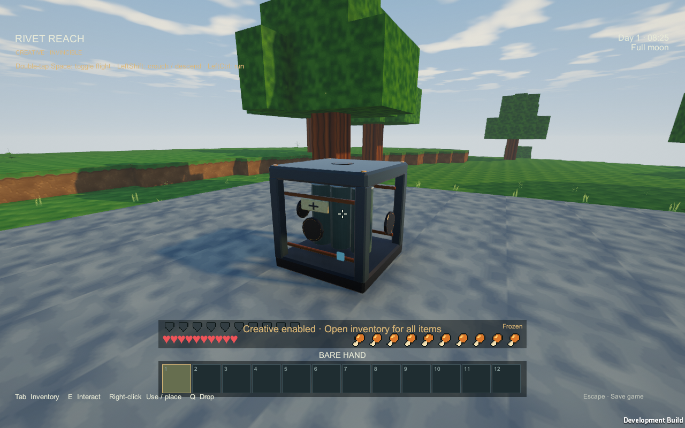
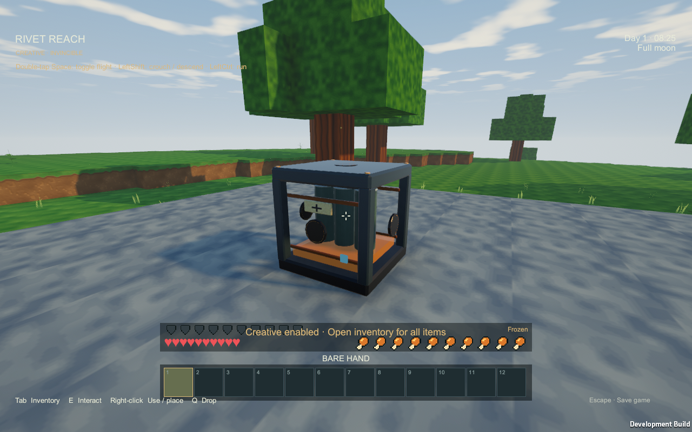
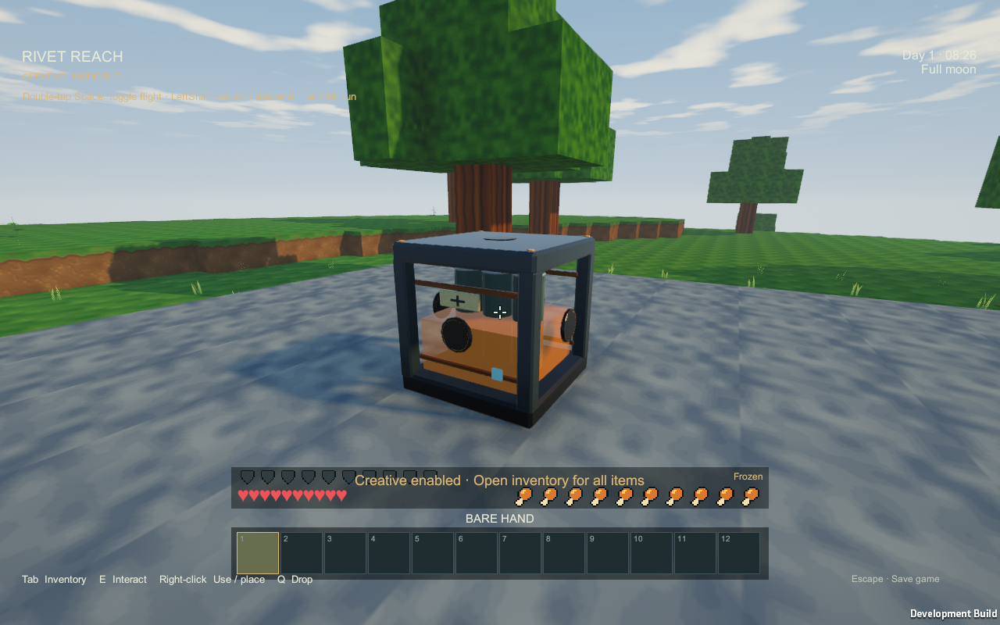
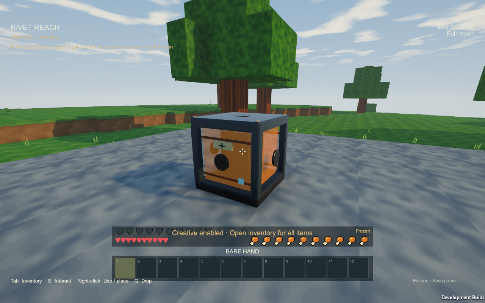

# Battery charge fill verification — 2026-09-12

The user's stored-power screenshot prompted a visible internal charge level. [BATTERIES.md](../BATTERIES.md#presentation-and-diagnostics) owns the mapping and electrical-only meaning.

## Artifact and reproduction

- Review player: `Builds/BatteryFill/RivetReach.exe`, Unity 6000.4.4f1, Windows x64 development build.
- With the project open and refreshed in the pinned Editor, run `powershell.exe -NoProfile -File Tools/Verify-BatteryFill.ps1 -Build`. The build request uses the existing idle-Editor bridge and preserves open scenes. Omit `-Build` to repeat only the native-player check.
- Runtime output: `Logs/BatteryFillVerification/`; electrical regression output: `Logs/battery-checks.txt`.

## Evidence

- Windows build succeeded with **0 errors and 0 warnings**; final material build completed at **2026-09-12 10:47:45 UTC**.
- **29 electrical regression assertions passed**, covering empty storage, real surplus charging, demand-driven discharge, modes, bank ownership, conservation and dormant/resident transitions.
- The final native run passed **33 assertions**, completed at **2026-09-12 10:48:46 UTC**. It checks fixed-base proportional levels, live discharge without topology rebuild, hidden empty fill, no collider, shared geometry/material, rotation, claimed bank cells, unequal cell levels and reconstruction from exact saved energy. [Raw runtime report](battery-fill-runtime-2026-09-12.json).
- Actual Unity captures below show the original housing with empty, 11.8%, 50% and 100% fill. The final material keeps the cans faintly visible through the amber volume. No concept image is used as runtime evidence.

| Empty | 11.8 kJ / 100 kJ |
|---|---|
|  |  |

| 50 kJ / 100 kJ | 100 kJ / 100 kJ |
|---|---|
|  |  |

Artifact SHA-256 fingerprints:

- `RivetReach_Data/Managed/Assembly-CSharp.dll`: `f97ed9357ee175be7763cc507387aff8addff50d817c6f4e825f3156277a231c`
- `RivetReach_Data/resources.assets`: `b5368cc983376db30cdffa2279cf0d1241eff0a24a05fc244851e5bd92e89446`

## Scope and limits

The original Blender housing, accumulator cans and sockets are retained. The dynamic internal volume uses the same presentation approach as contained tank liquid, with a shared 12-triangle cube and shared emissive transparent material. It inherits the existing nearby view's rotation, residency and origin shift. No source model or icon regeneration was needed.

This focused check is not a large battery-factory performance benchmark. Long-distance readability, all weather/night conditions and artistic acceptance remain play-review questions. The local player is separate from the published alpha release.
