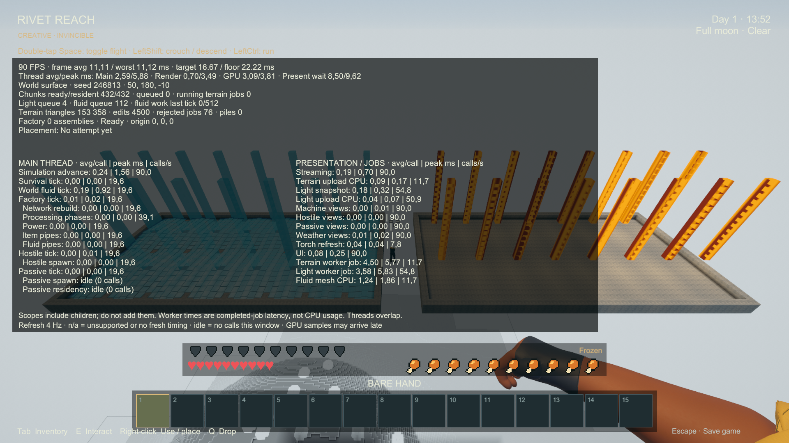
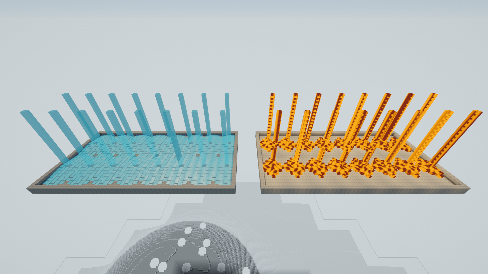

# Diagnostics and flowing-liquid review — 2026-09-22

**Latest factory measurement:** [September 22 phase profile](FACTORY_PROFILE_RESULTS.md) reruns the full fixture with 27 retail scopes, including the soak and chunk transitions. Its dated results supplement the earlier evidence below.

Status: implemented; 48 Editor suites and 53 native correctness checks pass. The 45 FPS worst-frame gate remains **unmet**. This page does not replace the dated [release review](RELEASE_REVIEW_RESULTS.md).

## What the existing factory measurements establish

The accepted September 20 release-review build has median GPU time **12.43 ms**, main-thread **5.14 ms**, and render-thread **3.66 ms** in the clear factory workload; frame p95 is **22.00 ms**. These are overlapping measurements, not additive costs. The settled terrain/storm GPU median is approximately **3.61 ms**. This points first to graphics cost in the large visible factory, but does not isolate shadow, material, geometry or creature rendering costs.

The final player's named per-system profiler counters were unavailable. The older Integrated2 **Development** build recorded factory scope active-frame p50/p95 of **3.97/6.23 ms**, passive scope **1.16/3.27 ms**, and hostile scope **0.26/0.73 ms**. These are totals on rendered frames with nonzero recorded scope work; a frame may contain multiple ticks. [Archived scope analysis](release-review-2026-09-20/Integrated2/scope-analysis.json) and [raw frames](release-review-2026-09-20/Integrated2/frames.csv.gz) preserve the inputs. They are historical leads, not final-build measurements or individual tick costs. That fixture has 14 hostiles and 64 chickens with natural spawning disabled, so it does not establish capacity for larger populations or more advanced AI.

The 606 ms worst final frame correlates with delayed GPU/present timing spikes. Its exact driver/OS/thermal cause remains unresolved. It must not be attributed to a 606 ms machine tick. Laptop thermal throttling was observed, but does not explain every spike by itself.

## Isolation priorities

| Area | Evidence or source finding | Required measurement |
| --- | --- | --- |
| GPU lighting/shadows | Factory GPU time dominates the median; cave fog requests another sparse lighting sample even at zero fog weight; shadowed torches and machine meshes add passes. Compiler elimination is unverified. | Alternate one shader change at a time, inspect compiled work and matched screenshots; directional/torch shadow and MSAA toggles only as diagnostic controls. |
| Factory CPU | Older factory scopes are material; final phase attribution was missing. | Power, item pipes, fluid pipes, processing and topology separately; same local edit with increasing unrelated factory size. |
| Streaming/lighting | Final light queues reach 1,773 after unload and 901 during streaming; snapshots scan cells and allocate arrays, publication rebuilds lookup metadata. | Snapshot, worker solve, CPU upload and terrain worker latency separately; queue size alone does not establish a frame stall. |
| Creatures | Hostile separation scans all hostiles; dense passive collision/breeding scans and fixed-order path budgets can scale poorly; per-frame animation lies outside AI scopes. | Spread versus packed populations, simultaneous pursuit/following, camera-facing versus offscreen views, spawn/search latency and fairness. |
| Flowing world liquids | Previous factory pipes do not establish world-flow cost. | Water/lava cascades, repeated source changes, geometry rebuilding, draining and unload/return with actual normal tick budgets. |

A previous route-instancing experiment reduced submissions without consistently improving frame p95, so it was rejected. Draw count alone is not an optimization acceptance criterion. No graphics quality reduction is part of this diagnostics change.

## New instrumentation and validation

The [runtime timing contract](../SIMULATION.md#runtime-timing-overlay--2026-09-22) defines units, nesting, worker latency and unavailable samples. **F12** opens the overlay; every row shows average milliseconds per call, peak completed-call duration and calls per second. Its 27 scopes include factory phases, world flow, creature AI/presentation, lighting preparation/uploads and terrain/light workers. CPU main/render, GPU and present wait are independent FrameTimingManager measurements. They are not CPU utilization percentages. Scope sampling is opt-in, uses preallocated storage and value-type scopes, and is available in non-Development players; formatted text refreshes at four Hz. Toggle epochs reject old worker completions and rebaseline the overlay independently of explicit verification sampling.

Actual September 22, 2026 capture of the final non-Development player. Readability and absence of clipping were visually checked at 1920×1080. Zero machines/mobs in this dedicated fixture explain the nearly empty factory/creature rows; this image does not establish their loaded costs.

## Flow bottleneck and implemented savings

The first native run isolated a **242.61 ms single fluid tick** processing 486 queued cells. The next reported frame interval was 250.41 ms. Fluid direction selection repeatedly ran the same downhill searches for each neighbour, including neighbours needing no update. Coordinate indexing and resident voxel queries also repeated address/dictionary work.

The implementation now shares a direction mask within Spread, rejects already sufficient neighbours before searching, and reuses an 11×11×2-plane read cache with a packed BFS queue. That scratch is cleared for every routing query; it cannot survive a terrain, source or readiness change. The existing 512-cell tick budget, timing, route choices, wake order and source rules are preserved. Signed 32-cell indexing uses the equivalent low-bit representation; resident reads retain edit precedence and closed unloaded boundaries.

[Routing checks](diagnostics-liquids-2026-09-22/Editor/fluid-routing-checks.txt) pass **6,220 assertions**, including 1,536 direction comparisons and 1,030 complete tick traces against a frozen Editor-only copy of the prior algorithm. Cells, mutation sequences, pending counts and processed work match. Flat Spread reads fall from **1,221 to 125**; already supplied neighbours need five reads. Extreme signed-coordinate round trips pass too.

## Native comparison

The same scripted fixture uses seed 246813, two separate 48×24×18 basins, 16 elevated emitters per liquid, 1080p D3D11, a 90 FPS cap, view distance four and unchanged visual settings on the i7-10750H / RTX 2060 laptop. Natural spawning is disabled. The test runs water, combined water/lava, source pulses, paused unload/return and draining with real simulation time. The queue reaches **4,532** cells and exercises the full **512-cell** budget. These bounded liquid results do not certify the earlier full-distance factory or larger creature populations.

| Measurement | Before | Final |
| --- | ---: | ---: |
| Water tick average per call | 1.916 ms | 0.314 ms |
| Worst water tick | 242.61 ms | 27.90 ms |
| Pulsed-flow tick average per call | 1.836 ms | 0.429 ms |
| Worst pulsed-flow tick | 199.95 ms | 35.44 ms |
| Worst draining tick | 60.55 ms | 24.00 ms |
| Worst rendered frame, all stages | 250.41 ms | 39.55 ms |
| Frames exceeding 22.22 ms | 43 / 12,010 | 6 / 12,209 |

Final frame p95 ranges from **11.14 to 11.21 ms** across the seven stages. Water has two floor breaches, source pulses two and draining two. The paused five-second unload and return windows have none; later settling tails are excluded. The final maximum remains approximately **25 FPS**, so neither the average nor the correctness PASS is a release performance pass. Measurements are sequential runs on one laptop, not population-wide estimates. GPU telemetry records no active thermal slowdown in these liquid runs; CPU clock/thermal telemetry was not captured.

All 53 native checks pass: actual falling/derived cells, correct explicit-source counts, basin containment, complete drainage, all fixture chunks genuinely unloaded, exact resident-cell restoration after return, resident reads agreeing with authoritative Get, live release timing counters, and visible overlay labels. Flowing voxel counts are derived state, not a conserved finite liquid volume. Later correctness audits have separate timestamps/queues; unaudited counts are -1.

The remaining fluid tail is still CPU work in synchronous route evaluation at high per-tick work counts. It is now measurable separately from worker meshing and GPU rendering. Further savings should target remaining repeated neighbour searches/voxel reads while retaining the tested decisions; lowering the tick budget or fluid reach is not part of this pass.

## Build and evidence

- [48-suite Editor result](diagnostics-liquids-2026-09-22/Editor/domain-summary.txt), [counter/concurrency checks](diagnostics-liquids-2026-09-22/Editor/runtime-diagnostics-checks.txt), [build summary](diagnostics-liquids-2026-09-22/Editor/build-summary.txt): zero build errors/warnings. An earlier batch-only shader metadata query reported “not initialized”; the initialized graphical Editor passed the unchanged check.
- [Before](diagnostics-liquids-2026-09-22/Before/fluid-stress.json), [first optimization](diagnostics-liquids-2026-09-22/FirstOptimization/fluid-stress.json), [final](diagnostics-liquids-2026-09-22/Final/fluid-stress.json), [comparison](diagnostics-liquids-2026-09-22/comparison.json), [native correctness](diagnostics-liquids-2026-09-22/Final/runtime-report.json).
- [Before raw CSV](diagnostics-liquids-2026-09-22/Before/fluid-stress-frames.csv.gz), [final raw CSV](diagnostics-liquids-2026-09-22/Final/fluid-stress-frames.csv.gz), [timing alignment notes](diagnostics-liquids-2026-09-22/Final/timing-notes.txt), [final GPU telemetry](diagnostics-liquids-2026-09-22/Final/gpu-telemetry.csv).
- [Fixture coordinates](diagnostics-liquids-2026-09-22/Final/fluid-stress-fixture.txt) and [build identity](diagnostics-liquids-2026-09-22/Final/build-identity.json). Final Assembly-CSharp SHA256: `01D4973584D9981E7DAA710B56598E5898BE0C26E92828666D7F2A79BAECD56B`.

Local review player: `Builds/DiagnosticsLiquids/RivetReach.exe`. In the graphical pinned Editor, request `diagnostics-liquids` through `Logs/build-request.txt` to run the 48-suite gate and build. `Tools/Verify-ReleaseReview.ps1 -Scenarios fluid-stress` selects the native scenario; use a fresh evidence/save directory. Build assets use the committed atlas. The user's unrelated working atlas/art were preserved. Item definitions, recipes and exported icons remain byte/content-equivalent; the refreshed catalog updates source hashes. Wiki validation runs in the matching isolated checkout because the user’s working atlas differs from the committed build atlas.

The [player guide](https://github.com/Starbugstone/Rivet-Reach/wiki/Performance-diagnostics) and both native screenshots were published in wiki commit `26035f8` by [workflow 35700166341](https://github.com/Starbugstone/Rivet-Reach/actions/runs/35700166341). Chromium verified the live rendered page, both 1920×1080 images, F12 instructions and the explicit remaining frame-time limit; published guide/Home/image files match the maintained sources. [Publication evidence](diagnostics-liquids-2026-09-22/Final/wiki-verification.json) records the check.
