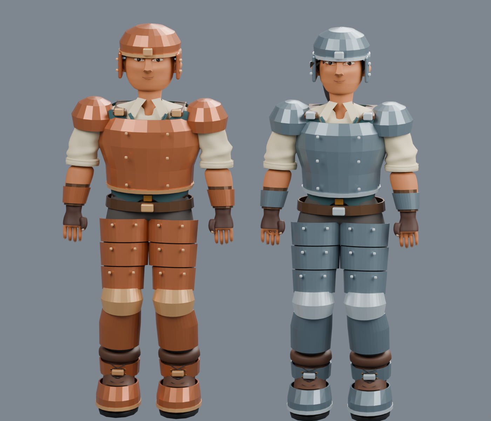
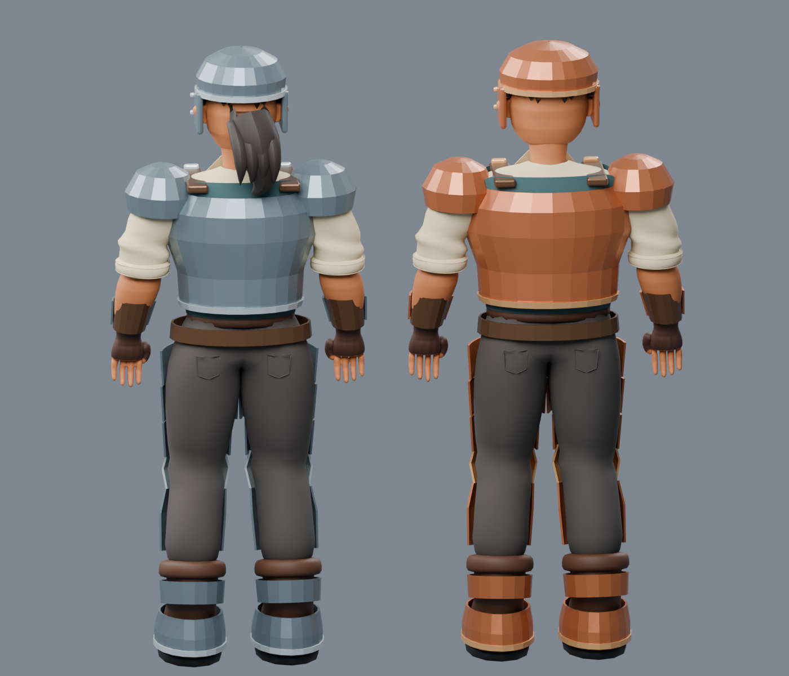

# Fitted armor and ingot art verification — 2026-09-12

Review artifact: `Builds/EquipmentArt/RivetReach.exe`, Unity **6000.4.4f1**, Windows x64 development build. [Specification and reproduction](../EQUIPMENT_ART.md). This is a local review player, separate from the published alpha. The final player was built from an isolated projection of HEAD plus only the owned equipment changes, excluding concurrent connection-system work.

## Source and import

Original source: `ArtSource/Equipment/Equipment.blend`; reproduction: `Tools/create_armor_assets.py`, Blender **5.2.0 LTS**. Both explorers use fitted variants, retaining the existing character source files and runtime FBX identities. Source front/back renders were inspected against the established explorer and equipment references. Shoulder caps, helmet hair coverage and the back hem were revised following actual renders. Native crouch review then prompted a thigh/shin weight blend for the knee guards; the revised native pose was checked again.

| Imported artwork | Triangles |
| --- | ---: |
| Male worn set, four slot meshes | 8,848 |
| Female worn set, four slot meshes | 8,864 |
| Static chest item | 3,008 |
| Static leggings item | 3,188 |
| Static boots item | 1,272 |
| Static helmet item | 1,380 |
| Shared cast ingot | 532 |

Unity checks validate readable meshes, finite vertices, normals, UVs, one submesh per piece, populated bone weights/bone references, four fitted slots, the 12,000-triangle set review ceiling, all fifteen icons/materials, and slot agreement with item definitions. Blender's unoptimized counts differ slightly from Unity's imported counts. Three armor tiers share fitted geometry per model variant and palette materials. Each ingot shares one mesh with a metal-specific palette.

## Native player

`Tools/Verify-EquipmentArt.ps1` exercises all three armor tiers on both model choices and both skins, synchronizes equipped slots to the body/arms/portrait, verifies live bone rebinding, checks all fifteen held models and palette assignments, and checks physical drop materials and removal after unequipping. The extended review checks mixed tiers and standalone imported walk/run/crouch/tool poses from front and back.

The retained report and screenshots below identify the final checked candidate. Artistic acceptance remains with the user. These are bounded correctness/visual checks, not a large-scene frame-rate benchmark or proof that every possible pose is intersection-free. Armor wear, further cosmetic choices and armor-specific gameplay remain outside this visual request. Existing save authority and schemas are unchanged; this focused review does not replace the separate durable-save suite.

Final isolated build: **succeeded, zero errors and zero warnings**, 30.49 seconds. Domain/survival checks also passed, including 93 crafting and 11 furnace recipes, equipment rules, conservation and deterministic world/inventory assertions. The native Windows/D3D11 review passed **134 checks with no logged errors** on an Intel i7-10750H / RTX 2060. [Recorded report](equipment-art-2026-09-12-report.json) includes the exact timestamp, checks, import counts and assembly fingerprint. No frame-rate claim is inferred from these checks.

The wiki export contains 131 items and 107 compiled recipes; its generated pages and **5,546 local links/images** passed validation in the isolated source tree. Fifteen matching equipment icons and twelve armor descriptions were refreshed.

