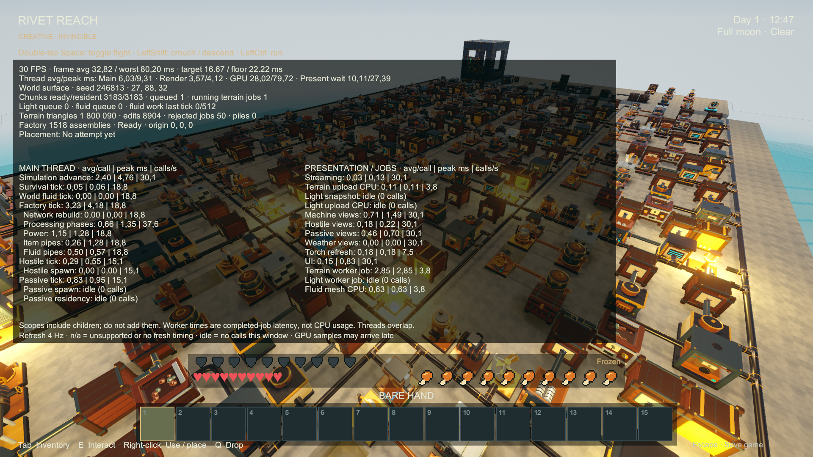

# Large-factory phase profile — 2026-09-22

**Status: 2,263 native correctness checks pass; the 60/45 FPS performance gate fails.** Across 30,318 measured frames, 2,216 exceed 22.22 ms. The worst gameplay frame is 176.09 ms. This report supplements the dated [release review](RELEASE_REVIEW_RESULTS.md) and [liquid review](DIAGNOSTICS_LIQUID_RESULTS.md); it does not certify 0.1.0.

Follow-up: [extra factory isolation tests and optimization proposals](FACTORY_ISOLATION_RESULTS.md) reproduce the terrain mesh submission hitch, measure ranged-pump preparation and power roles, and compare paired graphics controls. Those shorter diagnostic runs supplement this five-minute soak.
## Workload and build

The unchanged fixture runs 32 production lines, 1,518 industrial assemblies including routes, 230 stations/crates, 512 crop cells, 64 persistent chickens and 14 hostiles. All existing machine families, crates, steam/solar/wind, batteries/banks, hand crank, tanks, three bridge channels and an explicit loader-maintained remote circuit are present. Natural spawning is disabled; ordinary simulation and rendering remain active. Finite input stocks and growing output buffers mean later stages are not identical production loads. The fixture includes a five-minute soak, storms, inventory, unloading/return, output backpressure, power shortage and travel.

Hardware/settings: i7-10750H, RTX 2060, 32 GB RAM; non-Development Unity 6000.4.4f1 player, D3D11, 1920×1080, view distance 10, VSync off, 90 FPS cap, 4× MSAA and four directional shadow cascades at 160 m. The isolated build preserves committed artwork and the user's unrelated working atlas. No gameplay, graphics-quality or simulation-rate optimization is introduced in this rerun.

The benchmark now exports all 27 retail Stopwatch scopes, call counts, observation timestamps and terrain/light/fluid queue counts. Buffers are allocated before sampling; CSV serialization and captures happen after each measured window. The overlay is visible only in its named diagnostic stage. [Build summary](factory-profile-2026-09-22/build-summary.txt) and [source hashes](factory-profile-2026-09-22/source-manifest.json) identify the build inputs.

## Reading the measurements

- CPU main, render, GPU and present timings overlap. Analysis de-duplicates all four by their returned timing timestamp and excludes unavailable/nonpositive values.
- Scope totals are inclusive wall time between consecutive coroutine observations. Simulation advance contains factory/survival/world liquids; factory contains its phases. Do not add parents and children. Frame intervals precede observations; spike analysis retains adjacent rows instead of asserting exact same-row causality.
- Processing runs twice per factory tick; combined processing cost is normalized by factory tick count. Item routing is entered every tick but performs its transfers every fifth tick. A per-tick average therefore understates the individual routing pulse.
- Topology includes multiblock validation and cooperative reconstruction. Chunk-residency invalidation runs in streaming callbacks; topology alone does not measure every network-related cost.
- Streaming includes main-thread terrain application and light snapshot/upload work. Worker timings measure completed task-body wall latency, including preemption but excluding time waiting to start. They are not main-thread CPU utilization. Fluid mesh scope mixes synchronous and worker paths.
- Machine views exclude crate presentation. UI scopes exclude native Canvas/EventSystem work and some late updates. This is phase attribution, not a complete CPU sampling profile.

## Measured frame pacing

| Workload | Frames | Median / p95 / max, ms | Frames below 45 FPS |
| --- | ---: | ---: | ---: |
| Terrain day | 600 | 11.11 / 11.13 / 11.42 | 0 |
| Inventory baseline | 600 | 11.11 / 11.15 / 11.59 | 0 |
| Terrain night | 600 | 11.11 / 11.14 / 11.77 | 0 |
| Terrain storm | 600 | 11.11 / 11.14 / 11.53 | 0 |
| 192-assembly fixture | 600 | 11.11 / 11.15 / 18.72 | 0 |
| Large factory, clear | 1,800 | 13.34 / 23.77 / 82.69 | 103 |
| Large factory, overlay | 600 | 13.18 / 18.79 / 85.19 | 15 |
| Five-minute soak | 16,534 | 13.83 / 64.02 / 100.24 | 1,520 |
| Large factory, storm | 1,800 | 13.47 / 18.72 / 83.51 | 61 |
| Large factory, inventory | 600 | 14.92 / 83.78 / 89.75 | 69 |
| Factory unload/return | 3,784 | 11.12 / 47.23 / 176.09 | 307 |
| Full outputs | 600 | 13.76 / 26.42 / 85.01 | 44 |
| Power shortage | 600 | 12.01 / 24.12 / 70.35 | 38 |
| Travelling | 1,000 | 11.56 / 26.75 / 66.99 | 59 |

The clear factory's **deduplicated GPU median is 12.30 ms**, main CPU **5.26 ms**, render CPU **3.80 ms**. Soak GPU median/p95/max is **13.44 / 73.85 / 99.02 ms**. Rendering/presentation is the leading measured sustained limitation. Different weather/overlay windows have different clock, thermal and production states; their differences are not controlled feature-cost comparisons.

## Factory CPU breakdown

Mean combined milliseconds per **factory tick**, normalized by `RR.IndustryTick` call count:

| Phase | Clear | Five-minute soak |
| --- | ---: | ---: |
| Machine preparation and processing | 1.7194 | 1.8364 |
| Power allocation and battery status | 1.2578 | 1.3419 |
| Fluid pipes | 0.5555 | 0.5835 |
| Item pipes, including scheduled no-op checks | 0.2761 | 0.3754 |
| Topology/validation | 0.0004 | 0.0004 |
| Entire factory, inclusive | 3.8115 | 4.1399 |

Processing and power account for approximately **78% of settled factory CPU time**. The item pipe phase is not the largest factory CPU cost in this fixture. The topology check is effectively idle in settled operation; this does not measure the cost of actively changing a graph.

Other clear-factory costs: machine views **0.706 ms per rendered update**, passive views **0.537 ms**, hostile views **0.230 ms**; passive AI **0.960 ms per tick**, hostile AI **0.262 ms per tick**. Machine and creature views together use about **97 ms of main-thread wall time per measured second**, versus **76 ms/s** for the whole factory tick. That is a useful presentation optimization target as well as the machine simulation. The fixture still cannot establish headroom for a much higher mob cap or more advanced AI.

Weather views average **0.004 ms/update** in clear conditions and **0.218 ms/update** in the factory storm. This measures CPU weather presentation only, not its GPU cost. Lighting has no snapshot/upload work in the settled clear/soak windows; changing or streaming terrain has different costs.

## Transition and outlier attribution

| Recorded location | Measured evidence | Interpretation / next isolation |
| --- | --- | --- |
| Clear factory, frame 645 and neighbours | 82.69 ms frame; delayed GPU near 81 ms; topology below 0.002 ms, no lighting work or view creation | Graphics/presentation burst, not explained by settled network reconstruction. |
| Soak, frame 14946 and neighbours | 100.24 ms frame; delayed GPU reaches 99.02 ms | Graphics dominates this burst. Nearby factory totals include multiple ticks; they are not 100 ms individual machine ticks. |
| Soak, observation 4431 | One chunk application takes 33.39 ms, nearly all of the 33.46 ms Streaming scope | Concrete main-thread chunk-application hitch; inspect mesh submission and any first-residency callbacks separately. |
| Unload/return, observation 1921 | Two chunk applications total 38.96 ms; following frame 52.82 ms | Main-thread chunk application needs attention even though the work is already count-budgeted. This is not a 39 ms single-call measurement. |
| Unload/return, frame 775 and neighbours | 176.09 ms frame, delayed render-thread 175.03 ms and present wait 172.36 ms; exact GPU sample unavailable | Separate render-thread/presentation stall. Do not call this proven GPU shader time or network rebuilding. |
| Unload/return, topology peak | 2.003 ms, one call; whole-window mean 0.113 ms/call | Cooperative reconstruction is not the dominant measured transition spike. Residency callbacks live outside this marker, so this does not rule out all network-related callback cost. |
| Soak, observation 4407 | One passive AI tick 11.18 ms; following frame 33.17 ms, nearby GPU about 8–10 ms | A separate CPU hitch worth tracing through navigation/collision/residency. |
| Return, observation 2376 | Passive activation 11.57 ms | Spread activation work and inspect view creation/rebinding without changing persistent animal behavior. |

Unload/return queue peaks: **2,148 light chunks**, **1,641 terrain jobs/pages pending**, and **229 fluid cells**. Travelling peaks at **1,111 / 227 / 414** respectively. Queue size indicates backlog, not time spent blocking a frame. During unload/return the largest observed light snapshot total is **3.91 ms** and light upload total **2.94 ms**; these are material but smaller than the worst chunk application and presentation stalls. Background job totals must not be added to main-thread durations.

The precise 176 ms render-thread root cause remains unresolved. The next focused capture should split native mesh submission from residency callbacks and sample render-thread stacks/graphics events. Existing scopes pinpoint the subsystem but cannot distinguish driver waiting from each internal rendering operation.

## Thermal evidence and comparison limits

[GPU telemetry](factory-profile-2026-09-22/Native1/gpu-telemetry.csv) and its [per-workload summary](factory-profile-2026-09-22/Native1/thermal-summary.json) record **13/14 clear-factory samples** with software thermal slowdown, **83–87°C**, **95–98% GPU utilization**, and clocks **300–1,605 MHz**. The worst clear-factory burst coincides with a 300 MHz sample. The soak has **70/148 thermal-active samples**, **82–88°C**, and clocks **300–1,665 MHz**. These observations strongly support thermal amplification of graphics stalls; telemetry samples every two seconds cannot prove each frame's cause. CPU thermal data is unavailable.

The September 20 and September 22 runs are not a controlled optimization comparison: the current build includes the intervening liquid changes and active retail scope sampling, and thermal states differ. No improvement/regression percentage is claimed. Lower draw counts or a fast median do not establish acceptable frame pacing.

## Correctness and evidence

The native player exits **0**, with **2,263 assertions and no errors**. These include actual ingot output, per-line and bridge conservation, dormant factory freeze/return, loader-backed remote operation, view reuse/budgets and exact full-state save/load. The complete checkpoint retains **1,518 assemblies and 64 persistent animals**. Paused save takes **68.66 ms**; synchronous load **1,005.94 ms**, excluding subsequent streaming. Those operations are separate from gameplay frame windows. No gameplay defects were found by this rerun; it does not prove all interactions or multi-hour stability.

- [Build identity](factory-profile-2026-09-22/Native1/build-identity.json): Assembly-CSharp SHA256 `2436453455913A4D07B853C6CB6E4F01D84220B7948C90E90FF4A66AC8CBBAC5`; zero build warnings/errors.
- [Native checks](factory-profile-2026-09-22/Native1/runtime-report.json), [performance summary](factory-profile-2026-09-22/Native1/performance.json), [phase analysis](factory-profile-2026-09-22/Native1/analysis.json), [neighbouring spike samples](factory-profile-2026-09-22/Native1/analysis.spikes.json.gz), [raw frames](factory-profile-2026-09-22/Native1/frames.csv.gz), [all floor breaches](factory-profile-2026-09-22/Native1/floor-breaches.csv.gz), [player log](factory-profile-2026-09-22/Native1/player.log.gz).
- [Fixture population](factory-profile-2026-09-22/Native1/stress-workload.txt), [checkpoint](factory-profile-2026-09-22/Native1/stress-save.txt), [view reuse](factory-profile-2026-09-22/Native1/view-reuse.txt), [interaction probe](factory-profile-2026-09-22/Native1/interactions.json).
- Analysis validates consecutive Unity frames, nonnegative counter deltas, one power/item/fluid/topology call and two processing calls per factory tick. All 27 scope columns are present. Unsupported legacy profiler/allocation fields remain unavailable, not zero-cost claims.

Actual September 22 capture, visually checked at 1920×1080. The overlay's short rolling window is not the full-workload distribution. It correctly shows the loaded factory; capture and file writes are outside measurement windows.

## First optimization candidates

These source findings explain where to investigate within the measured phases; the rerun does not individually prove their savings:

1. Reduce graphics work while preserving the image: isolate shader lighting, shadow passes and geometry submissions with controlled GPU-pass comparisons. Prior route batching reduced draws without consistently improving FPS, so draw count alone is insufficient.
2. Isolate and reduce main-thread chunk application spikes and investigate the render-thread stall. Preserve resident-state publication and collision safety; a count cap alone does not bound a single expensive upload.
3. Reduce processing traversals and repeated eligibility lookups. Five passes over non-route devices preserve required prepare/transfer/advance ordering; immutable phase membership and shared per-tick renewable environment calculations are candidates. Cooker plans must be invalidated when pipe transfers or recipe selection change inputs.
4. Cache structural power endpoint roles and avoid scanning groups incapable of a transfer. Keep per-machine budgets shared across faces, equal battery sharing, rotating residuals and both surplus-charge passes. Never cache live capacity or generation per group across transfers without updating the shared authority.
5. Measure static machine presentation and animal animation separately from ticks. They execute every rendered frame and can consume more CPU per second than their per-call durations suggest.

## Reproduction

Build the non-Development player with the existing `diagnostics-liquids-player` graphical Editor request. Run `Tools/Verify-ReleaseReview.ps1` with `-Scenarios release-review -FrameLimit 90 -GpuTelemetry` and a fresh output/save directory. Analyze `frames.csv` or its gzip archive with `python3 Tools/analyze_factory_timings.py <capture> <output.json>`.
