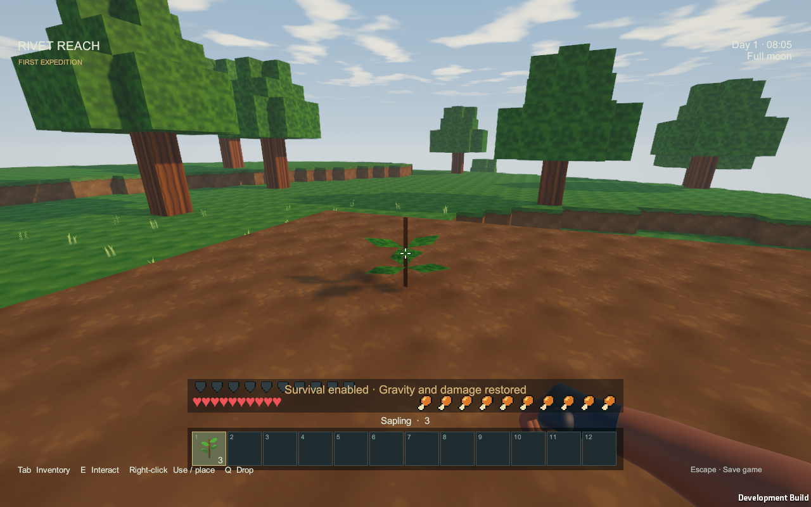
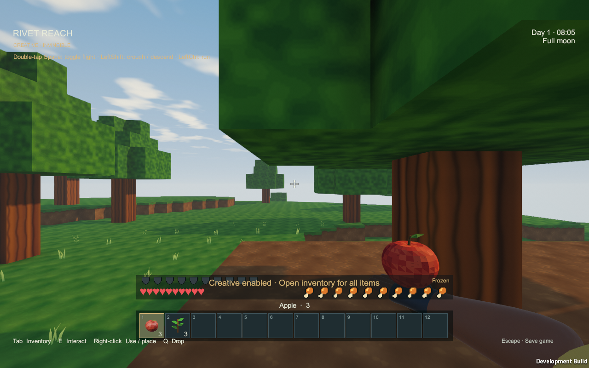
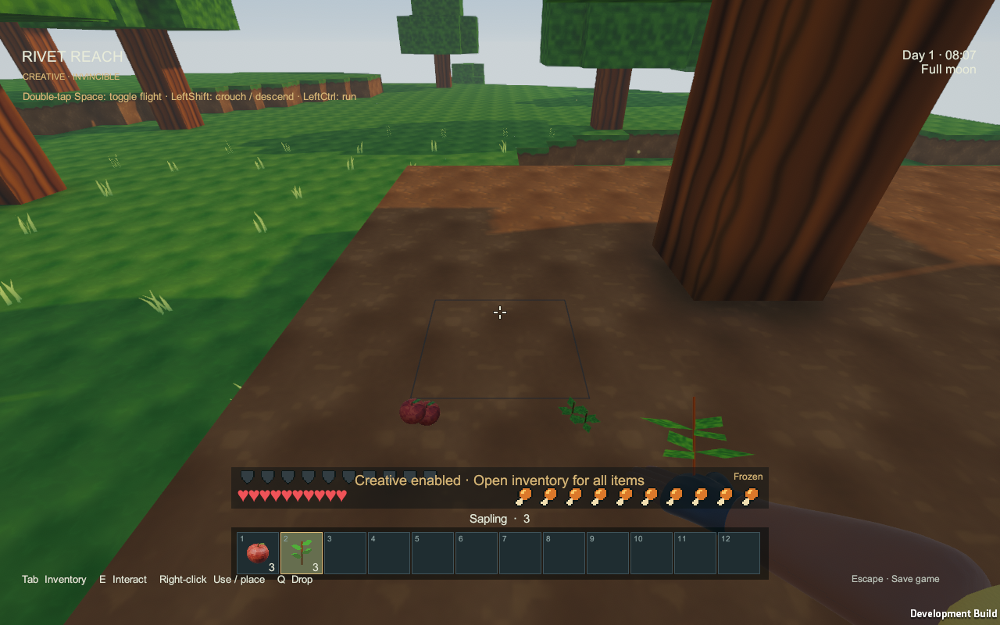
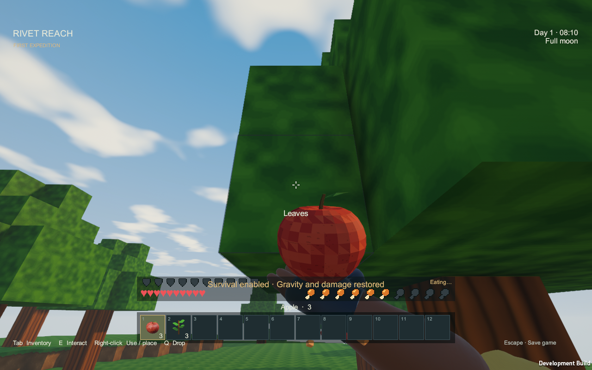

# Saplings and apples verification

The 2026-09-12 [sapling/apple extension](../GAMEPLAY.md#saplings-and-apples) is implemented and verified in **`Builds/Orchard/RivetReach.exe`**, Unity **6000.4.4f1 / URP 17.4.0**. The [artifact manifest](orchard-2026-09-12/artifact.json) records executable/assembly hashes and the source snapshot. This focused build includes the concurrent committed food, station and hand-crank work, plus the wooden-door source present during verification; this report makes no new door acceptance claim.

## Measured checks

| Check | Result and evidence |
|---|---|
| Windows development build | **Succeeded**, zero errors/warnings, 38.02 seconds for the final cached build. [Build result](orchard-2026-09-12/build.txt). The first isolated import/shader compilation took longer and is not represented by that incremental timing. |
| Orchard import and core | Apple: **782 triangles**, one mesh/material, upright bounds about 0.88 × 0.86 × 0.88 authored units; normals, UVs and palette validated. Across 100,000 independent leaf samples: **4,949 saplings**, **2,062 apples**, 104 both. Full-hunger/one-apple transactions and pass-through sapling meshing passed. [Checks](orchard-2026-09-12/orchard-checks.txt). |
| Existing domain, survival and fluids | **92,354 domain assertions**, **47,706 survival assertions**, **52 fluid checks** passed, covering terrain/halos, trees, ore/bedrock, inventory, crafting, furnaces, hunger/equipment, buckets, water renewal and streaming. [Domain](orchard-2026-09-12/domain-checks.txt), [survival](orchard-2026-09-12/survival-checks.txt), [fluids](orchard-2026-09-12/fluid-checks.txt). |
| Native orchard gameplay | **189 checks passed**, zero reported runtime errors. Real Use placement consumes one sapling; Creative retains it. Early growth, darkness, construction and player occupancy defer safely. Regrown trees, deadlines and leaf sequence round-trip exactly. Manually mining 86 natural leaves produced both new item types; chopping 20 trees then advancing decay produced 54 saplings and 21 apples in the fixed fixture. Placed-leaf repetition and stale removals generate no bonus duplicates. Replacement building wood remains protected; soil removal and water return one sapling. Held/dropped meshes and icons render; interrupted eating consumes nothing and a completed Use hold consumes one apple for four food points. [Runtime report](orchard-2026-09-12/runtime-report.json). |
| Actual previous saves | **16 checks passed** using two retained, pre-existing **schema-2** checkpoints: a pre-crank death checkpoint and a hand-crank checkpoint. Both load, migrate to new schema-3 slots and round-trip every serialized field. Changing an older item definition still rejects. [Migration report](orchard-2026-09-12/legacy-report.json), [fixture identities](orchard-2026-09-12/legacy-fixtures/fixtures.json). |
| Full persistence regression | **183 checks plus 5 fresh-process checks passed**: all-state round-trip, stations/crops, armor, mobs, fluid quantities, battery energy, queues, corruption/truncation rejection, rollback, previous-checkpoint recovery, distant coordinates and Continue after restarting the executable. [Save report](orchard-2026-09-12/save-report.json), [restart report](orchard-2026-09-12/restart-report.json). |

The native growth fixture advances the real scheduler by explicit fixed ticks to exercise the 180-second boundary; it does not wait three wall-clock minutes. Native input is used for planting and eating. No large-orchard frame-time claim follows from these focused checks. The older tree-art review retains its original dated evidence; its log-conservation counters now exclude the new leaf bonuses.

## Actual source and runtime review

The [Blender source render](../../ArtSource/Orchard/apple-review.png) was inspected, followed by the actual Unity import and these native screenshots. The apple retains its red faceted body, stem and green leaf in the held/dropped presentations. Saplings show their small stem and leafy shoots as part of the terrain mesh. Eating raises the apple in the existing hand pose. Artistic acceptance and drop/growth balance remain for user play review.

[Inventory screenshot](orchard-2026-09-12/orchard-inventory.png).

## Reproduction and remaining limits

Use `RivetReach.Editor.OrchardBuild.Run` in the pinned Editor, then `Tools/Verify-Orchard.ps1`. `Tools/Verify-Saves.ps1 -Executable <path>` runs the full save/restart suite. Builds in this report used an isolated project, preserving the user's open Editor.

One generic sapling grows broadleaf trees; geometric skylight follows existing crop rules. Growth requires the entire footprint to be resident. Distant deadlines can pass while the world runs, with growth deferred until return; pausing/quitting grants no progress. Species-specific seeds, fertilizer and full voxel light propagation are outside this change. Schema 1 retains the existing legacy reader path; the actual migration fixtures tested here are schema 2. New schema-3 checkpoints require the newer executable.
