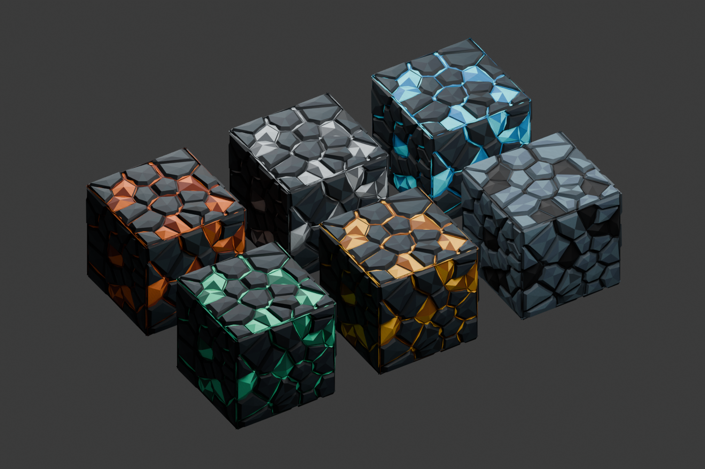

# Ore material variants and shared geometry — 2026-09-11

The user accepted the Azure texture and requested reuse across the other ores, with attention to resource/rendering costs during exploration and factory building. [The content contract](../CONTENT_PIPELINE.md#shared-ore-art-and-rendering--2026-09-11) owns authoring and runtime reuse. The approved [Azure geometry](../../ArtSource/Industry/azure-ore-geometry.json) remains unchanged at **4,129 triangles**.

## Actual art

[create_ore_variants.py](../../Tools/create_ore_variants.py) reads the existing Azure source, changes palette materials, and renders five 256-pixel icons plus five 64-pixel terrain faces. [OreVariants.blend](../../ArtSource/Industry/OreVariants.blend) contains six linked objects with one mesh datablock and object-level material assignments. No additional FBX or Unity mesh was created. Iron is silver-grey, copper orange, coal black in lighter host rock, gold golden, and diamond green-tinted turquoise. Azure keeps its prior appearance and remains the only self-emissive terrain ore.

Actual Unity material and held views were reviewed against this source. Ore items use the shared detailed mesh; terrain uses the matching flat face texture in the existing chunk mesh. Mining/drop rules, generation bands, raw-resource items and saved identities are unchanged. Byte comparisons found changes only in terrain colour/detail layers **7–11**, leaving Azure layer 44 and other terrain intact.

## Verification and workload

Local review build: `Builds/OreVariants/RivetReach.exe`, Unity **6000.4.4f1**. Write `ore-art-build` to `Logs/build-request.txt` in the existing Editor; this prepares materials and terrain, runs industry checks, exports the real UI icons/catalog and builds the player. The user's open scene is preserved.

Run `-rr-verify -rr-ore-variants-review -rr-output <absolute-output-folder>` to reproduce the focused runtime check. This explicit fixture creates six model/terrain pairs above a seeded world, then 256 small ore props, then switches the actual held object through all six ore types. It does not grant items or create fixtures in ordinary play.

- [Build result](ore-variants/build.txt): zero errors and warnings.
- [Industry checks](ore-variants/industry-checks.txt): 324 assertions.
- [Runtime report](ore-variants/runtime-report.json): 309 assertions, no errors. Covers shared material/palette references, mesh identity for all variants and 256 instances, held object reuse and correct palette selection, preserved raw drops, and terrain meshing counts.
- A uniform **32³ = 32,768-cell ore chunk** with air around it produces **12 exterior triangles**. The same ore volume surrounded by opaque rock produces **zero visible triangles**. Those counts exercise the existing greedy mesher, not a new per-ore optimization.
- [Sharing and timing measurements](ore-variants/ore-sharing.txt): one mesh reference across 256 objects and six shared world materials. Unity reports **917,326 runtime bytes** for that mesh, with **9,028 imported vertices**. This is Unity's object memory report, not a GPU-memory measurement or total scene memory.

[Iron held](ore-variants/ore-held-9.png) · [Copper held](ore-variants/ore-held-10.png) · [Coal held](ore-variants/ore-held-11.png) · [Gold held](ore-variants/ore-held-12.png) · [Diamond held](ore-variants/ore-held-13.png) · [Inventory](ore-variants/ore-variants-inventory.png)

## What these savings do and do not establish

`OreVisuals` caches the loaded prefab, palettes and shared world materials. Instances reference the same mesh; each instance still has its transform and renderer. The first-person view retains its own single material for depth handling and changes its palette while retaining the same held object. No per-instance mesh or world material copy is needed. Existing raw-resource drop presentation stays distinct.

The detailed 256-prop fixture can submit up to **1,057,024 triangles** before culling, excluding shadow passes, despite sharing one mesh. Mesh sharing saves resource memory; it does not eliminate drawing each visible instance. Materials have instancing enabled, but this run does not claim one instanced draw or record a verified draw-call count. Unity distinguishes [shared mesh assets](https://docs.unity3d.com/6000.4/Documentation/ScriptReference/MeshFilter-sharedMesh.html) from [GPU instancing](https://docs.unity3d.com/6000.4/Documentation/Manual/GPUInstancing.html), with render-pipeline compatibility and workload-dependent benefits.

The final timing sample removes the normal 90 fps cap and uses two three-second samples at 1280×720 on an RTX 2060/i7-10750H: the streamed world without props, then the same view with 256 props. These are short whole-frame timings, not isolated CPU/GPU timings, a sustained exploration test, or a large mixed-factory benchmark. Clock/streaming/GC work can affect the comparison. A prior capped sample was discarded because it hid the available rendering margin.

| Uncapped sample | Median frame time | 95th percentile |
|---|---|---|
| Streamed world, no review props | 3.884 ms | 5.599 ms |
| Same view, 256 shared ore props | 5.349 ms | 6.912 ms |

The measured median difference is **1.465 ms** for this workload; shared resource memory does not remove rendering work.

For a large factory, the next profiling decision should use a representative mixture of active machines, animated parts, shadows, transparent tanks and chunk streaming. Distance LODs, instanced submissions or view pooling are candidates only after identifying the measured bottleneck. Shared ore resources, chunk surface reduction and the existing view/simulation ranges preserve those options without changing gameplay scope.

## Wiki

The five new icons are exported by Unity's actual item UI and used by the item catalog and ore pages. The publisher's content-versioned image URLs refresh the artwork without stale cached icons. Azure's wiki icon is unchanged. Current generated source/link checks cover 136 pages and 5,407 local links/images.

## Small refinement experiment — 2026-09-11, 18:38 UTC

The user requested small refinements to the measured frame time. **No reliable gain was found in the tested mesh-order refinement, so the production mesh and renderer remain unchanged.** This does not establish that every possible small optimization has been exhausted.

The normalized mesh has 9,028 distinct complete vertex records (position, normal, tangent and UV); exact duplicate removal offers no reduction. A diagnostic-only clone then exercised Unity's [Mesh.Optimize](https://docs.unity3d.com/6000.4/Documentation/ScriptReference/Mesh.Optimize.html), which reorders indices/vertices for vertex-cache use without reducing geometry. All 256 props alternated between the shared original and shared clone in one player/process/camera. Materials, shadows, resolution and geometry counts stayed the same. The clone is destroyed afterward and never replaces the authored asset.

[Raw timings](ore-refinement/ore-mesh-order.txt), in execution order:

| Sample | Original median / p95 | Reordered median / p95 |
|---|---|---|
| A then B | 4.828 / 6.170 ms | 5.037 / 6.555 ms |
| B then A | 5.411 / 6.935 ms | 5.387 / 6.565 ms |
| A then B | 5.403 / 6.773 ms | 5.595 / 6.949 ms |

Each sample settles for one second and measures five seconds uncapped. The changing timings show background/thermal/scene variation; this is a bounded whole-frame experiment, not an isolated GPU benchmark. The reordered mesh was only 0.024 ms faster in the middle pair and slower in the other two, which gives no basis for shipping it as a frame-time improvement. Both actual Unity captures were visually inspected. The earlier 5.349 ms result remains a dated sample from its original build, not a universal baseline to subtract from this run.

Reproduction: request `ore-refinement-build` through `Logs/build-request.txt`, then launch `Builds/OreRefinement/RivetReach.exe` at 1280×720 with `-rr-verify -rr-ore-variants-review -rr-ore-refinement-review -rr-output <absolute-folder>`. The [build](ore-refinement/build.txt) has zero errors/warnings; the [runtime report](ore-refinement/runtime-report.json) passes 310 assertions. This build includes committed crafting changes through `f8ac9f2`, so it is not byte-identical to the earlier ore build. Ordinary play has no added optimisation work or test fixture. Future experiments can assess distant detail or shadow cost, with explicit visual comparison; no such quality tradeoff was introduced here.
