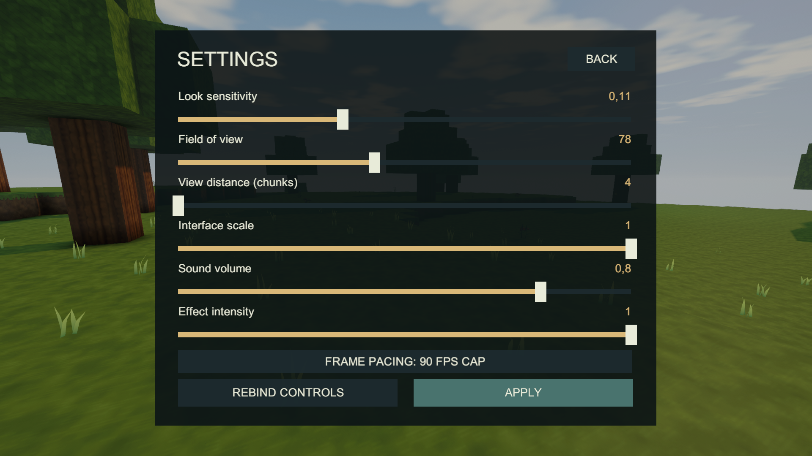
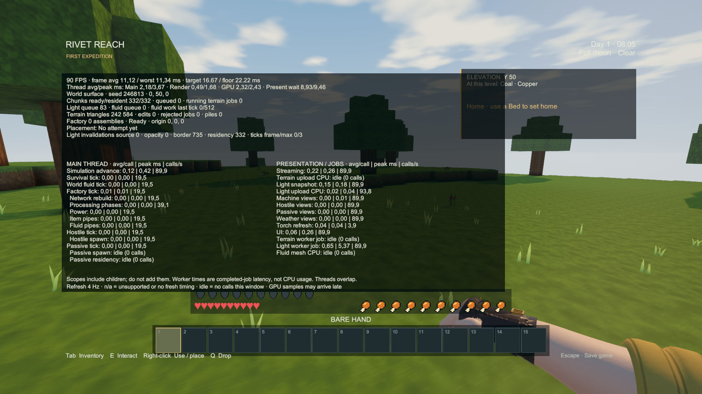

# Performance plan implementation — October 3, 2026

The user authorized reviewing and implementing [the October 3 plan](../PERFORMANCE_PLAN.md). Its main targets are reasonable: repeated resident-world lookups, fruitless ranged-pump scans, fluid scheduling allocations, factory lookup budgets, repeated presentation work and save-catalog construction. The current implementation covers the first tranche before the plan's deferred measurement gate. **The first tranche is implemented and functionally verified. No new FPS gain or release-performance acceptance is claimed.**

## Implemented scope

| Plan items | Result |
| --- | --- |
| A1 | Separate source, opacity, border and residency lighting-invalidation counters; last/max factory ticks per rendered frame; expanded four-Hz diagnostics header. Counters count requests, including requests ignored at nonresident boundaries. |
| B1, B3a | Disable the unused pipeline opaque texture and explicitly disable portrait scene colour/depth copies and post-processing. Shadows, SSAO, anti-aliasing, portrait refresh rate and view distance retain their settings. |
| B4 | Disable the unused built-in physics simulation while the expedition owns it, restoring the prior mode on teardown. Voxel movement/collision remain authoritative. |
| B5 | Persisted 90 FPS, display sync, 60 FPS and 120 FPS choices. Default remains 90; valid `-rr-frame-limit` still overrides preferences. |
| C1 | At most three survival/industry ticks per rendered frame. Retain the entire backlog and existing serialized fraction; never discard ticks. Catch-up can span frames. |
| D1–D3 | Exact resident liquid-source counts and empty-reach pump shortcut; versioned scheduler activity cache; per-machine generation budget shared across grids. |
| E1–E4, E8–E9 | Arithmetic chunk addressing, resident-first reads and single-read collision/selection, immutable block-trait tables, direct light-column invalidation, iterator-free point tree queries, pooled fluid deadline queues with a min-heap. Fluid serialization still sorts due ticks. |
| F1, F2a/b, F5 | Old/new block notification filters bed/station refreshes; chicken tint updates only on change, ordinary white tint uses the shared material, imported clips are cached; distant-view native property reads are hoisted. |
| G1–G3 | Once-per-frame mouse preference reads with explicit settings invalidation; crate text changes only when its displayed values change; cable-grid UI lookup follows topology identity/revision. |
| H1–H2 | Constructor-local fingerprint memoization and metadata-only save-list caching. Every actual load still validates the complete save; writes invalidate current/backup entries and failures are never cached. |
| J1, J2a/b/c, J5, J8 | Remove independently checked unused members, centralize machine body/connection decisions and placement body checks, remove the duplicate weather-flash writer, add incremental C# formatting guidance and ignore `/output/`. Existing local builds/evidence are preserved. |

No item definition, recipe, generation version or save schema changes. `RR_VALIDATE_WORLD` adds resident/edit and source-count assertions to the functional verification player; that player is unsuitable for paired performance acceptance measurements.

## Review corrections and remaining work

- **C2 is not safe as drafted.** At 60 FPS the initial offsets can separate ordinary single ticks, but a hitch produces multiple due groups in the same frame. The proposed “never share a frame, including hitches” check cannot pass. Realigning on load also overwrites the independently saved fluid/grass/item remainders and can discard backlog. The current implementation retains their saved timing and ordering. A future dispatcher must preserve those authorities and specify cross-system ordering before this change is accepted.
- **A2 remains deferred by the user.** The plan places E5 (more terrain workers), B6 (IL2CPP adoption), I1 (near-machine merging) and the remaining P2 work after this gate. More logical CPU threads are not free cores; adopting additional workers on this busy machine without the paired streaming test would be unsupported.
- **Visual/gameplay decisions remain unchanged:** B2, B3b/c, D7 and I4 require their specified measurements and review. Lamp light still follows the immediate gameplay rule.
- **Further sketches are not implemented:** D4–D6, E6–E7, E10–E11, F2c/d, F3–F4, F6–F8, H3–H4, I2–I3 and J2d/J3/J6/J7. Their equivalence, shader, lifecycle or architectural work remains explicit follow-up scope after the measurement gate; none is represented here as complete.
- **J4 already has a shared native runner:** `Tools/Verify-ReleaseReview.ps1` accepts a player executable, isolated evidence/save directories and the relevant scenario set. This task adds the focused performance-plan and starter-station cases to it. A second runner or broad verification-assembly migration is unnecessary for this tranche; the larger dispatch refactor remains unimplemented.
- **The original gate inventory was stale.** `DomainChecks` already calls terrain and survival checks. The direct release gate now also runs this task's differential checks and the existing guidance/slab suite. The existing tag contract omitted the already implemented `IHalfBlock` mapping; it now checks all 26 explicit mappings and exact membership rather than weakening the assertion.
- **The older mob runner expected eating through a creature target.** Its [initial run](performance-plan-2026-10-03/prior-mob-run/mob-runtime-report.json) failed after 153 checks. `FirstPersonPlayer.TargetAndMine` is unchanged from `e293b1e` and already gives the shared nearest entity ownership of Use, as specified by [the targeting contract](../GAMEPLAY.md#alpha-playtest-interactions--2026-09-19). The runner now checks creature priority, eating when aiming away and cancellation on retargeting. No gameplay behavior was changed to satisfy this test.
- **Shader reference assets are not production assets.** Generate them in an isolated project using `Tools/prepare_shader_comparison.py ... --reference e293b1e`. The working directory has unrelated pre-existing asset changes, so final native rendering evidence uses the committed assets plus this task's owned source changes.
- **Save-list metadata has a stated limit:** an external replacement preserving both byte length and modification time may retain stale menu metadata. Loading still reads and validates the file, including slot identity and checksum.

## Verification record

The [golden reference](performance-plan-2026-10-03/reference.txt) was captured from `e293b1e` before these runtime changes. It records all 256 block traits, all five current/historical fingerprint sets, and terrain point hashes across four generator versions and three seeds. It is never regenerated by an ordinary check or build.

`PerformanceEquivalenceChecks` compares pump shortcut on/off state, scheduler cache/direct lookup, every fluid read/transaction and exact serialized queue/frontier bytes against a frozen pre-change implementation, negative/extreme coordinates, saved tick backlog, resident source recounts, shape-aware collision/selection, frame preferences and save-list invalidation. These are behavior and compatibility checks, not speed measurements.

### Domain, compatibility and rendering checks

- **52/52 Editor suites passed** in the [release gate](performance-plan-2026-10-03/domain-summary.txt), covering resource allocation, durability, recipes, legacy saves, generation, world lighting, fluids, creatures and the existing guidance/slab increment.
- The final [differential check](performance-plan-2026-10-03/equivalence.txt) passed **182,642 assertions**. This includes same-length save replacement with a changed timestamp, filename identity validation, deletion and restoration. The final Editor-only fixture explicitly releases its inactive world's lighting subscription.
- All **34 shader comparisons passed with zero changed pixels**, against the pre-change shaders from `e293b1e`. [Results](performance-plan-2026-10-03/shader-equivalence.txt) and [reference input manifest](performance-plan-2026-10-03/shader-reference.json) identify the four shaders and staged material variants. This tests shader output, not whole-game frame rate or pixel equality of every game camera.
- Both the [assertion-enabled build](performance-plan-2026-10-03/build-summary.txt) and [ordinary player](performance-plan-2026-10-03/player-build-summary.txt) built with **zero errors and zero warnings**, using Unity 6000.4.4f1, Windows x64, D3D11, Mono and non-Development settings.

### Build identity and reproduction

The final runtime implementation is `9f7ed76`. The working project contained unrelated terrain-art and other asset changes before this task. Verification used an isolated checkout of `e293b1e` plus the owned performance changes and committed assets. Those pre-existing edits were preserved and excluded from the delivered player, catalog and commits. The catalog's item/recipe data and all **197 icons** remain unchanged; only source fingerprints changed.

`ProjectBuild.BuildPerformancePlan` runs the shader and domain gates, creates `Builds/PerformancePlan/RivetReach.exe` with `RR_VALIDATE_WORLD`, and exports the wiki. First stage the reference shaders in that isolated project with `Tools/prepare_shader_comparison.py <isolated-project> --reference e293b1e`. They are temporary comparison resources, never repository production assets. [Validation source hashes](performance-plan-2026-10-03/validation-source-hashes.json) record its runtime inputs.

`ProjectBuild.BuildPerformancePlayer` creates the ordinary **`Builds/PerformancePlanPlayer/RivetReach.exe`**, reruns the differential gate and exports the catalog. It refuses a project containing the temporary shader references; move those out of `Assets` first. The ordinary player has no extra resident assertions. Its [artifact manifest](performance-plan-2026-10-03/player-artifact.json) records the assembly, resources, pipeline and exported-catalog hashes. It was copied, with its complete data/runtime, into the main workspace at that path.

Visual review found the initial frame-pacing button overlapping the effect-intensity slider handle. The ordinary player's final changes move the button/action row down and add a native non-overlap assertion. The assertion-enabled gameplay runs therefore have their own earlier assembly identity; their results are not presented as if that UI correction had already been built. The simulation and rendering optimization code is the same in both builds.

The final ordinary rebuild changes only the verification scenarios after the [weather/Floater artifact](performance-plan-2026-10-03/player-regression-artifact.json): the mob runner follows the existing shared target rule, and the small-scale UI check now drives the actual interface-scale slider. The mob and both UI-resolution checks are rerun on that final artifact; weather and the separate Floater report retain their earlier identity.

### Native functional verification

**22 retained native runs passed, totaling 3,156 assertions.** [Machine-readable summary](performance-plan-2026-10-03/native-summary.json) and the individual reports below identify the actual checks and timestamps. The first run was the ordinary empty-handed Survival route: gathering, a crafted/placed Workbench, a wooden pickaxe and 312 seconds of exploration, ending alive at 14 food / 20 health.

Validation uses the assertion-enabled [artifact identity](performance-plan-2026-10-03/native/build-identity.json). Final player UI/mob checks use [the delivered artifact](performance-plan-2026-10-03/player-artifact.json); weather and the separate Floater run use [the preceding ordinary artifact](performance-plan-2026-10-03/player-regression-artifact.json), differing only in the final verification-scenario corrections.

| Scenario | Artifact | Passed assertions |
| --- | --- | ---: |
| [alpha-survival](performance-plan-2026-10-03/native/alpha-survival/runtime-report.json) | validation | 7 |
| [bed](performance-plan-2026-10-03/native/bed/runtime-report.json) | validation | 237 |
| [chicken](performance-plan-2026-10-03/native/chicken/runtime-report.json) | validation | 321 |
| [connections](performance-plan-2026-10-03/native/connections/runtime-report.json) | validation | 408 |
| [crates](performance-plan-2026-10-03/native/crates/runtime-report.json) | validation | 137 |
| [fluid](performance-plan-2026-10-03/native/fluid/runtime-report.json) | validation | 36 |
| [industry](performance-plan-2026-10-03/native/industry/runtime-report.json) | validation | 89 |
| [interaction](performance-plan-2026-10-03/native/interaction/runtime-report.json) | validation | 88 |
| [inventory](performance-plan-2026-10-03/native/inventory/runtime-report.json) | validation | 107 |
| [lava](performance-plan-2026-10-03/native/lava/runtime-report.json) | validation | 28 |
| [lighting](performance-plan-2026-10-03/native/lighting/runtime-report.json) | validation | 722 |
| [ranged-pump](performance-plan-2026-10-03/native/ranged-pump/runtime-report.json) | validation | 140 |
| [release-legacy](performance-plan-2026-10-03/native/release-legacy/runtime-report.json) | validation | 87 |
| [renewables](performance-plan-2026-10-03/native/renewables/runtime-report.json) | validation | 147 |
| [save](performance-plan-2026-10-03/native/save/runtime-report.json) | validation | 183 |
| [save-resume](performance-plan-2026-10-03/native/save-resume/runtime-report.json) | validation | 5 |
| [starter-stations](performance-plan-2026-10-03/native/starter-stations/runtime-report.json) | validation | 47 |
| [player-1080p](performance-plan-2026-10-03/player-1080p/runtime-report.json) | final player | 19 |
| [player-720p](performance-plan-2026-10-03/player-720p/runtime-report.json) | final player | 19 |
| [player-mobs](performance-plan-2026-10-03/player-mobs/mob-runtime-report.json) | final player | 168 |
| [player-weather](performance-plan-2026-10-03/player-weather/runtime-report.json) | player regression | 73 |
| [player-floater](performance-plan-2026-10-03/player-floater/mob-runtime-report.json) | player regression | 88 |

No resident/edit or source-count assertion failed during the validation-player routes. Native reports can contain incidental timing fields; these functional runs are **not A2**, a paired benchmark or a 60/45 FPS acceptance result.

### Reviewed captures

Actual Windows captures, October 3, 2026. Settings were reviewed at 1920×1080 and 1280×720; the reduced interface scale was exercised through its actual slider in the final UI run. All four model/skin portraits were inspected. The initial overlapping settings image was replaced.

Further focused evidence: [720p settings at 0.85](performance-plan-2026-10-03/player-720p/settings-scale085.png), [male skin 0](performance-plan-2026-10-03/player-1080p/portrait-male-0.png), [male skin 1](performance-plan-2026-10-03/player-1080p/portrait-male-1.png), [female skin 0](performance-plan-2026-10-03/player-1080p/portrait-female-0.png), [female skin 1](performance-plan-2026-10-03/player-1080p/portrait-female-1.png), [chickens and chick](performance-plan-2026-10-03/captures/chickens-adult-and-chick.png), [feeding](performance-plan-2026-10-03/captures/chickens-feeding.png), [operating workshop](performance-plan-2026-10-03/captures/industry-workshop-running.png), [40 L pump destination](performance-plan-2026-10-03/captures/ranged-pump-destination.png), [placed bed](performance-plan-2026-10-03/captures/bed-placed.png) and [Survival Workbench](performance-plan-2026-10-03/captures/survival-workbench.png). These validate the affected paths and presentation; they are not a full-game artistic review.

### Wiki and remaining limits

The [player guide](../wiki/Performance-diagnostics.md) explains all four saved frame-pacing choices and the new diagnostic counters with final-player captures. The fresh Unity export retains 197 item pages, 201 recipes and unchanged icons. `python3 Tools/publish_wiki.py --check` [passed](performance-plan-2026-10-03/wiki-check.txt) for **239 pages and 10,099 local links/images** in the isolated checkout. The main workspace check still detects its pre-existing `BlockTiles.asset` change; that unrelated art was deliberately excluded from this export and publication.

The live wiki matched the committed source before publication. [Publication from `8c79134`](https://github.com/Starbugstone/Rivet-Reach/actions/runs/37083312996) succeeded, producing wiki commit `b2a14fc`. All 625 published pages/assets match the maintained sources. [Live browser verification](performance-plan-2026-10-03/wiki-live.json) confirmed the new frame-pacing text, both current 1920×1080 images loaded and visibly laid out, and no horizontal page overflow at 1280×800. The browser screenshot tool failed on repeated attempts; no live-page screenshot is claimed. The game captures were inspected before publication and their published bytes match exactly.

Renewed FPS measurement, thermal attribution, tuning decisions and the later plan groups listed above remain deferred. Historical September measurements keep their original artifact identities; these checks do not transfer their numbers onto the October build.
