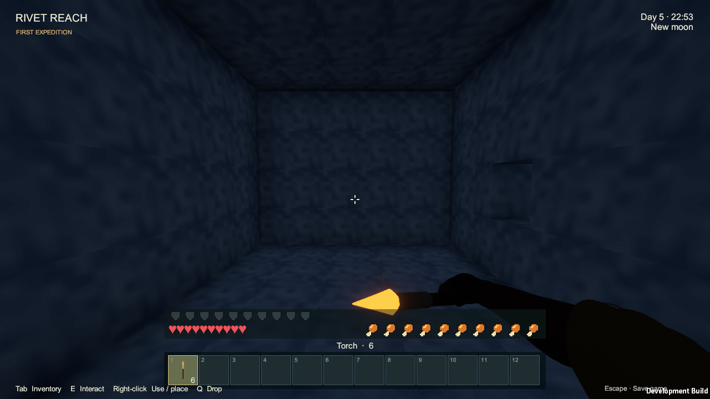
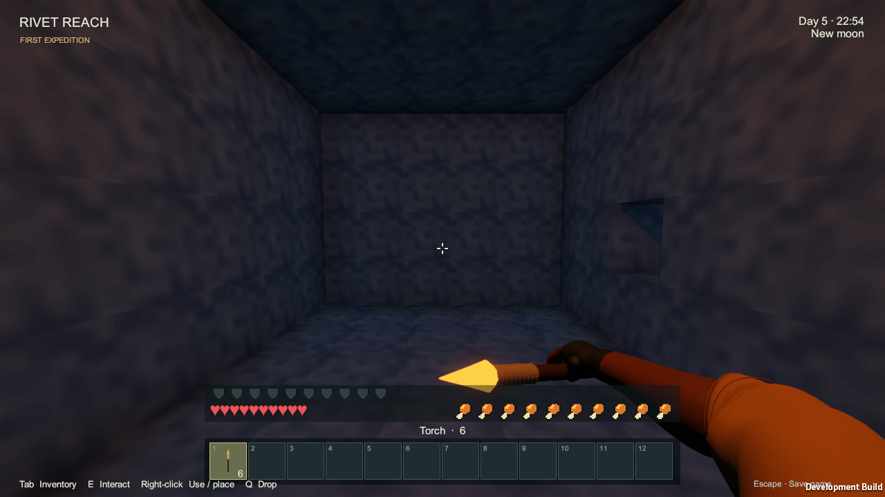

# Torch verification — 2026-09-12

Artifact: `Builds/Torches/RivetReach.exe`, Windows x64 Development player, Unity **6000.4.4f1 / URP 17.4.0**, Direct3D 12. Runtime gameplay assembly SHA-256: `f38369754cca516db77b2c5ab65de47ca5de020890eb79d4d3f58dcc509ace47`.

`Tools/Verify-Torches.ps1 -Build -OutputDirectory Logs/HeldTorchesVerification` completed **2026-09-12T12:24:19.8228625Z**, **PASS: 41 assertions**, with no runtime errors/exceptions at 1280×720 on an Intel i7-10750H / NVIDIA RTX 2060. [Raw report](torches/runtime-2026-09-12.json).

The [final build](torches/build-summary.txt) succeeded with **0 errors and 1 warning**: Unity reported concurrent uncompiled changes could leave Editor post-processing/import code out of this build. [Exact warning](torches/build-messages.txt). This task changes runtime presentation and its scenario, both exercised in the resulting player. The workspace also contained concurrent station/pipe work; this report verifies the identified torch artifact, not all concurrent changes.

## Measured checks

- A selected torch activates one reusable warm, shadowed ten-block point light without any placed lights. Selecting an empty slot or another item turns it off; reselecting the torch reuses that light.
- Inventory and pause retain light with the hands hidden. The light follows player movement. Emptying the selected stack or returning to the title turns it off, and illumination consumes no items.
- In the roofed room, the same central terrain patch increases from **0.1028 to 0.1201** mean grayscale with the held light enabled (about **17%**). The hands and flame remain present in both control captures; mining particles expire before capture. The acceptance check requires at least 0.01 absolute and 10% relative increase for one carried source, farther from the rear wall than the two placed fixtures.
- Existing coal/charcoal-over-stick recipes, four-torch outputs, floor/wall placement, rejected ceiling/wet placement, targeting and non-solid geometry pass. The two placed lights raise the same terrain patch from **0.1140 to 0.2577**.
- Mining, removed supports and flowing water each recover one placed torch and remove its attachment/light. Placed torches survive a 640-block residency/origin-shift round trip. Dense placement retains the eight-light pool.
- Build prerequisites passed [world/domain checks](torches/domain-checks.txt) and [fluid checks](torches/fluid-checks.txt). These retain their raw assertion counts and workload descriptions.

## Rendered evidence

| Held light disabled for comparison | Selected torch lighting the room |
| --- | --- |
|  |  |

[Placed lighting disabled](torches/torches-unlit-2026-09-12.png) and [two placed lights enabled](torches/torches-lit-2026-09-12.png) preserve the independent placed-torch control.

## Remaining limits

[Gameplay rules](../GAMEPLAY.md#torches) own the light budgets and selection behavior. This is a pixel comparison, not a physical illumination or frame-time benchmark. Dense held-plus-placed lighting, both avatars in inspection/crouching, and the wall-clipping clamp still need focused visual review. The raw report's unused performance counters are not measurements. Dropped/unselected torches remain unlit; artificial light does not change crop or mob rules. No persistence schema changes were made; [save verification](SAVE_RESULTS.md) retains its own artifact identity.

The Torch wiki page matches its generator using the checked-in catalog and current notes. Full catalog freshness was blocked by concurrent code edits during this task; no unrelated item catalog was regenerated here. Superseded torch reports and captures remain in Git history.
