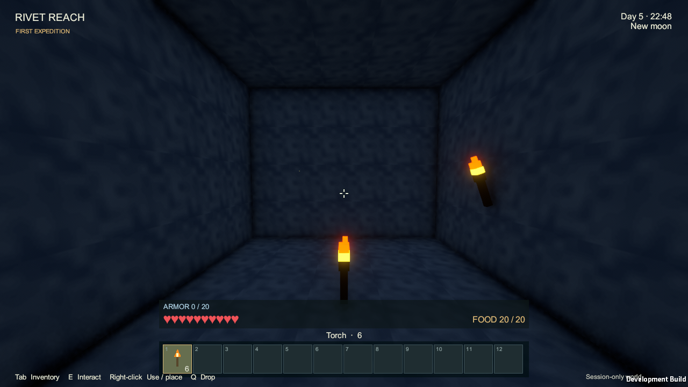
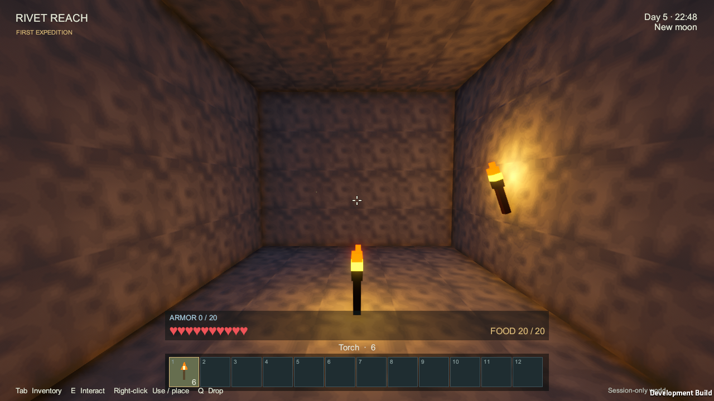

# Torch verification — 2026-09-10

Artifact: `Builds/Torches/RivetReach.exe`, Windows x64 Development player, Unity **6000.4.4f1 / URP 17.4.0**. The final [build](torches/build-summary.txt) completed with **0 errors and 0 warnings**. Runtime gameplay assembly SHA-256: `19362c6291f735651ec74b3ac00a7f6c33b46d2237871b5b29ca0940c24b6922`.

Run `Tools/Verify-Torches.ps1 -Build` with the pinned project Editor open. The focused player scenario finished **2026-09-10T07:54:57.4700190Z**, **PASS: 29 assertions**, no logged errors/exceptions or Unity warnings, at 1280×720 on an Intel i7-10750H / NVIDIA RTX 2060. [Raw runtime report](torches/runtime-2026-09-10.json).

Measured coverage:

- Coal/stick and charcoal/stick each consume one of each ingredient and produce four torches in the personal grid; reversed arrangements reject. Normal sessions still start empty-handed.
- Actual session placement authority consumes one item for a floor or wall torch; ceiling/wet-cell attachment rejects. Torches remain targetable and do not become solid or opaque.
- Two placed torches activate shadowed point lights. A fixed camera in the same roofed stone room was captured with the point lights disabled and enabled, leaving the torch geometry present in both. Mean rendered grayscale in the central half-width/middle-third-height patch rises from **0.1123 to 0.2568**. This is a screen-pixel comparison, not a physical light-level or frame-time benchmark.
- Mining, support removal and falling water each recover exactly one torch and clear its attachment/light. Moving 640 blocks away unloads the fixture and removes its light; returning restores the same torch, attachment and correctly positioned light after floating-origin shifts.
- Dense placement retains the fixed pool of eight lights. The final screenshots were visually inspected for the flame, floor/wall placement, local illumination and UI icon.

Build-time checks also passed:

| Suite | Result |
| --- | --- |
| [Independent starter recipes](torches/starter-recipe-checks.txt) | 1,862 acceptance checks covering all 55 recipes, exact ingredients/outputs and translations across fitting 2×2/3×3/4×4 grids |
| [Crafting engine](torches/crafting-checks.txt) | 1,158,133 assertions |
| [World/domain](torches/domain-checks.txt) | 92,297 assertions |
| [Survival](torches/survival-checks.txt) | 47,267 assertions, including the extended recipe dependency graph |
| [Fluids](torches/fluid-checks.txt) | 52 checks, including dry-torch preservation and horizontal/falling water displacement |

## Actual Unity captures

The light-disabled capture is a verification control; ordinary placed torches stay lit.

## Remaining limits

[Gameplay rules](../GAMEPLAY.md#torches) own the current light-selection bounds: the eight nearest torches within 24 blocks of the observer receive ten-block-range lights, and geometry is displayed within 48 blocks. This focused test does not establish long-session frame cost, final brightness/art acceptance, or exact voxel light propagation. Grass/crops and mob spawning retain their existing light/clock rules. Held and dropped torches do not illuminate the world. The scenario calls placement/crafting authorities directly; existing mouse-binding and recipe-browser UI checks retain their earlier artifact identity. The raw report's unused frame/geometry counters are zero and must not be treated as measurements. Durable saves remain future scope.
