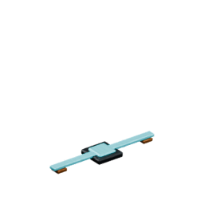
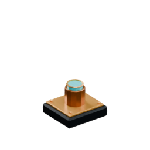
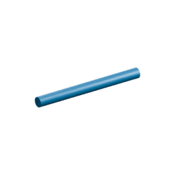
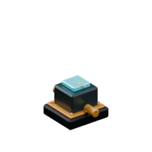

# Control machines with Blue Signal

Blue Signal is Rivet Reach's **ON / OFF automation network**. Use it to switch machines, pulse controls, show a status light, automate tank valves and react to tank fill levels.

> **Blue Signal carries instructions, not power.** Electricity, item transport, fluid transport and signal are separate channels. A signal can tell a machine to run, but it does not supply the electricity, items or fluid that machine needs.

## What Blue Signal looks like in-game

The machinery below is using Rivet Reach's real pipe/channel system. Fluid, power and Blue Signal can follow the same transport-pipe route, but each remains an independent network.


## Start here: make a simple signal circuit

The easiest first test is a **Lever → Signal Wire → Signal Indicator** circuit.

<table>
<tr>
<td align="center"><a href="Item-lever.md"></a><br><b>Lever</b><br>ON / OFF</td>
<td align="center">→</td>
<td align="center"><a href="Item-signal-wire.md"></a><br><b>Signal Wire</b><br>carries the state</td>
<td align="center">→</td>
<td align="center"><a href="Item-signal-indicator.md"></a><br><b>Signal Indicator</b><br>shows the state</td>
</tr>
</table>

1. Place a **Lever**.
2. Place a **Signal Indicator** nearby.
3. Join them with **Signal Wire**.
4. Use the Lever once: it stays **ON** until you use it again.
5. The Signal Indicator should follow the same state.

The Signal Indicator does **not** need electrical power. It is a simple visual signal output, which makes it useful for testing a circuit before connecting machinery.

If your route needs to turn vertically, use **Signal Conduit** instead of ordinary Signal Wire.

## The six Blue Signal parts

| In-game part | What it does |
|---|---|
| <a href="Item-signal-wire.md"></a><br>**Signal Wire** | Carries Blue Signal horizontally. Use it for simple flat runs. |
| <a href="Item-signal-conduit.md"></a><br>**Signal Conduit** | Carries Blue Signal through all six directions, so it can route vertically as well as horizontally. It is also the item consumed when fitting a signal channel to a transport pipe in Survival. |
| <a href="Item-signal-relay.md"></a><br>**Signal Relay** | Directional signal part: **rear input → front output**. The output changes one simulation tick after the input. |
| <a href="Item-lever.md"></a><br>**Lever** | Manual latched control. Use it once for ON and again for OFF. |
| <a href="Item-button.md"></a><br>**Button** | Manual momentary control. Sends an **ON pulse for one second**, then returns to OFF automatically. |
| <a href="Item-signal-indicator.md"></a><br>**Signal Indicator** | Visual output that shows the current signal state. It does not require electricity. |

## Control a machine

For a normal controllable machine, the pattern is:

**Control → Signal Wire / Conduit → machine's front signal input**

A **Pump, Crusher, Drill or Workshop Lamp** is allowed to operate with **no signal attached** when its other requirements are satisfied.

Once a signal is attached:

- **OFF** disables the machine.
- **ON** permits the machine to operate.
- Electricity is still supplied through the machine's separate power connection.

This means adding Blue Signal gives you control without making signal wiring mandatory for every basic machine.

### Lever or Button?

Use a **Lever** when you want the machine to remain enabled or disabled until you change it again.

Use a **Button** when you want a short trigger. Its signal lasts **one second**, so seeing it return to OFF immediately afterward is normal behaviour.

## Route signals in three dimensions

### Signal Wire

Signal Wire is the simple option for **horizontal runs**.

### Signal Conduit

Signal Conduit can connect through **all six directions**. Use it when a circuit needs to climb, drop or route through a more complex factory layout.

### Signal Relay

A Signal Relay is directional:

```text
REAR INPUT  →  RELAY  →  FRONT OUTPUT
                 +1 tick
```

Place it facing the direction you want the signal to travel. A state received at the rear appears at the front **one simulation tick later**.

That tiny delay is intentional, not lag or a broken connection.

## Put Blue Signal onto Item Pipes and Fluid Pipes

Item Pipes and Fluid Pipes can carry extra fitted channels alongside their normal transport route.

Open the pipe and choose:

- **FIT SIGNAL** to add a Blue Signal channel.
- **FIT POWER** to add an electrical channel.

In **Survival**:

- fitting signal consumes **1 Signal Conduit**;
- fitting power consumes **1 Power Cable**.

In **Creative**, fittings can be added without consuming inventory.

A pipe may have **both** fittings at the same time.

> A fitted pipe can visually share one route for fluid/items, Blue Signal and electricity, but the three channels remain completely independent. Plain Item Pipe and Fluid Pipe carry **neither signal nor electricity** until the corresponding fitting is installed.

Each fitted channel follows its own real connections, so adding or removing a transport branch does not magically connect unrelated signal or power networks.

## Automate a tank

Multiblock tanks add two Blue Signal components that behave differently from ordinary machines.

### Signal Valve Port

A **Tank Signal Valve Port** is fail-closed: it requires an attached **ON** signal before fluid can pass.

1. Configure the valve's fluid direction as **INPUT** or **OUTPUT**.
2. Connect the Fluid Pipe to the valve's **front nozzle**.
3. Connect Blue Signal to the valve's **keyed signal fitting**.
4. Send **ON** to open it.
5. **OFF or no attached signal** keeps it closed.

This is different from machines such as the Pump or Crusher, which are allowed to operate when no signal is attached.

### Tank Level Sensor

A **Tank Level Sensor** is a signal source. Set its percentage threshold and it outputs **ON** when the tank's stored liquid reaches that level.

That makes circuits such as this possible:

```text
Tank Level Sensor → Signal route → Indicator / Relay / controlled system
```

See [Build a multiblock tank](Tanks.md) for the tank-side construction rules.

## Crafting Blue Signal parts

These are **shapeless recipes**: ingredient positions do not matter. The grid size shown is the minimum crafting grid required by the recipe.

| Part | Grid | Ingredients | Output |
|---|---:|---|---:|
| <a href="Item-signal-wire.md"></a><br>**Signal Wire** | **4×4** | Copper Wire ×1 + Azure Crystal ×1 | **×4** |
| <a href="Item-signal-conduit.md"></a><br>**Signal Conduit** | **4×4** | Copper Plate ×2 + Signal Wire ×1 | **×2** |
| <a href="Item-signal-relay.md"></a><br>**Signal Relay** | **4×4** | Signal Conduit ×2 + Azure Crystal ×1 + Iron Plate ×1 | **×1** |
| <a href="Item-lever.md"></a><br>**Lever** | **3×3** | Stick ×1 + Cobblestone ×1 + Azure Crystal ×1 | **×1** |
| <a href="Item-button.md"></a><br>**Button** | **3×3** | Stone ×1 + Azure Crystal ×1 | **×1** |
| <a href="Item-signal-indicator.md"></a><br>**Signal Indicator** | **4×4** | Glass ×1 + Azure Crystal ×1 + Copper Wire ×1 | **×1** |

The 4×4 recipes require the larger crafting grid used by the **Machinist's Bench**. Lever and Button can be made with a 3×3 grid.

## Useful starter circuits

### Workshop master switch

```text
Lever → Signal route → Workshop Lamp / Pump / Crusher / Drill
```

Use the Lever as a persistent master enable/disable control. Remember that each machine still needs its normal power and material inputs.

### Momentary trigger

```text
Button → Signal route → controlled input
```

The Button supplies a one-second pulse instead of remaining latched ON.

### Tank status display

```text
Tank Level Sensor → Signal Wire / Conduit → Signal Indicator
```

Set the sensor threshold to the fill level you care about. The indicator gives you a simple visible status without needing electrical power.

### Routed tank control

A Fluid Pipe can be fitted with signal so the fluid route and control route can travel together:

```text
Fluid Pipe:   water channel ───────────────→ valve nozzle
              Blue Signal fitting ─────────→ valve signal fitting
```

They share the physical pipe route but are still separate networks.

## Troubleshooting

| Symptom | What to check |
|---|---|
| **Nothing reacts to the Lever** | First test the route with a Signal Indicator. Check that the signal reaches the receiver's correct signal connection rather than its power, item or fluid connection. |
| **The Button turns itself OFF** | Correct behaviour. A Button only sends a **one-second pulse**. Use a Lever if you need a persistent ON state. |
| **The Relay seems one step late** | Correct behaviour. A Relay deliberately delays its rear input by **one simulation tick** before sending it from the front. |
| **A flat wire route cannot climb vertically** | Use **Signal Conduit** for six-direction routing. Signal Wire is horizontal. |
| **A machine runs even though I did not wire a signal** | Normal for Pump, Crusher, Drill and Workshop Lamp. No attached signal means signal control is optional; attach a signal if you want to gate operation. |
| **A Tank Signal Valve stays closed with no signal** | Normal. The valve requires an attached **ON** signal. Also confirm its fluid mode is INPUT or OUTPUT and the Fluid Pipe is connected to the front nozzle. |
| **A fitted transport pipe carries fluid/items but not signal** | Open the pipe and confirm **FIT SIGNAL** has actually been installed. A plain Item Pipe or Fluid Pipe does not carry Blue Signal. |
| **The machine has ON signal but still will not run** | Blue Signal is only permission/control. Check the machine's separate electrical supply and its normal item/fluid requirements. |
| **Signal and power share the same fitted pipe but one is disconnected** | Expected if their connection shapes differ. Signal, power and transport each follow their own actual network connections. |

## Blue Signal vs electricity

The easiest rule to remember is:

- **Blue Signal = should this happen?**
- **Electricity = does it have energy to happen?**

A Workshop Lamp is a good example: it needs electricity to produce light, while Blue Signal can optionally tell it whether it is allowed to turn on.

For generators, cables, batteries and battery banks, see [Electricity and batteries](Electricity-and-batteries.md).
