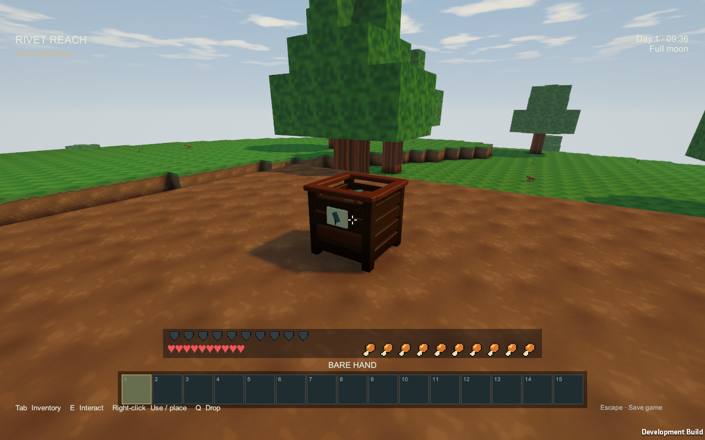
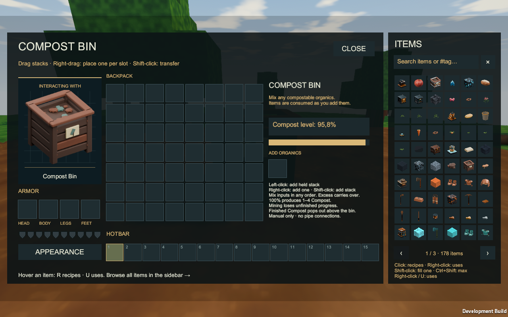
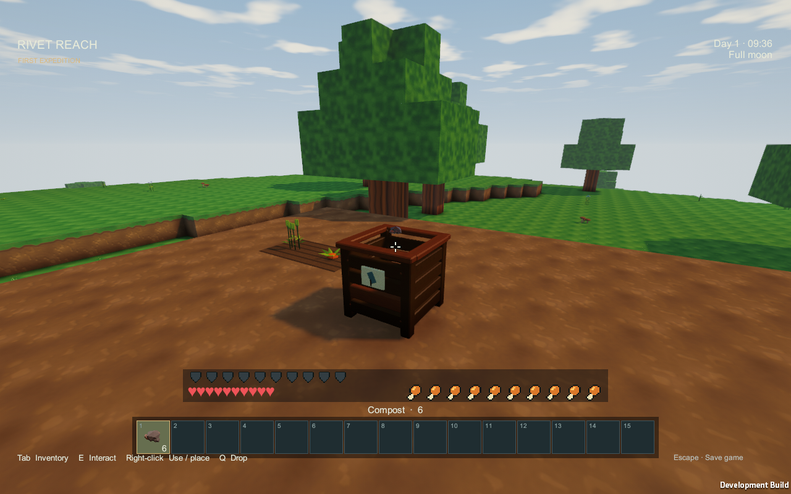
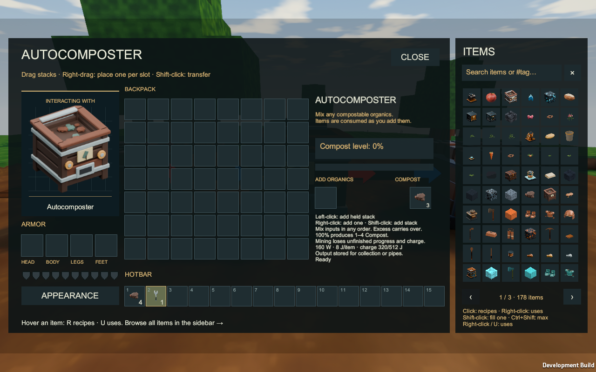
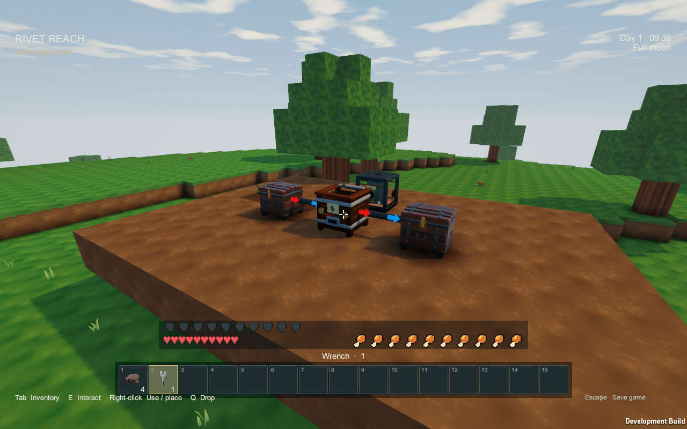
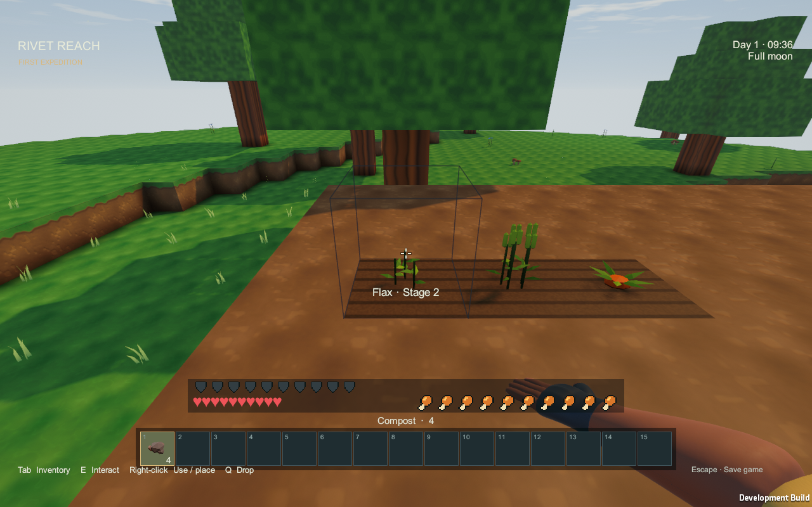

# Compost

Mix spare seeds, plants and food into Compost, then use it to advance immature crops by one stage. Farming remains possible without Compost or watering.

## Make a manual bin

Craft a [Compost Bin](Item-compost-bin.md) from **seven planks in a U shape** at a Workbench. Open it with **right-click or Interact**.

The basic bin is **manual-only**: it takes no fuel or electricity and cannot connect to pipes or Blue Signal.

## Mix your surplus

Use the **Add organics** target in the bin interface:

- Left-click to deposit the stack held by your cursor.
- Right-click to deposit one item.
- Shift-click an inventory stack to deposit it directly.

Accepted items disappear immediately and increase the shared compost level. Mix different items in any order; you do not need a matching stack or a recipe batch. Search **`#compostable`** in the item browser.

| Progress per item | Accepted items |
|---:|---|
| 4.17% | Leaves, wheat/flax/carrot/berry seeds, flax fibre |
| 8.33% | Saplings, apples, potatoes, grain, carrots, berries, mushrooms |
| 16.67% | Baked potatoes, bread, roasted carrots, vegetable stew, cooked mushrooms, fruit porridge |

The displayed percentages are rounded; the bin retains exact values. At **100%**, it immediately produces a random **1–4 Compost**. Excess progress carries into the next level, and a large stack can complete several levels. Finished Compost pops out above the basic bin for pickup. There is no waiting timer.

## Automate with electricity

Craft an [Autocomposter](Item-auto-composter.md) at the **Machinist's Bench** using one Compost Bin, one Machine Casing, two Cogs, two Item Pipes and one Gold Ingot.

It uses the same mixed inputs and random yields, but stores finished Compost in its output slot. It requires **electricity: 160 W charging, 8 J per input item**. Its small 512 J reserve can process up to 64 items after charging; once that runs out, it needs power again.

Connect power cables on any face. Configure an item-pipe **Input** end to feed organics and an **Output** end to collect finished Compost. Either can use any face. The selected [Wrench](Item-wrench.md) changes pipe direction; [Pipes](Pipes.md) explains the arrows. A front Blue Signal connection can optionally stop operation.

If charge or output capacity is insufficient, the unaccepted items stay in your hand or source storage. Partial level, stored output and unused charge survive pauses and save/load. Output retries do not reroll the yield.

## Use Compost on crops

Hold Compost and right-click an immature potato, wheat, flax, carrot or berry plant. One successful click spends one Compost and advances one stage. This works on wild and cultivated plants. Holding the button does not repeatedly spend it.

Plants still need valid support and enough sky or placed light; see [underground farms](Lighting-and-underground-farms.md). Mature plants, mushrooms and saplings do not accept Compost. Failed uses spend nothing. Creative keeps the stack. The next natural stage receives its full normal growth interval.

## Saving and moving bins

Save/load retains accumulated progress and the output sequence; it also preserves the autocomposter's charge. Mining returns the machine and any stored finished output, but **loses unfinished organic progress and internal charge**. Finish a level and collect output before moving a bin.

Bins from older saves stay basic manual bins. Opening one returns its old finished Compost and feeds its old queued inputs into the new mixed level. Previous attached pipes no longer transfer to the manual bin; craft the autocomposter for automation.

Images show actual September 14, 2026 review-player gameplay. See [Farming and cooking](Farming-and-cooking.md) for growing food and keeping planting stock.
