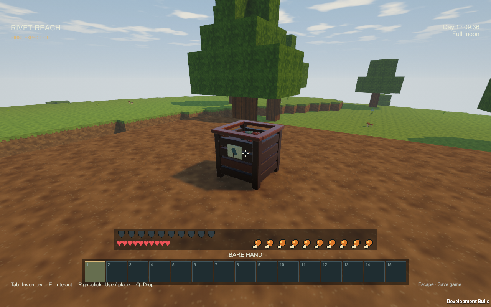
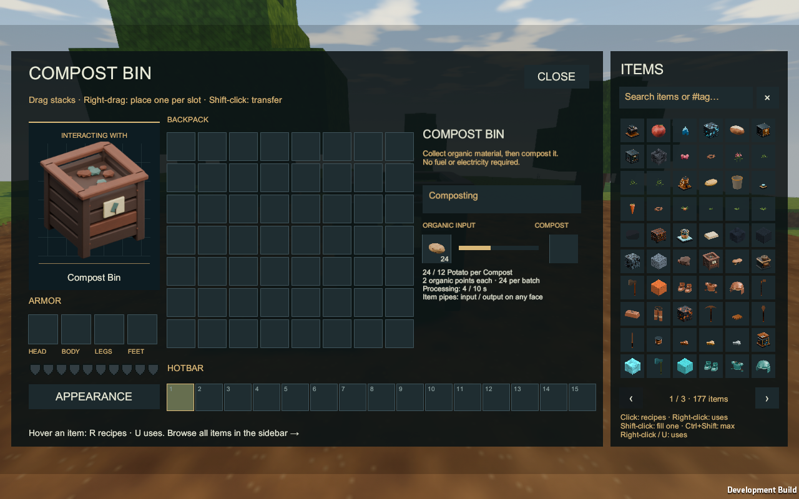
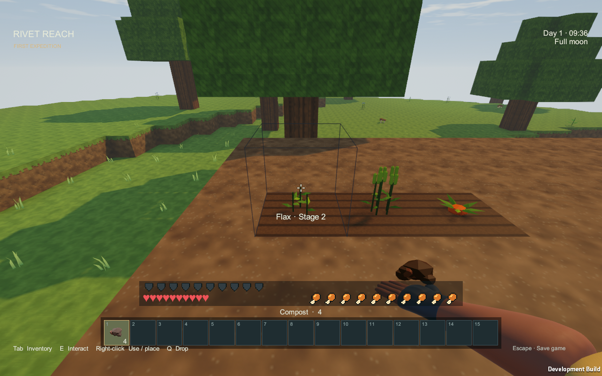
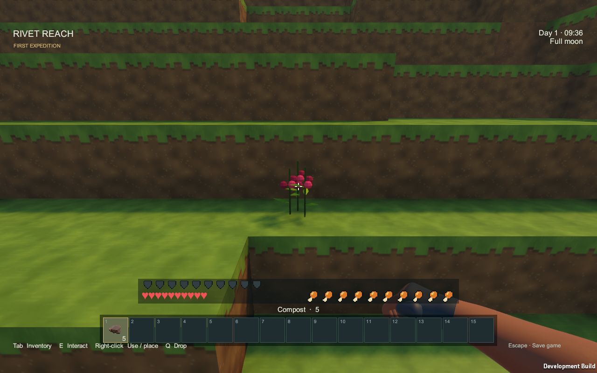
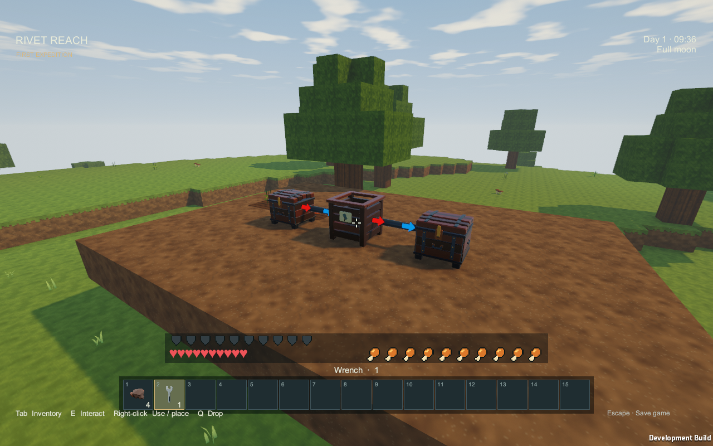

# Compost

Turn surplus plants and food into [Compost](Item-compost.md), then use it to advance a growing crop. Compost is optional: ordinary crops still grow without it, with no watering requirement.

## Make a bin

Craft a [Compost Bin](Item-compost-bin.md) at a [Workbench](Item-workbench.md) with **seven planks in a U shape**. Place it and open it with **right-click or Interact**. It needs no fuel or electricity.

## Turn surplus into compost

Add one type of organic item to the input slot. A complete batch takes **10 seconds** and produces **one Compost**.

| Items per Compost | Accepted items |
|---:|---|
| 24 | Leaves, wheat/flax/carrot/berry seeds, flax fibre |
| 12 | Saplings, apples, potatoes, grain, carrots, berries, mushrooms |
| 6 | Baked potatoes, bread, roasted carrots, vegetable stew, cooked mushrooms, fruit porridge |

Search **`#compostable`** in the item browser to find suitable inputs. The bin shows how many of the selected item it needs and its processing progress. Keep enough planting stock and food for yourself before composting surplus.

Insufficient ingredients, full output, unloaded terrain or a connected OFF Blue Signal pause the bin. Ingredients are consumed only when the finished Compost can enter the output slot. Save/load retains processing progress. Mining returns the bin, queued ingredients and finished compost; replacing it starts processing time again. Changing the input item type also restarts processing time.

## Accelerate a plant

Hold Compost and **right-click an immature crop** to advance it by **one growth stage**, using one Compost. This works on wild or cultivated potatoes, wheat, flax, carrots and berry plants. Click again for another stage; holding the button does not keep spending compost.

Plants still need suitable support, loaded terrain and open sky light. Mature plants, mushrooms and saplings cannot use Compost. An unsuccessful use consumes nothing. Creative mode keeps your Compost stack. The next natural growth stage gets its normal interval after acceleration.

## Connect item pipes

Connect a source chest through an **Input** pipe end to feed organic items into the bin. Connect another end as **Output** to move finished Compost into a destination chest. Either direction can use any bin face. Use the selected [Wrench](Item-wrench.md) to configure the ends; [Pipes](Pipes.md) explains blue input/red output arrows and disconnection.

The bin accepts one input type at a time. Pipes cannot extract unfinished ingredients. Optional [Blue Signal](Blue-Signal.md) control connects at the front; the bin runs without a signal connection.

These are actual September 13, 2026 in-game captures from the compost review build. See [Farming and cooking](Farming-and-cooking.md) for crop harvests and the food progression.
