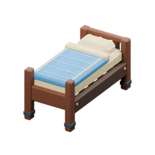

<!-- Generated by Tools/generate_wiki_items.py; edit .docs/wiki-data/item-notes.json. -->

# Bed

[All items](Items.md) · [Crafting guide](Crafting-Recipes.md) · [Home](Home.md)

[How to obtain](#how-to-obtain) · [Crafting and processing](#crafting-and-processing)

A two-block timber bed for home respawning and sleeping until morning.

## At a glance

| Property | Value |
|---|---|
| Stack size | 1 |
| Placement | Place from the hotbar |

## How to obtain

Craft at a Workbench from three Cloth above three Planks.

## Using it

Place on two dry, solid floor blocks. Use/right-click or Interact sets home during the day and also skips to 06:00 at night. Leave safe standing space beside it. See [Beds and home spawn](Beds-and-home-spawn.md) for placement, recovery and respawn fallback.

## Crafting and processing

### Recipe 1

**Station:** <a href="Item-workbench.md" title="Workbench"> Workbench</a> · 3×3

**Shaped:** keep the arrangement below. The pattern can move within a compatible grid.

<table>
<tr>
<td align="center" width="72" height="64"> ×1</td>
<td align="center" width="72" height="64"> ×1</td>
<td align="center" width="72" height="64"> ×1</td>
</tr>
<tr>
<td align="center" width="72" height="64"> ×1</td>
<td align="center" width="72" height="64"> ×1</td>
<td align="center" width="72" height="64"> ×1</td>
</tr>
<tr>
<td align="center" width="72" height="64">&nbsp;</td>
<td align="center" width="72" height="64">&nbsp;</td>
<td align="center" width="72" height="64">&nbsp;</td>
</tr>
</table>

**Output:** <a href="Item-bed.md" title="Bed"> Bed</a> ×1

| Ingredient | Total per operation |
|---|---:|
|  [Cloth](Item-cloth.md) | 3 |
|  [Planks](Item-planks.md) | 3 |
