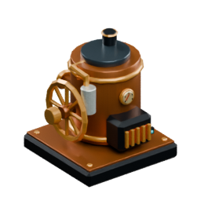
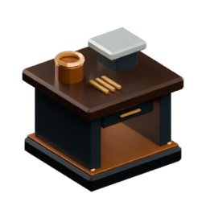
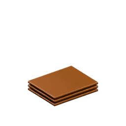
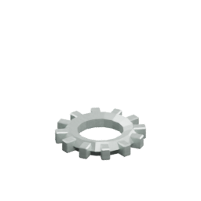
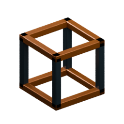

<!-- Generated by Tools/generate_wiki_items.py; edit .docs/wiki-data/item-notes.json. -->

# Boiler Engine

[All items](Items.md) · [Crafting guide](Crafting-Recipes.md) · [Home](Home.md)

[How to obtain](#how-to-obtain) · [Crafting and processing](#crafting-and-processing)

Coal / charcoal + water → right-hand shaft.

## At a glance

| Property | Value |
|---|---|
| Stack size | 64 |
| Internal fluid capacity | 100 L |
| Placement | Place from the hotbar |

## How to obtain

Make this item using the crafting or processing recipes below.

## Using it

Supply coal/charcoal and water manually or through configured item/fluid pipe inputs on any face. Use a selected [Wrench](Item-wrench.md) to set blue input arrows. Its right-hand mechanical shaft must still meet an [Alternator](Item-alternator.md). See [Pipes](Pipes.md) and [Electricity](Electricity-and-batteries.md). Item Pipe supplies coal or charcoal only through the back, relative to placement rotation. Water pipes can enter any face.

## Crafting and processing

### Recipe 1

**Station:** <a href="Item-machinist-bench.md" title="Machinist&#x27;s Bench"> Machinist&#x27;s Bench</a> · 4×4

**Shapeless:** slot positions do not matter. Keep each pictured ingredient stack and its quantity; the layout below is only an example.

<table>
<tr>
<td align="center" width="72" height="64"> ×4</td>
<td align="center" width="72" height="64"> ×2</td>
<td align="center" width="72" height="64"> ×1</td>
<td align="center" width="72" height="64">&nbsp;</td>
</tr>
<tr>
<td align="center" width="72" height="64">&nbsp;</td>
<td align="center" width="72" height="64">&nbsp;</td>
<td align="center" width="72" height="64">&nbsp;</td>
<td align="center" width="72" height="64">&nbsp;</td>
</tr>
<tr>
<td align="center" width="72" height="64">&nbsp;</td>
<td align="center" width="72" height="64">&nbsp;</td>
<td align="center" width="72" height="64">&nbsp;</td>
<td align="center" width="72" height="64">&nbsp;</td>
</tr>
<tr>
<td align="center" width="72" height="64">&nbsp;</td>
<td align="center" width="72" height="64">&nbsp;</td>
<td align="center" width="72" height="64">&nbsp;</td>
<td align="center" width="72" height="64">&nbsp;</td>
</tr>
</table>

**Output:** <a href="Item-boiler-engine.md" title="Boiler Engine"> Boiler Engine</a> ×1

| Ingredient | Total per operation |
|---|---:|
|  [Copper Plate](Item-copper-plate.md) | 4 |
|  [Iron Cog](Item-cog.md) | 2 |
|  [Machine Casing](Item-machine-casing.md) | 1 |
