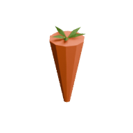

<!-- Generated by Tools/generate_wiki_items.py; edit .docs/wiki-data/item-notes.json. -->

# Carrot

[All items](Items.md) · [Crafting guide](Crafting-Recipes.md) · [Home](Home.md)

[How to obtain](#how-to-obtain) · [Crafting and processing](#crafting-and-processing) · [Uses](#used-to-make)

Eat raw, roast it, or use it as a vegetable in stew.

## At a glance

| Property | Value |
|---|---|
| Stack size | 64 |
| Tags | `edible`, `vegetable` |
| Food restored | 2 points |

## How to obtain

Harvest mature carrot plants. See [Farming and cooking](Farming-and-cooking.md).

## Crafting and processing

There is no registered crafting or processing recipe for this item. Use the acquisition method above.

## Used to make

Follow a result to see its complete ingredients and recipe.

| Result | Station | Recipe |
|---|---|---|
|  ×1 [Roasted Carrot](Item-roast-carrot.md) | [Cooker](Item-cooker.md) | [View recipe](Item-roast-carrot.md#recipe-1) |
|  ×1 [Roasted Carrot](Item-roast-carrot.md) | [Electric Cooker](Item-electric-cooker.md) | [View recipe](Item-roast-carrot.md#recipe-2) |
|  ×1 [Vegetable Stew](Item-vegetable-stew.md) | [Cooker](Item-cooker.md) | [View recipe](Item-vegetable-stew.md#recipe-1) |
|  ×1 [Vegetable Stew](Item-vegetable-stew.md) | [Electric Cooker](Item-electric-cooker.md) | [View recipe](Item-vegetable-stew.md#recipe-2) |
