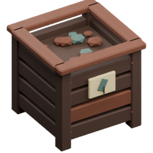
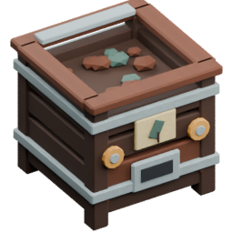

<!-- Generated by Tools/generate_wiki_items.py; edit .docs/wiki-data/item-notes.json. -->

# Compost Bin

[All items](Items.md) · [Crafting guide](Crafting-Recipes.md) · [Home](Home.md)

[How to obtain](#how-to-obtain) · [Crafting and processing](#crafting-and-processing) · [Uses](#used-to-make) · [Recipes made here](#recipes-made-here)

A manual wooden bin that immediately consumes mixed organic surplus and ejects 1–4 Compost at each full level.

## At a glance

| Property | Value |
|---|---|
| Stack size | 64 |
| Placement | Place from the hotbar |

## How to obtain

Make this item using the crafting or processing recipes below.

## Using it

Open with right-click or Interact. Deposit compostable items or stacks; their values add to one shared percentage. Excess carries over. No fuel, power or pipe connections. See [Compost](Compost.md).

## Crafting and processing

### Recipe 1

**Station:** <a href="Item-workbench.md" title="Workbench"> Workbench</a> · 3×3

**Shaped:** keep the arrangement below. The pattern can move within a compatible grid.

<table>
<tr>
<td align="center" width="72" height="64"> ×1</td>
<td align="center" width="72" height="64">&nbsp;</td>
<td align="center" width="72" height="64"> ×1</td>
</tr>
<tr>
<td align="center" width="72" height="64"> ×1</td>
<td align="center" width="72" height="64">&nbsp;</td>
<td align="center" width="72" height="64"> ×1</td>
</tr>
<tr>
<td align="center" width="72" height="64"> ×1</td>
<td align="center" width="72" height="64"> ×1</td>
<td align="center" width="72" height="64"> ×1</td>
</tr>
</table>

**Output:** <a href="Item-compost-bin.md" title="Compost Bin"> Compost Bin</a> ×1

| Ingredient | Total per operation |
|---|---:|
|  [Planks](Item-planks.md) | 7 |

## Used to make

Follow a result to see its complete ingredients and recipe.

| Result | Station | Recipe |
|---|---|---|
|  ×1 [Autocomposter](Item-auto-composter.md) | [Machinist's Bench](Item-machinist-bench.md) | [View recipe](Item-auto-composter.md#recipe-1) |

## Recipes made here

The station is reusable; it is not consumed by these recipes.

| Result | Station | Recipe |
|---|---|---|
|  [Compost](Item-compost.md) | [Compost Bin](Item-compost-bin.md) | [View recipe](Item-compost.md#recipe-1) |
|  [Compost](Item-compost.md) | [Compost Bin](Item-compost-bin.md) | [View recipe](Item-compost.md#recipe-2) |
|  [Compost](Item-compost.md) | [Compost Bin](Item-compost-bin.md) | [View recipe](Item-compost.md#recipe-3) |
|  [Compost](Item-compost.md) | [Compost Bin](Item-compost-bin.md) | [View recipe](Item-compost.md#recipe-4) |
|  [Compost](Item-compost.md) | [Compost Bin](Item-compost-bin.md) | [View recipe](Item-compost.md#recipe-5) |
|  [Compost](Item-compost.md) | [Compost Bin](Item-compost-bin.md) | [View recipe](Item-compost.md#recipe-6) |
|  [Compost](Item-compost.md) | [Compost Bin](Item-compost-bin.md) | [View recipe](Item-compost.md#recipe-7) |
|  [Compost](Item-compost.md) | [Compost Bin](Item-compost-bin.md) | [View recipe](Item-compost.md#recipe-8) |
|  [Compost](Item-compost.md) | [Compost Bin](Item-compost-bin.md) | [View recipe](Item-compost.md#recipe-9) |
|  [Compost](Item-compost.md) | [Compost Bin](Item-compost-bin.md) | [View recipe](Item-compost.md#recipe-10) |
|  [Compost](Item-compost.md) | [Compost Bin](Item-compost-bin.md) | [View recipe](Item-compost.md#recipe-11) |
|  [Compost](Item-compost.md) | [Compost Bin](Item-compost-bin.md) | [View recipe](Item-compost.md#recipe-12) |
|  [Compost](Item-compost.md) | [Compost Bin](Item-compost-bin.md) | [View recipe](Item-compost.md#recipe-13) |
|  [Compost](Item-compost.md) | [Compost Bin](Item-compost-bin.md) | [View recipe](Item-compost.md#recipe-14) |
|  [Compost](Item-compost.md) | [Compost Bin](Item-compost-bin.md) | [View recipe](Item-compost.md#recipe-15) |
|  [Compost](Item-compost.md) | [Compost Bin](Item-compost-bin.md) | [View recipe](Item-compost.md#recipe-16) |
|  [Compost](Item-compost.md) | [Compost Bin](Item-compost-bin.md) | [View recipe](Item-compost.md#recipe-17) |
|  [Compost](Item-compost.md) | [Compost Bin](Item-compost-bin.md) | [View recipe](Item-compost.md#recipe-18) |
|  [Compost](Item-compost.md) | [Compost Bin](Item-compost-bin.md) | [View recipe](Item-compost.md#recipe-19) |
