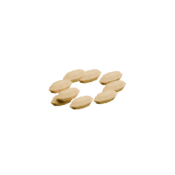

<!-- Generated by Tools/generate_wiki_items.py; edit .docs/wiki-data/item-notes.json. -->

# Compost

[All items](Items.md) · [Crafting guide](Crafting-Recipes.md) · [Home](Home.md)

[How to obtain](#how-to-obtain) · [Crafting and processing](#crafting-and-processing)

An optional crop growth accelerator made from organic surplus in a [Compost Bin](Item-compost-bin.md).

## At a glance

| Property | Value |
|---|---|
| Stack size | 64 |

## How to obtain

Make this item using the crafting or processing recipes below.

## Using it

Select it and right-click an immature wild or cultivated crop to advance one stage. One successful click uses one Compost; invalid or mature targets consume nothing. See [Compost](Compost.md).

## Crafting and processing

### Recipe 1

**Station:** <a href="Item-compost-bin.md" title="Compost Bin"> Compost Bin</a>

**Processing time:** 10 seconds per operation.

**Output:** <a href="Item-compost.md" title="Compost"> Compost</a> ×1

| Ingredient | Total per operation |
|---|---:|
|  [Leaves](Item-leaves.md) | 24 |

### Recipe 2

**Station:** <a href="Item-compost-bin.md" title="Compost Bin"> Compost Bin</a>

**Processing time:** 10 seconds per operation.

**Output:** <a href="Item-compost.md" title="Compost"> Compost</a> ×1

| Ingredient | Total per operation |
|---|---:|
|  [Sapling](Item-sapling.md) | 12 |

### Recipe 3

**Station:** <a href="Item-compost-bin.md" title="Compost Bin"> Compost Bin</a>

**Processing time:** 10 seconds per operation.

**Output:** <a href="Item-compost.md" title="Compost"> Compost</a> ×1

| Ingredient | Total per operation |
|---|---:|
|  [Apple](Item-apple.md) | 12 |

### Recipe 4

**Station:** <a href="Item-compost-bin.md" title="Compost Bin"> Compost Bin</a>

**Processing time:** 10 seconds per operation.

**Output:** <a href="Item-compost.md" title="Compost"> Compost</a> ×1

| Ingredient | Total per operation |
|---|---:|
|  [Potato](Item-potato.md) | 12 |

### Recipe 5

**Station:** <a href="Item-compost-bin.md" title="Compost Bin"> Compost Bin</a>

**Processing time:** 10 seconds per operation.

**Output:** <a href="Item-compost.md" title="Compost"> Compost</a> ×1

| Ingredient | Total per operation |
|---|---:|
|  [Baked potato](Item-baked-potato.md) | 6 |

### Recipe 6

**Station:** <a href="Item-compost-bin.md" title="Compost Bin"> Compost Bin</a>

**Processing time:** 10 seconds per operation.

**Output:** <a href="Item-compost.md" title="Compost"> Compost</a> ×1

| Ingredient | Total per operation |
|---|---:|
|  [Wheat Seeds](Item-wheat-seed.md) | 24 |

### Recipe 7

**Station:** <a href="Item-compost-bin.md" title="Compost Bin"> Compost Bin</a>

**Processing time:** 10 seconds per operation.

**Output:** <a href="Item-compost.md" title="Compost"> Compost</a> ×1

| Ingredient | Total per operation |
|---|---:|
|  [Grain](Item-grain.md) | 12 |

### Recipe 8

**Station:** <a href="Item-compost-bin.md" title="Compost Bin"> Compost Bin</a>

**Processing time:** 10 seconds per operation.

**Output:** <a href="Item-compost.md" title="Compost"> Compost</a> ×1

| Ingredient | Total per operation |
|---|---:|
|  [Flax Seeds](Item-flax-seed.md) | 24 |

### Recipe 9

**Station:** <a href="Item-compost-bin.md" title="Compost Bin"> Compost Bin</a>

**Processing time:** 10 seconds per operation.

**Output:** <a href="Item-compost.md" title="Compost"> Compost</a> ×1

| Ingredient | Total per operation |
|---|---:|
|  [Flax Fibre](Item-flax-fibre.md) | 24 |

### Recipe 10

**Station:** <a href="Item-compost-bin.md" title="Compost Bin"> Compost Bin</a>

**Processing time:** 10 seconds per operation.

**Output:** <a href="Item-compost.md" title="Compost"> Compost</a> ×1

| Ingredient | Total per operation |
|---|---:|
|  [Carrot Seeds](Item-carrot-seed.md) | 24 |

### Recipe 11

**Station:** <a href="Item-compost-bin.md" title="Compost Bin"> Compost Bin</a>

**Processing time:** 10 seconds per operation.

**Output:** <a href="Item-compost.md" title="Compost"> Compost</a> ×1

| Ingredient | Total per operation |
|---|---:|
|  [Carrot](Item-carrot.md) | 12 |

### Recipe 12

**Station:** <a href="Item-compost-bin.md" title="Compost Bin"> Compost Bin</a>

**Processing time:** 10 seconds per operation.

**Output:** <a href="Item-compost.md" title="Compost"> Compost</a> ×1

| Ingredient | Total per operation |
|---|---:|
|  [Berry Seeds](Item-berry-seed.md) | 24 |

### Recipe 13

**Station:** <a href="Item-compost-bin.md" title="Compost Bin"> Compost Bin</a>

**Processing time:** 10 seconds per operation.

**Output:** <a href="Item-compost.md" title="Compost"> Compost</a> ×1

| Ingredient | Total per operation |
|---|---:|
|  [Berries](Item-berries.md) | 12 |

### Recipe 14

**Station:** <a href="Item-compost-bin.md" title="Compost Bin"> Compost Bin</a>

**Processing time:** 10 seconds per operation.

**Output:** <a href="Item-compost.md" title="Compost"> Compost</a> ×1

| Ingredient | Total per operation |
|---|---:|
|  [Mushroom](Item-mushroom.md) | 12 |

### Recipe 15

**Station:** <a href="Item-compost-bin.md" title="Compost Bin"> Compost Bin</a>

**Processing time:** 10 seconds per operation.

**Output:** <a href="Item-compost.md" title="Compost"> Compost</a> ×1

| Ingredient | Total per operation |
|---|---:|
|  [Bread](Item-bread.md) | 6 |

### Recipe 16

**Station:** <a href="Item-compost-bin.md" title="Compost Bin"> Compost Bin</a>

**Processing time:** 10 seconds per operation.

**Output:** <a href="Item-compost.md" title="Compost"> Compost</a> ×1

| Ingredient | Total per operation |
|---|---:|
|  [Roasted Carrot](Item-roast-carrot.md) | 6 |

### Recipe 17

**Station:** <a href="Item-compost-bin.md" title="Compost Bin"> Compost Bin</a>

**Processing time:** 10 seconds per operation.

**Output:** <a href="Item-compost.md" title="Compost"> Compost</a> ×1

| Ingredient | Total per operation |
|---|---:|
|  [Vegetable Stew](Item-vegetable-stew.md) | 6 |

### Recipe 18

**Station:** <a href="Item-compost-bin.md" title="Compost Bin"> Compost Bin</a>

**Processing time:** 10 seconds per operation.

**Output:** <a href="Item-compost.md" title="Compost"> Compost</a> ×1

| Ingredient | Total per operation |
|---|---:|
|  [Cooked Mushrooms](Item-cooked-mushroom.md) | 6 |

### Recipe 19

**Station:** <a href="Item-compost-bin.md" title="Compost Bin"> Compost Bin</a>

**Processing time:** 10 seconds per operation.

**Output:** <a href="Item-compost.md" title="Compost"> Compost</a> ×1

| Ingredient | Total per operation |
|---|---:|
|  [Fruit Porridge](Item-fruit-porridge.md) | 6 |
