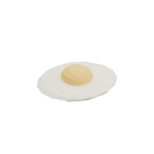
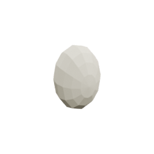

<!-- Generated by Tools/generate_wiki_items.py; edit .docs/wiki-data/item-notes.json. -->

# Cooked Egg

[All items](Items.md) · [Crafting guide](Crafting-Recipes.md) · [Home](Home.md)

[How to obtain](#how-to-obtain) · [Crafting and processing](#crafting-and-processing)

Cooked Egg restores 4 food points.

## At a glance

| Property | Value |
|---|---|
| Stack size | 64 |
| Tags | `edible`, `egg`, `prepared_food` |
| Food restored | 4 points |
| Saturation reserve | 1 points |

## How to obtain

Make this item using the crafting or processing recipes below.

## Using it

Prepare in either fuel or electric Cooker; hold Use to eat when hungry. See [Chickens](Chickens.md). [Food and hunger](Food-and-hunger.md) explains food restoration, saturation and meal planning.

## Crafting and processing

### Recipe 1

**Station:** <a href="Item-cooker.md" title="Cooker"> Cooker</a>

**Processing time:** 10 seconds per operation.

**Output:** <a href="Item-cooked-egg.md" title="Cooked Egg"> Cooked Egg</a> ×1

| Ingredient | Total per operation |
|---|---:|
| **#raw_egg**:  [Egg](Item-egg.md) | 1 |

For tagged ingredients, any listed item counts; combinations and split stacks are accepted. Select this recipe on the cooker.

**Fuel:** add burnable fuel separately; it is not a crafting ingredient.  [Log](Item-log.md) ·  [Coal](Item-coal.md) ·  [Planks](Item-planks.md) ·  [Stick](Item-stick.md) ·  [Charcoal](Item-charcoal.md) ·  [Wood axe](Item-wood-axe.md) ·  [Wood pickaxe](Item-wood-pickaxe.md) ·  [Wood sword](Item-wood-sword.md) ·  [Wood shovel](Item-wood-shovel.md) ·  [Wood hoe](Item-wood-hoe.md) ·  [Coal block](Item-coal-block.md).

Cookers retain unused heat while blocked or idle. See the [Cooker](Item-cooker.md) page for fuel durations.

### Recipe 2

**Station:** <a href="Item-electric-cooker.md" title="Electric Cooker"> Electric Cooker</a>

**Processing time:** 10 seconds per operation at **200 W**. Reduced power slows progress.

**Output:** <a href="Item-cooked-egg.md" title="Cooked Egg"> Cooked Egg</a> ×1

| Ingredient | Total per operation |
|---|---:|
| **#raw_egg**:  [Egg](Item-egg.md) | 1 |

For tagged ingredients, any listed item counts; combinations and split stacks are accepted. Select this recipe on the cooker.
