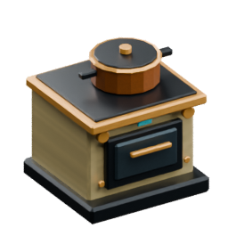
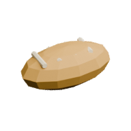
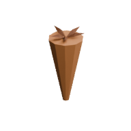
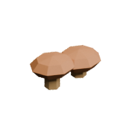

<!-- Generated by Tools/generate_wiki_items.py; edit .docs/wiki-data/item-notes.json. -->

# Cooker

[All items](Items.md) · [Crafting guide](Crafting-Recipes.md) · [Home](Home.md)

[How to obtain](#how-to-obtain) · [Crafting and processing](#crafting-and-processing) · [Uses](#used-to-make) · [Recipes made here](#recipes-made-here)

A food preparation station with selectable recipes and interchangeable tagged ingredients.

## At a glance

| Property | Value |
|---|---|
| Stack size | 64 |
| Placement | Place from the hotbar |

## How to obtain

Make this item using the crafting or processing recipes below.

## Using it

Right-click or Interact, select a recipe, load ingredients and supply burnable fuel. Rear pipes carry fuel; other faces accept ingredients. See [Farming and cooking](Farming-and-cooking.md) for setup, recipes and screenshots. Partial work and stored heat persist through saves; blocked or idle cookers consume no new energy.

## Crafting and processing

### Recipe 1

**Station:** <a href="Item-workbench.md" title="Workbench"> Workbench</a> · 3×3

**Shapeless:** slot positions do not matter. Keep each pictured ingredient stack and its quantity; the layout below is only an example.

<table>
<tr>
<td align="center" width="72" height="64"> ×1</td>
<td align="center" width="72" height="64"> ×2</td>
<td align="center" width="72" height="64">&nbsp;</td>
</tr>
<tr>
<td align="center" width="72" height="64">&nbsp;</td>
<td align="center" width="72" height="64">&nbsp;</td>
<td align="center" width="72" height="64">&nbsp;</td>
</tr>
<tr>
<td align="center" width="72" height="64">&nbsp;</td>
<td align="center" width="72" height="64">&nbsp;</td>
<td align="center" width="72" height="64">&nbsp;</td>
</tr>
</table>

**Output:** <a href="Item-cooker.md" title="Cooker"> Cooker</a> ×1

| Ingredient | Total per operation |
|---|---:|
|  [Furnace](Item-furnace.md) | 1 |
|  [Copper ingot](Item-copper-ingot.md) | 2 |

## Used to make

Follow a result to see its complete ingredients and recipe.

| Result | Station | Recipe |
|---|---|---|
|  ×1 [Electric Cooker](Item-electric-cooker.md) | [Machinist's Bench](Item-machinist-bench.md) | [View recipe](Item-electric-cooker.md#recipe-1) |

## Recipes made here

The station is reusable; it is not consumed by these recipes.

| Result | Station | Recipe |
|---|---|---|
|  ×1 [Bread](Item-bread.md) | [Cooker](Item-cooker.md) | [View recipe](Item-bread.md#recipe-1) |
|  ×1 [Baked potato](Item-baked-potato.md) | [Cooker](Item-cooker.md) | [View recipe](Item-baked-potato.md#recipe-3) |
|  ×1 [Roasted Carrot](Item-roast-carrot.md) | [Cooker](Item-cooker.md) | [View recipe](Item-roast-carrot.md#recipe-1) |
|  ×1 [Cooked Mushrooms](Item-cooked-mushroom.md) | [Cooker](Item-cooker.md) | [View recipe](Item-cooked-mushroom.md#recipe-1) |
|  ×1 [Vegetable Stew](Item-vegetable-stew.md) | [Cooker](Item-cooker.md) | [View recipe](Item-vegetable-stew.md#recipe-1) |
|  ×1 [Fruit Porridge](Item-fruit-porridge.md) | [Cooker](Item-cooker.md) | [View recipe](Item-fruit-porridge.md#recipe-1) |

## Fuel durations

| Fuel | Seconds per item |
|---|---:|
|  [Log](Item-log.md) | 15 |
|  [Coal](Item-coal.md) | 80 |
|  [Planks](Item-planks.md) | 15 |
|  [Stick](Item-stick.md) | 5 |
|  [Charcoal](Item-charcoal.md) | 80 |
|  [Wood axe](Item-wood-axe.md) | 10 |
|  [Wood pickaxe](Item-wood-pickaxe.md) | 10 |
|  [Wood sword](Item-wood-sword.md) | 10 |
|  [Wood shovel](Item-wood-shovel.md) | 10 |
|  [Wood hoe](Item-wood-hoe.md) | 10 |
|  [Coal block](Item-coal-block.md) | 800 |
