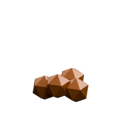
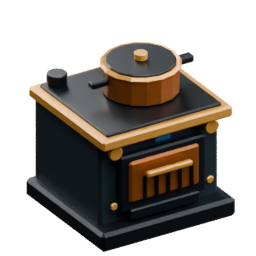

<!-- Generated by Tools/generate_wiki_items.py; edit .docs/wiki-data/item-notes.json. -->

# Copper ingot

[All items](Items.md) · [Crafting guide](Crafting-Recipes.md) · [Home](Home.md)

[How to obtain](#how-to-obtain) · [Crafting and processing](#crafting-and-processing) · [Uses](#used-to-make)

Smelted metal used in crafting. Direct smelting makes one ingot per raw ore; crushing first makes two crushed pieces, each worth one ingot.

## At a glance

| Property | Value |
|---|---|
| Stack size | 64 |

## How to obtain

Make this item using the crafting or processing recipes below.

## Crafting and processing

### Recipe 1

**Station:** [Personal crafting](Crafting-Recipes.md#personal-crafting--22) · 2×2

**Shapeless:** slot positions do not matter. Keep each pictured ingredient stack and its quantity; the layout below is only an example.

<table>
<tr>
<td align="center" width="72" height="64"> ×1</td>
<td align="center" width="72" height="64">&nbsp;</td>
</tr>
<tr>
<td align="center" width="72" height="64">&nbsp;</td>
<td align="center" width="72" height="64">&nbsp;</td>
</tr>
</table>

**Output:** <a href="Item-copper-ingot.md" title="Copper ingot"> Copper ingot</a> ×9

| Ingredient | Total per operation |
|---|---:|
|  [Copper block](Item-copper-block.md) | 1 |

### Recipe 2

**Station:** <a href="Item-furnace.md" title="Furnace"> Furnace</a>

**Processing time:** 10 seconds per operation.

**Output:** <a href="Item-copper-ingot.md" title="Copper ingot"> Copper ingot</a> ×1

| Ingredient | Total per operation |
|---|---:|
|  [Raw copper](Item-raw-copper.md) | 1 |

**Fuel:** add burnable fuel separately; it is not a crafting ingredient.  [Log](Item-log.md) ·  [Coal](Item-coal.md) ·  [Planks](Item-planks.md) ·  [Stick](Item-stick.md) ·  [Charcoal](Item-charcoal.md) ·  [Wood axe](Item-wood-axe.md) ·  [Wood pickaxe](Item-wood-pickaxe.md) ·  [Wood sword](Item-wood-sword.md) ·  [Wood shovel](Item-wood-shovel.md) ·  [Wood hoe](Item-wood-hoe.md) ·  [Coal block](Item-coal-block.md).

Fuel burns down after ignition even if the input runs out. See the [Furnace](Item-furnace.md) page for fuel durations.

### Recipe 3

**Station:** <a href="Item-furnace.md" title="Furnace"> Furnace</a>

**Processing time:** 10 seconds per operation.

**Output:** <a href="Item-copper-ingot.md" title="Copper ingot"> Copper ingot</a> ×1

| Ingredient | Total per operation |
|---|---:|
|  [Crushed Copper](Item-crushed-copper.md) | 1 |

**Fuel:** add burnable fuel separately; it is not a crafting ingredient.  [Log](Item-log.md) ·  [Coal](Item-coal.md) ·  [Planks](Item-planks.md) ·  [Stick](Item-stick.md) ·  [Charcoal](Item-charcoal.md) ·  [Wood axe](Item-wood-axe.md) ·  [Wood pickaxe](Item-wood-pickaxe.md) ·  [Wood sword](Item-wood-sword.md) ·  [Wood shovel](Item-wood-shovel.md) ·  [Wood hoe](Item-wood-hoe.md) ·  [Coal block](Item-coal-block.md).

Fuel burns down after ignition even if the input runs out. See the [Furnace](Item-furnace.md) page for fuel durations.

### Recipe 4

**Station:** <a href="Item-electric-furnace.md" title="Electric Furnace"> Electric Furnace</a>

**Processing time:** 10 seconds per operation at **200 W**. Reduced power slows progress.

**Output:** <a href="Item-copper-ingot.md" title="Copper ingot"> Copper ingot</a> ×1

| Ingredient | Total per operation |
|---|---:|
|  [Raw copper](Item-raw-copper.md) | 1 |

### Recipe 5

**Station:** <a href="Item-electric-furnace.md" title="Electric Furnace"> Electric Furnace</a>

**Processing time:** 10 seconds per operation at **200 W**. Reduced power slows progress.

**Output:** <a href="Item-copper-ingot.md" title="Copper ingot"> Copper ingot</a> ×1

| Ingredient | Total per operation |
|---|---:|
|  [Crushed Copper](Item-crushed-copper.md) | 1 |

## Used to make

Follow a result to see its complete ingredients and recipe.

| Result | Station | Recipe |
|---|---|---|
|  ×1 [Copper axe](Item-copper-axe.md) | [Workbench](Item-workbench.md) | [View recipe](Item-copper-axe.md#recipe-1) |
|  ×1 [Copper pickaxe](Item-copper-pickaxe.md) | [Workbench](Item-workbench.md) | [View recipe](Item-copper-pickaxe.md#recipe-1) |
|  ×1 [Copper sword](Item-copper-sword.md) | [Workbench](Item-workbench.md) | [View recipe](Item-copper-sword.md#recipe-1) |
|  ×1 [Copper shovel](Item-copper-shovel.md) | [Workbench](Item-workbench.md) | [View recipe](Item-copper-shovel.md#recipe-1) |
|  ×1 [Copper hoe](Item-copper-hoe.md) | [Workbench](Item-workbench.md) | [View recipe](Item-copper-hoe.md#recipe-1) |
|  ×1 [Copper helmet](Item-copper-helmet.md) | [Workbench](Item-workbench.md) | [View recipe](Item-copper-helmet.md#recipe-1) |
|  ×1 [Copper chestplate](Item-copper-chestplate.md) | [Workbench](Item-workbench.md) | [View recipe](Item-copper-chestplate.md#recipe-1) |
|  ×1 [Copper leggings](Item-copper-leggings.md) | [Workbench](Item-workbench.md) | [View recipe](Item-copper-leggings.md#recipe-1) |
|  ×1 [Copper boots](Item-copper-boots.md) | [Workbench](Item-workbench.md) | [View recipe](Item-copper-boots.md#recipe-1) |
|  ×1 [Copper block](Item-copper-block.md) | [Workbench](Item-workbench.md) | [View recipe](Item-copper-block.md#recipe-1) |
|  ×1 [Machinist's Bench](Item-machinist-bench.md) | [Workbench](Item-workbench.md) | [View recipe](Item-machinist-bench.md#recipe-1) |
|  ×4 [Copper Wire](Item-copper-wire.md) | [Machinist's Bench](Item-machinist-bench.md) | [View recipe](Item-copper-wire.md#recipe-1) |
|  ×3 [Copper Plate](Item-copper-plate.md) | [Machinist's Bench](Item-machinist-bench.md) | [View recipe](Item-copper-plate.md#recipe-1) |
|  ×1 [Hand Crank](Item-hand-crank.md) | [Workbench](Item-workbench.md) | [View recipe](Item-hand-crank.md#recipe-1) |
|  ×1 [Cooker](Item-cooker.md) | [Workbench](Item-workbench.md) | [View recipe](Item-cooker.md#recipe-1) |
