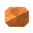

<!-- Generated by Tools/generate_wiki_items.py; edit .docs/wiki-data/item-notes.json. -->

# Copper ore

[All items](Items.md) · [Crafting guide](Crafting-Recipes.md) · [Home](Home.md)

[How to obtain](#how-to-obtain) · [Crafting and processing](#crafting-and-processing)

Orange copper seams and pockets in fractured dark stone. A finite underground deposit found at **Y −48 to 64**, with the strongest generation preference near **Y 16**. These are world heights, not depth below the surface. Ore replaces stone and does not regenerate after mining.

## At a glance

| Property | Value |
|---|---|
| Stack size | 64 |
| Required mining tool | Stone pickaxe or better |
| Placement | World block; cannot be placed directly as an inventory item |

## How to obtain

Find this deposit in stone. Mine it with a **stone pickaxe or better**.

Mining yields <a href="Item-raw-copper.md" title="Raw copper"> Raw copper</a> ×1.

## Crafting and processing

There is no registered crafting or processing recipe for this item. Use the acquisition method above.
