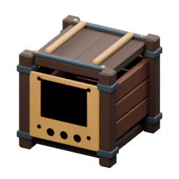
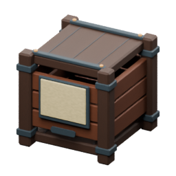

<!-- Generated by Tools/generate_wiki_items.py; edit .docs/wiki-data/item-notes.json. -->

# Crate Controller

[All items](Items.md) · [Crafting guide](Crafting-Recipes.md) · [Home](Home.md)

[How to obtain](#how-to-obtain) · [Crafting and processing](#crafting-and-processing)

Provides one interface for up to **64 face-connected crates**, with no extra storage capacity or electrical demand.

## At a glance

| Property | Value |
|---|---|
| Stack size | 64 |
| Placement | Place from the hotbar |

## How to obtain

Make this item using the crafting or processing recipes below.

## Using it

Use one controller per connected bank. It fills crates already assigned to an item before using empty unlocked crates. Removing the controller leaves every crate and its contents intact. Pipes use saved editable priorities: machines 50, controllers 40, crates 30 and chests 20 by default; equal priorities round-robin among compatible receivers. See [Item-pipe routing](Item-pipe-routing.md). See [Crates and warehouses](Crates-and-warehouses.md).

## Crafting and processing

### Recipe 1

**Station:** <a href="Item-machinist-bench.md" title="Machinist&#x27;s Bench"> Machinist&#x27;s Bench</a> · 4×4

**Shapeless:** slot positions do not matter. Keep each pictured ingredient stack and its quantity; the layout below is only an example.

<table>
<tr>
<td align="center" width="72" height="64"> ×2</td>
<td align="center" width="72" height="64"> ×2</td>
<td align="center" width="72" height="64"> ×1</td>
<td align="center" width="72" height="64"> ×1</td>
</tr>
<tr>
<td align="center" width="72" height="64"> ×2</td>
<td align="center" width="72" height="64"> ×1</td>
<td align="center" width="72" height="64">&nbsp;</td>
<td align="center" width="72" height="64">&nbsp;</td>
</tr>
<tr>
<td align="center" width="72" height="64">&nbsp;</td>
<td align="center" width="72" height="64">&nbsp;</td>
<td align="center" width="72" height="64">&nbsp;</td>
<td align="center" width="72" height="64">&nbsp;</td>
</tr>
<tr>
<td align="center" width="72" height="64">&nbsp;</td>
<td align="center" width="72" height="64">&nbsp;</td>
<td align="center" width="72" height="64">&nbsp;</td>
<td align="center" width="72" height="64">&nbsp;</td>
</tr>
</table>

**Output:** <a href="Item-crate-controller.md" title="Crate Controller"> Crate Controller</a> ×1

| Ingredient | Total per operation |
|---|---:|
|  [Iron ingot](Item-iron-ingot.md) | 2 |
|  [Gold ingot](Item-gold-ingot.md) | 2 |
|  [Iron Cog](Item-cog.md) | 1 |
|  [Machine Casing](Item-machine-casing.md) | 1 |
|  [Item Pipe](Item-item-pipe.md) | 2 |
|  [Bulk Crate](Item-bulk-crate.md) | 1 |
