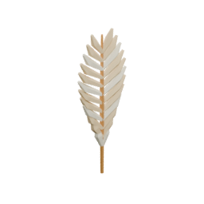

<!-- Generated by Tools/generate_wiki_items.py; edit .docs/wiki-data/item-notes.json. -->

# Feather

[All items](Items.md) · [Crafting guide](Crafting-Recipes.md) · [Home](Home.md)

[How to obtain](#how-to-obtain) · [Crafting and processing](#crafting-and-processing)

A material dropped by adult chickens.

## At a glance

| Property | Value |
|---|---|
| Stack size | 64 |
| Tags | `feather` |

## How to obtain

Defeat an adult [Chicken](Chickens.md) for one or two feathers.

## Using it

Store for future recipes; no feather crafting recipe is implemented yet.

## Crafting and processing

There is no registered crafting or processing recipe for this item. Use the acquisition method above.
