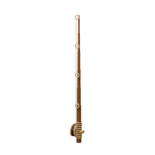

<!-- Generated by Tools/generate_wiki_items.py; edit .docs/wiki-data/item-notes.json. -->

# Fishing Rod

[All items](Items.md) · [Crafting guide](Crafting-Recipes.md) · [Home](Home.md)

[How to obtain](#how-to-obtain) · [Crafting and processing](#crafting-and-processing)

A reusable wooden rod for catching fish by hand.

## At a glance

| Property | Value |
|---|---|
| Stack size | 1 |
| Tags | `fishing_rod` |

## How to obtain

Make this item using the crafting or processing recipes below.

## Using it

Use to cast at an open 7×7 patch of source water, two source blocks deep. Wait for the bite, then Use again within three seconds. See [Fishing](Fishing.md).

## Crafting and processing

### Recipe 1

**Station:** <a href="Item-workbench.md" title="Workbench"> Workbench</a> · 3×3

**Shaped:** keep the arrangement below. The pattern can move within a compatible grid. Horizontal mirroring is also accepted.

<table>
<tr>
<td align="center" width="72" height="64">&nbsp;</td>
<td align="center" width="72" height="64">&nbsp;</td>
<td align="center" width="72" height="64"> ×1</td>
</tr>
<tr>
<td align="center" width="72" height="64">&nbsp;</td>
<td align="center" width="72" height="64"> ×1</td>
<td align="center" width="72" height="64"> ×1</td>
</tr>
<tr>
<td align="center" width="72" height="64"> ×1</td>
<td align="center" width="72" height="64">&nbsp;</td>
<td align="center" width="72" height="64"> ×1</td>
</tr>
</table>

**Output:** <a href="Item-fishing-rod.md" title="Fishing Rod"> Fishing Rod</a> ×1

| Ingredient | Total per operation |
|---|---:|
|  [Stick](Item-stick.md) | 3 |
|  [String](Item-string.md) | 2 |
