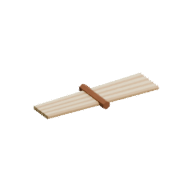
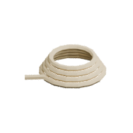

<!-- Generated by Tools/generate_wiki_items.py; edit .docs/wiki-data/item-notes.json. -->

# Flax Fibre

[All items](Items.md) · [Crafting guide](Crafting-Recipes.md) · [Home](Home.md)

[How to obtain](#how-to-obtain) · [Crafting and processing](#crafting-and-processing) · [Uses](#used-to-make)

Craft three fibres into one String.

## At a glance

| Property | Value |
|---|---|
| Stack size | 64 |
| Tags | `fibre` |

## How to obtain

Harvest mature flax plants. See [Farming and cooking](Farming-and-cooking.md).

## Crafting and processing

There is no registered crafting or processing recipe for this item. Use the acquisition method above.

## Used to make

Follow a result to see its complete ingredients and recipe.

| Result | Station | Recipe |
|---|---|---|
|  ×1 [String](Item-string.md) | Personal 2×2 | [View recipe](Item-string.md#recipe-1) |
