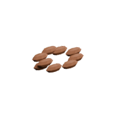

<!-- Generated by Tools/generate_wiki_items.py; edit .docs/wiki-data/item-notes.json. -->

# Flax Seeds

[All items](Items.md) · [Crafting guide](Crafting-Recipes.md) · [Home](Home.md)

[How to obtain](#how-to-obtain) · [Crafting and processing](#crafting-and-processing) · [Uses](#used-to-make)

Planting stock for flax.

## At a glance

| Property | Value |
|---|---|
| Stack size | 64 |
| Tags | `compostable`, `seed` |

## How to obtain

Harvest wild or cultivated flax; young plants return one seed and mature plants return two.

## Using it

Select these seeds and right-click farmland prepared with a hoe. See [Farming and cooking](Farming-and-cooking.md).

## Crafting and processing

There is no registered crafting or processing recipe for this item. Use the acquisition method above.

## Used to make

Follow a result to see its complete ingredients and recipe.

| Result | Station | Recipe |
|---|---|---|
|  [Compost](Item-compost.md) | [Compost Bin](Item-compost-bin.md) | [View recipe](Item-compost.md#recipe-8) |
|  [Compost](Item-compost.md) | [Autocomposter](Item-auto-composter.md) | [View recipe](Item-compost.md#recipe-27) |
