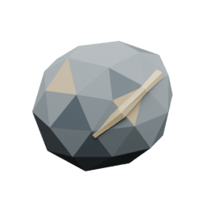
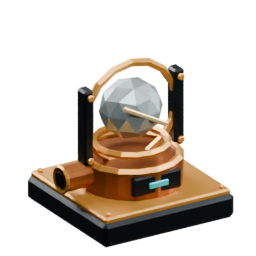

<!-- Generated by Tools/generate_wiki_items.py; edit .docs/wiki-data/item-notes.json. -->

# Floater Rock

[All items](Items.md) · [Crafting guide](Crafting-Recipes.md) · [Home](Home.md)

[How to obtain](#how-to-obtain) · [Crafting and processing](#crafting-and-processing) · [Uses](#used-to-make)

A stone fragment from a defeated [Floater](Floater.md), with the same gray facets and pale mineral vein.

## At a glance

| Property | Value |
|---|---|
| Stack size | 64 |

## How to obtain

Kill a Floater to receive exactly one Floater Rock. Walk near the dropped rock to collect it. Floaters spawn on supported surfaces at night.

## Using it

Craft a [Ranged Liquid Pump](Item-ranged-liquid-pump.md) with a [Pump](Item-pump.md) at the Machinist’s Bench. See [setup](Ranged-Liquid-Pump.md).

## Crafting and processing

There is no registered crafting or processing recipe for this item. Use the acquisition method above.

## Used to make

Follow a result to see its complete ingredients and recipe.

| Result | Station | Recipe |
|---|---|---|
|  ×1 [Ranged Liquid Pump](Item-ranged-liquid-pump.md) | [Machinist's Bench](Item-machinist-bench.md) | [View recipe](Item-ranged-liquid-pump.md#recipe-1) |
