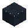
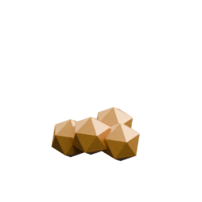
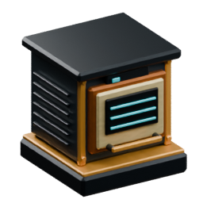

<!-- Generated by Tools/generate_wiki_items.py; edit .docs/wiki-data/item-notes.json. -->

# Gold ingot

[All items](Items.md) · [Crafting guide](Crafting-Recipes.md) · [Home](Home.md)

[How to obtain](#how-to-obtain) · [Crafting and processing](#crafting-and-processing) · [Uses](#used-to-make)

Smelted metal used in crafting. Direct smelting makes one ingot per raw ore; crushing first makes two crushed pieces, each worth one ingot.

## At a glance

| Property | Value |
|---|---|
| Stack size | 64 |

## How to obtain

Make this item using the crafting or processing recipes below.

## Crafting and processing

### Recipe 1

**Station:** [Personal crafting](Crafting-Recipes.md#personal-crafting--22) · 2×2

**Shapeless:** slot positions do not matter. Keep each pictured ingredient stack and its quantity; the layout below is only an example.

<table>
<tr>
<td align="center" width="72" height="64"> ×1</td>
<td align="center" width="72" height="64">&nbsp;</td>
</tr>
<tr>
<td align="center" width="72" height="64">&nbsp;</td>
<td align="center" width="72" height="64">&nbsp;</td>
</tr>
</table>

**Output:** <a href="Item-gold-ingot.md" title="Gold ingot"> Gold ingot</a> ×9

| Ingredient | Total per operation |
|---|---:|
|  [Gold block](Item-gold-block.md) | 1 |

### Recipe 2

**Station:** <a href="Item-furnace.md" title="Furnace"> Furnace</a>

**Processing time:** 10 seconds per operation.

**Output:** <a href="Item-gold-ingot.md" title="Gold ingot"> Gold ingot</a> ×1

| Ingredient | Total per operation |
|---|---:|
|  [Raw gold](Item-raw-gold.md) | 1 |

**Fuel:** add furnace fuel separately; it is not a crafting ingredient.  [Log](Item-log.md) ·  [Coal](Item-coal.md) ·  [Planks](Item-planks.md) ·  [Stick](Item-stick.md) ·  [Charcoal](Item-charcoal.md) ·  [Wood axe](Item-wood-axe.md) ·  [Wood pickaxe](Item-wood-pickaxe.md) ·  [Wood sword](Item-wood-sword.md) ·  [Wood shovel](Item-wood-shovel.md) ·  [Wood hoe](Item-wood-hoe.md) ·  [Coal block](Item-coal-block.md).

Fuel burns down after ignition even if the input runs out. See the [Furnace](Item-furnace.md) page for fuel durations.

### Recipe 3

**Station:** <a href="Item-furnace.md" title="Furnace"> Furnace</a>

**Processing time:** 10 seconds per operation.

**Output:** <a href="Item-gold-ingot.md" title="Gold ingot"> Gold ingot</a> ×1

| Ingredient | Total per operation |
|---|---:|
|  [Crushed Gold](Item-crushed-gold.md) | 1 |

**Fuel:** add furnace fuel separately; it is not a crafting ingredient.  [Log](Item-log.md) ·  [Coal](Item-coal.md) ·  [Planks](Item-planks.md) ·  [Stick](Item-stick.md) ·  [Charcoal](Item-charcoal.md) ·  [Wood axe](Item-wood-axe.md) ·  [Wood pickaxe](Item-wood-pickaxe.md) ·  [Wood sword](Item-wood-sword.md) ·  [Wood shovel](Item-wood-shovel.md) ·  [Wood hoe](Item-wood-hoe.md) ·  [Coal block](Item-coal-block.md).

Fuel burns down after ignition even if the input runs out. See the [Furnace](Item-furnace.md) page for fuel durations.

### Recipe 4

**Station:** <a href="Item-electric-furnace.md" title="Electric Furnace"> Electric Furnace</a>

**Processing time:** 10 seconds per operation at **200 W**. Reduced power slows progress.

**Output:** <a href="Item-gold-ingot.md" title="Gold ingot"> Gold ingot</a> ×1

| Ingredient | Total per operation |
|---|---:|
|  [Raw gold](Item-raw-gold.md) | 1 |

### Recipe 5

**Station:** <a href="Item-electric-furnace.md" title="Electric Furnace"> Electric Furnace</a>

**Processing time:** 10 seconds per operation at **200 W**. Reduced power slows progress.

**Output:** <a href="Item-gold-ingot.md" title="Gold ingot"> Gold ingot</a> ×1

| Ingredient | Total per operation |
|---|---:|
|  [Crushed Gold](Item-crushed-gold.md) | 1 |

## Used to make

Follow a result to see its complete ingredients and recipe.

| Result | Station | Recipe |
|---|---|---|
|  ×1 [Gold block](Item-gold-block.md) | [Workbench](Item-workbench.md) | [View recipe](Item-gold-block.md#recipe-1) |
