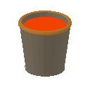

<!-- Generated by Tools/generate_wiki_items.py; edit .docs/wiki-data/item-notes.json. -->

# Lava bucket

[All items](Items.md) · [Crafting guide](Crafting-Recipes.md) · [Home](Home.md)

[How to obtain](#how-to-obtain) · [Crafting and processing](#crafting-and-processing)

A bucket containing one lava source, equivalent to **10 L**.

## At a glance

| Property | Value |
|---|---|
| Stack size | 1 |

## How to obtain

Use an empty [Bucket](Item-bucket.md) on source lava. New worlds have lava lakes near bedrock; see [Lava](Lava.md).

## Using it

Right-click a block face to place a source and recover your empty bucket. Lava flows slowly, never renews sources, destroys dropped items and burns players. It is safe while carried in inventory. A compatible multiblock tank can also accept or return 10 L through its bucket controls.

## Crafting and processing

There is no registered crafting or processing recipe for this item. Use the acquisition method above.
