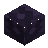

<!-- Generated by Tools/generate_wiki_items.py; edit .docs/wiki-data/item-notes.json. -->

# Lava Rock

[All items](Items.md) · [Crafting guide](Crafting-Recipes.md) · [Home](Home.md)

[How to obtain](#how-to-obtain) · [Crafting and processing](#crafting-and-processing)

Dark volcanic glass formed when flowing water contacts a lava source.

## At a glance

| Property | Value |
|---|---|
| Stack size | 64 |
| Required mining tool | Diamond pickaxe or better |
| Placement | Place from the hotbar |

## How to obtain

Let flowing water contact a lava source from above or beside it, then mine the resulting block with a [Diamond Pickaxe](Item-diamond-pickaxe.md).

## Using it

Place it as a building block. See [Lava](Lava.md) for the exact reaction and source rules.

## Crafting and processing

There is no registered crafting or processing recipe for this item. Use the acquisition method above.
