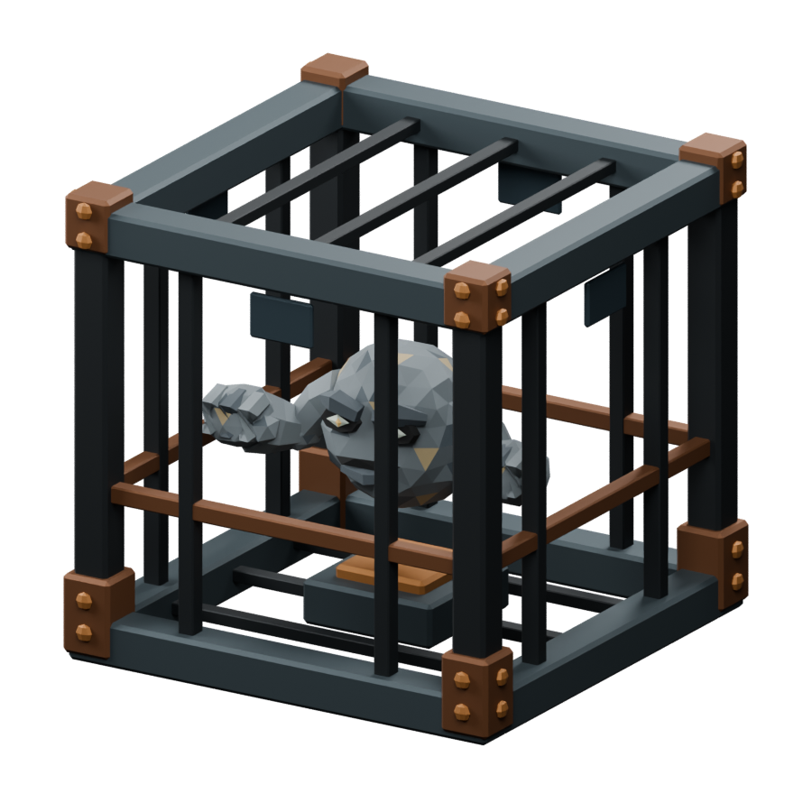

<!-- Generated by Tools/generate_wiki_items.py; edit .docs/wiki-data/item-notes.json. -->

# Mob Spawner

[All items](Items.md) · [Crafting guide](Crafting-Recipes.md) · [Home](Home.md)

[How to obtain](#how-to-obtain) · [Crafting and processing](#crafting-and-processing)

A cage containing a visual miniature of its configured creature. Rare underground rooms contain Floater cages.

## At a glance

| Property | Value |
|---|---|
| Stack size | 64 |
| Placement | Place from the hotbar |

## How to obtain

Find one in newly explored cave terrain. Breaking it destroys it and drops no collectible spawner; the item is available only for Creative testing.

## Using it

Stay within 36 blocks and keep suitable nearby floor space dark. Each cage owns at most five active mobs. See [Spawners](Spawners.md).

## Crafting and processing

There is no registered crafting or processing recipe for this item. Use the acquisition method above.
