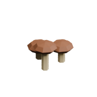

<!-- Generated by Tools/generate_wiki_items.py; edit .docs/wiki-data/item-notes.json. -->

# Mushroom Cluster

[All items](Items.md) · [Crafting guide](Crafting-Recipes.md) · [Home](Home.md)

[How to obtain](#how-to-obtain) · [Crafting and processing](#crafting-and-processing)

An edible mushroom cluster found on grassy terrain.

## At a glance

| Property | Value |
|---|---|
| Stack size | 64 |
| Placement | World block; cannot be placed directly as an inventory item |

## How to obtain

Explore newly generated terrain. Break a cluster to gather one or two mushrooms.

## Using it

Forage only in this increment. Eat mushrooms raw or cook them in a [Cooker](Item-cooker.md).

## Crafting and processing

There is no registered crafting or processing recipe for this item. Use the acquisition method above.
