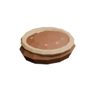

<!-- Generated by Tools/generate_wiki_items.py; edit .docs/wiki-data/item-notes.json. -->

# Potato

[All items](Items.md) · [Crafting guide](Crafting-Recipes.md) · [Home](Home.md)

[How to obtain](#how-to-obtain) · [Crafting and processing](#crafting-and-processing) · [Uses](#used-to-make)

A food item and planting material. Eat it raw for 1 food point, or bake it for 5.

## At a glance

| Property | Value |
|---|---|
| Stack size | 64 |
| Tags | `edible`, `vegetable` |
| Food restored | 1 points |

## How to obtain

Harvest naturally occurring ripe potatoes on grassy terrain, or grow your own crop. A ripe crop yields **2–4 potatoes**; an immature crop returns one.

## Using it

Till grass or dirt with a hoe, then use one potato on the exposed [Farmland](Item-farmland.md). Each of the three growth stages takes 60 seconds while suitable exposed terrain is loaded. Water irrigation is not required by the current crop system.

## Crafting and processing

There is no registered crafting or processing recipe for this item. Use the acquisition method above.

## Used to make

Follow a result to see its complete ingredients and recipe.

| Result | Station | Recipe |
|---|---|---|
|  ×1 [Baked potato](Item-baked-potato.md) | [Furnace](Item-furnace.md) | [View recipe](Item-baked-potato.md#recipe-1) |
|  ×1 [Baked potato](Item-baked-potato.md) | [Electric Furnace](Item-electric-furnace.md) | [View recipe](Item-baked-potato.md#recipe-2) |
|  ×1 [Baked potato](Item-baked-potato.md) | [Cooker](Item-cooker.md) | [View recipe](Item-baked-potato.md#recipe-3) |
|  ×1 [Baked potato](Item-baked-potato.md) | [Electric Cooker](Item-electric-cooker.md) | [View recipe](Item-baked-potato.md#recipe-4) |
|  ×1 [Vegetable Stew](Item-vegetable-stew.md) | [Cooker](Item-cooker.md) | [View recipe](Item-vegetable-stew.md#recipe-1) |
|  ×1 [Vegetable Stew](Item-vegetable-stew.md) | [Electric Cooker](Item-electric-cooker.md) | [View recipe](Item-vegetable-stew.md#recipe-2) |
