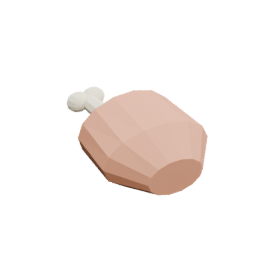
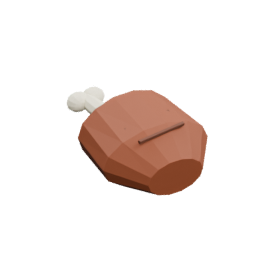
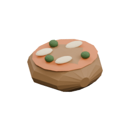

<!-- Generated by Tools/generate_wiki_items.py; edit .docs/wiki-data/item-notes.json. -->

# Raw Chicken

[All items](Items.md) · [Crafting guide](Crafting-Recipes.md) · [Home](Home.md)

[How to obtain](#how-to-obtain) · [Crafting and processing](#crafting-and-processing) · [Uses](#used-to-make)

Raw meat restoring 2 food points.

## At a glance

| Property | Value |
|---|---|
| Stack size | 64 |
| Tags | `edible`, `meat`, `raw_meat` |
| Food restored | 2 points |

## How to obtain

Defeat an adult [Chicken](Chickens.md); chicks drop no meat.

## Using it

Cook into Cooked Chicken, or combine with two vegetables for Chicken Stew.

## Crafting and processing

There is no registered crafting or processing recipe for this item. Use the acquisition method above.

## Used to make

Follow a result to see its complete ingredients and recipe.

| Result | Station | Recipe |
|---|---|---|
|  ×1 [Cooked Chicken](Item-cooked-chicken.md) | [Cooker](Item-cooker.md) | [View recipe](Item-cooked-chicken.md#recipe-1) |
|  ×1 [Cooked Chicken](Item-cooked-chicken.md) | [Electric Cooker](Item-electric-cooker.md) | [View recipe](Item-cooked-chicken.md#recipe-2) |
|  ×1 [Chicken Stew](Item-chicken-stew.md) | [Cooker](Item-cooker.md) | [View recipe](Item-chicken-stew.md#recipe-1) |
|  ×1 [Chicken Stew](Item-chicken-stew.md) | [Electric Cooker](Item-electric-cooker.md) | [View recipe](Item-chicken-stew.md#recipe-2) |
