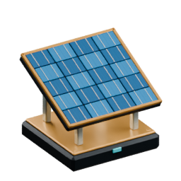

<!-- Generated by Tools/generate_wiki_items.py; edit .docs/wiki-data/item-notes.json. -->

# Solar Panel

[All items](Items.md) · [Crafting guide](Crafting-Recipes.md) · [Home](Home.md)

[How to obtain](#how-to-obtain) · [Crafting and processing](#crafting-and-processing)

Generates electricity in daylight, peaking at **400 W** at clear noon. Rain halves the available sunlight; storms reduce it to 15%.

## At a glance

| Property | Value |
|---|---|
| Stack size | 64 |
| Placement | Place from the hotbar |

## How to obtain

Make this item using the crafting or processing recipes below.

## Using it

Place outdoors with air directly above, then connect Power Cable on any face. Machines take priority and surplus charges batteries in parallel. No fuel is consumed. See [Renewable power](Renewable-power.md) for weather, setup and battery behavior.

## Crafting and processing

### Recipe 1

**Station:** <a href="Item-machinist-bench.md" title="Machinist&#x27;s Bench"> Machinist&#x27;s Bench</a> · 4×4

**Shapeless:** slot positions do not matter. Keep each pictured ingredient stack and its quantity; the layout below is only an example.

<table>
<tr>
<td align="center" width="72" height="64"> ×1</td>
<td align="center" width="72" height="64"> ×2</td>
<td align="center" width="72" height="64"> ×4</td>
<td align="center" width="72" height="64"> ×1</td>
</tr>
<tr>
<td align="center" width="72" height="64"> ×4</td>
<td align="center" width="72" height="64">&nbsp;</td>
<td align="center" width="72" height="64">&nbsp;</td>
<td align="center" width="72" height="64">&nbsp;</td>
</tr>
<tr>
<td align="center" width="72" height="64">&nbsp;</td>
<td align="center" width="72" height="64">&nbsp;</td>
<td align="center" width="72" height="64">&nbsp;</td>
<td align="center" width="72" height="64">&nbsp;</td>
</tr>
<tr>
<td align="center" width="72" height="64">&nbsp;</td>
<td align="center" width="72" height="64">&nbsp;</td>
<td align="center" width="72" height="64">&nbsp;</td>
<td align="center" width="72" height="64">&nbsp;</td>
</tr>
</table>

**Output:** <a href="Item-solar-panel.md" title="Solar Panel"> Solar Panel</a> ×1

| Ingredient | Total per operation |
|---|---:|
|  [Diamond](Item-diamond.md) | 1 |
|  [Gold ingot](Item-gold-ingot.md) | 2 |
|  [Copper Wire](Item-copper-wire.md) | 4 |
|  [Machine Casing](Item-machine-casing.md) | 1 |
|  [Glass](Item-glass.md) | 4 |
