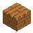
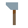
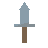
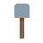
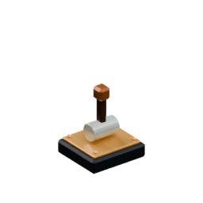
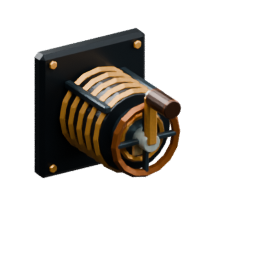

<!-- Generated by Tools/generate_wiki_items.py; edit .docs/wiki-data/item-notes.json. -->

# Stick

[All items](Items.md) · [Crafting guide](Crafting-Recipes.md) · [Home](Home.md)

[How to obtain](#how-to-obtain) · [Crafting and processing](#crafting-and-processing) · [Uses](#used-to-make)

A wooden handle used in tools and torches. Two planks arranged vertically make four sticks.

## At a glance

| Property | Value |
|---|---|
| Stack size | 64 |
| Furnace fuel duration | 5 seconds |

## How to obtain

Make this item using the crafting or processing recipes below.

## Crafting and processing

### Recipe 1

**Station:** [Personal crafting](Crafting-Recipes.md#personal-crafting--22) · 2×2

**Shaped:** keep the arrangement below. The pattern can move within a compatible grid.

<table>
<tr>
<td align="center" width="72" height="64"> ×1</td>
<td align="center" width="72" height="64">&nbsp;</td>
</tr>
<tr>
<td align="center" width="72" height="64"> ×1</td>
<td align="center" width="72" height="64">&nbsp;</td>
</tr>
</table>

**Output:** <a href="Item-stick.md" title="Stick"> Stick</a> ×4

| Ingredient | Total per operation |
|---|---:|
|  [Planks](Item-planks.md) | 2 |

## Used to make

Follow a result to see its complete ingredients and recipe.

| Result | Station | Recipe |
|---|---|---|
|  ×1 [Wood axe](Item-wood-axe.md) | [Workbench](Item-workbench.md) | [View recipe](Item-wood-axe.md#recipe-1) |
|  ×1 [Wood pickaxe](Item-wood-pickaxe.md) | [Workbench](Item-workbench.md) | [View recipe](Item-wood-pickaxe.md#recipe-1) |
|  ×1 [Wood sword](Item-wood-sword.md) | [Workbench](Item-workbench.md) | [View recipe](Item-wood-sword.md#recipe-1) |
|  ×1 [Wood shovel](Item-wood-shovel.md) | [Workbench](Item-workbench.md) | [View recipe](Item-wood-shovel.md#recipe-1) |
|  ×1 [Wood hoe](Item-wood-hoe.md) | [Workbench](Item-workbench.md) | [View recipe](Item-wood-hoe.md#recipe-1) |
|  ×1 [Stone axe](Item-stone-axe.md) | [Workbench](Item-workbench.md) | [View recipe](Item-stone-axe.md#recipe-1) |
|  ×1 [Stone pickaxe](Item-stone-pickaxe.md) | [Workbench](Item-workbench.md) | [View recipe](Item-stone-pickaxe.md#recipe-1) |
|  ×1 [Stone sword](Item-stone-sword.md) | [Workbench](Item-workbench.md) | [View recipe](Item-stone-sword.md#recipe-1) |
|  ×1 [Stone shovel](Item-stone-shovel.md) | [Workbench](Item-workbench.md) | [View recipe](Item-stone-shovel.md#recipe-1) |
|  ×1 [Stone hoe](Item-stone-hoe.md) | [Workbench](Item-workbench.md) | [View recipe](Item-stone-hoe.md#recipe-1) |
|  ×1 [Copper axe](Item-copper-axe.md) | [Workbench](Item-workbench.md) | [View recipe](Item-copper-axe.md#recipe-1) |
|  ×1 [Copper pickaxe](Item-copper-pickaxe.md) | [Workbench](Item-workbench.md) | [View recipe](Item-copper-pickaxe.md#recipe-1) |
|  ×1 [Copper sword](Item-copper-sword.md) | [Workbench](Item-workbench.md) | [View recipe](Item-copper-sword.md#recipe-1) |
|  ×1 [Copper shovel](Item-copper-shovel.md) | [Workbench](Item-workbench.md) | [View recipe](Item-copper-shovel.md#recipe-1) |
|  ×1 [Copper hoe](Item-copper-hoe.md) | [Workbench](Item-workbench.md) | [View recipe](Item-copper-hoe.md#recipe-1) |
|  ×1 [Iron axe](Item-iron-axe.md) | [Workbench](Item-workbench.md) | [View recipe](Item-iron-axe.md#recipe-1) |
|  ×1 [Iron pickaxe](Item-iron-pickaxe.md) | [Workbench](Item-workbench.md) | [View recipe](Item-iron-pickaxe.md#recipe-1) |
|  ×1 [Iron sword](Item-iron-sword.md) | [Workbench](Item-workbench.md) | [View recipe](Item-iron-sword.md#recipe-1) |
|  ×1 [Iron shovel](Item-iron-shovel.md) | [Workbench](Item-workbench.md) | [View recipe](Item-iron-shovel.md#recipe-1) |
|  ×1 [Iron hoe](Item-iron-hoe.md) | [Workbench](Item-workbench.md) | [View recipe](Item-iron-hoe.md#recipe-1) |
|  ×1 [Diamond axe](Item-diamond-axe.md) | [Workbench](Item-workbench.md) | [View recipe](Item-diamond-axe.md#recipe-1) |
|  ×1 [Diamond pickaxe](Item-diamond-pickaxe.md) | [Workbench](Item-workbench.md) | [View recipe](Item-diamond-pickaxe.md#recipe-1) |
|  ×1 [Diamond sword](Item-diamond-sword.md) | [Workbench](Item-workbench.md) | [View recipe](Item-diamond-sword.md#recipe-1) |
|  ×1 [Diamond shovel](Item-diamond-shovel.md) | [Workbench](Item-workbench.md) | [View recipe](Item-diamond-shovel.md#recipe-1) |
|  ×1 [Diamond hoe](Item-diamond-hoe.md) | [Workbench](Item-workbench.md) | [View recipe](Item-diamond-hoe.md#recipe-1) |
|  ×4 [Torch](Item-torch.md) | Personal 2×2 | [View recipe](Item-torch.md#recipe-1) |
|  ×4 [Torch](Item-torch.md) | Personal 2×2 | [View recipe](Item-torch.md#recipe-2) |
|  ×1 [Lever](Item-lever.md) | [Workbench](Item-workbench.md) | [View recipe](Item-lever.md#recipe-1) |
|  ×1 [Hand Crank](Item-hand-crank.md) | [Workbench](Item-workbench.md) | [View recipe](Item-hand-crank.md#recipe-1) |

## Furnace fuel

One item supplies **5 seconds** of burning fuel. Use it in a [Furnace](Item-furnace.md) for smelting or cooking.
