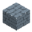

<!-- Generated by Tools/generate_wiki_items.py; edit .docs/wiki-data/item-notes.json. -->

# Stone shovel

[All items](Items.md) · [Crafting guide](Crafting-Recipes.md) · [Home](Home.md)

[How to obtain](#how-to-obtain) · [Crafting and processing](#crafting-and-processing)

Digs dirt, grass and farmland faster. Tools currently have no durability loss.

## At a glance

| Property | Value |
|---|---|
| Stack size | 1 |
| Tool tier | Stone |
| Effective mining speed | 4× on suitable blocks |
| Melee damage | 3 |

## How to obtain

Make this item using the crafting or processing recipes below.

## Crafting and processing

### Recipe 1

**Station:** <a href="Item-workbench.md" title="Workbench"> Workbench</a> · 3×3

**Shaped:** keep the arrangement below. The pattern can move within a compatible grid.

<table>
<tr>
<td align="center" width="72" height="64"> ×1</td>
<td align="center" width="72" height="64">&nbsp;</td>
<td align="center" width="72" height="64">&nbsp;</td>
</tr>
<tr>
<td align="center" width="72" height="64"> ×1</td>
<td align="center" width="72" height="64">&nbsp;</td>
<td align="center" width="72" height="64">&nbsp;</td>
</tr>
<tr>
<td align="center" width="72" height="64"> ×1</td>
<td align="center" width="72" height="64">&nbsp;</td>
<td align="center" width="72" height="64">&nbsp;</td>
</tr>
</table>

**Output:** <a href="Item-stone-shovel.md" title="Stone shovel"> Stone shovel</a> ×1

| Ingredient | Total per operation |
|---|---:|
|  [Cobblestone](Item-cobblestone.md) | 1 |
|  [Stick](Item-stick.md) | 2 |
