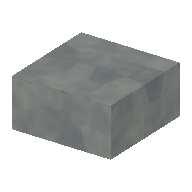
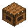
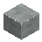

<!-- Generated by Tools/generate_wiki_items.py; edit .docs/wiki-data/item-notes.json. -->

# Stone Slab

[All items](Items.md) · [Crafting guide](Crafting-Recipes.md) · [Home](Home.md)

[How to obtain](#how-to-obtain) · [Crafting and processing](#crafting-and-processing)

A half-height building block for floors, porches and ceilings.

## At a glance

| Property | Value |
|---|---|
| Stack size | 64 |
| Tags | `half_block` |
| Required mining tool | Wood pickaxe or better |
| Placement | Place from the hotbar |

## How to obtain

Craft three Stone in a horizontal workbench row to make six slabs.

## Using it

Place in the lower or upper half of a cell. Combine two matching slabs into a full block; mining recovers two slabs. See [Slabs and connected glass](Slabs-and-connected-glass.md). Requires a wooden pickaxe or better to mine.

## Crafting and processing

### Recipe 1

**Station:** <a href="Item-workbench.md" title="Workbench"> Workbench</a> · 3×3

**Shaped:** keep the arrangement below. The pattern can move within a compatible grid.

<table>
<tr>
<td align="center" width="72" height="64"> ×1</td>
<td align="center" width="72" height="64"> ×1</td>
<td align="center" width="72" height="64"> ×1</td>
</tr>
<tr>
<td align="center" width="72" height="64">&nbsp;</td>
<td align="center" width="72" height="64">&nbsp;</td>
<td align="center" width="72" height="64">&nbsp;</td>
</tr>
<tr>
<td align="center" width="72" height="64">&nbsp;</td>
<td align="center" width="72" height="64">&nbsp;</td>
<td align="center" width="72" height="64">&nbsp;</td>
</tr>
</table>

**Output:** <a href="Item-stone-slab.md" title="Stone Slab"> Stone Slab</a> ×6

| Ingredient | Total per operation |
|---|---:|
|  [Stone](Item-stone.md) | 3 |
