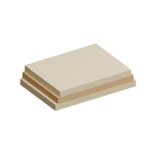

<!-- Generated by Tools/generate_wiki_items.py; edit .docs/wiki-data/item-notes.json. -->

# String

[All items](Items.md) · [Crafting guide](Crafting-Recipes.md) · [Home](Home.md)

[How to obtain](#how-to-obtain) · [Crafting and processing](#crafting-and-processing) · [Uses](#used-to-make)

Renewable flax cordage, crafted from three Flax Fibre.

## At a glance

| Property | Value |
|---|---|
| Stack size | 64 |
| Tags | `cordage` |

## How to obtain

Make this item using the crafting or processing recipes below.

## Using it

Craft four Strings into one Cloth. Fishing rods are a later increment.

## Crafting and processing

### Recipe 1

**Station:** [Personal crafting](Crafting-Recipes.md#personal-crafting--22) · 2×2

**Shapeless:** slot positions do not matter. Keep each pictured ingredient stack and its quantity; the layout below is only an example.

<table>
<tr>
<td align="center" width="72" height="64"> ×3</td>
<td align="center" width="72" height="64">&nbsp;</td>
</tr>
<tr>
<td align="center" width="72" height="64">&nbsp;</td>
<td align="center" width="72" height="64">&nbsp;</td>
</tr>
</table>

**Output:** <a href="Item-string.md" title="String"> String</a> ×1

| Ingredient | Total per operation |
|---|---:|
|  [Flax Fibre](Item-flax-fibre.md) | 3 |

## Used to make

Follow a result to see its complete ingredients and recipe.

| Result | Station | Recipe |
|---|---|---|
|  ×1 [Cloth](Item-cloth.md) | Personal 2×2 | [View recipe](Item-cloth.md#recipe-1) |
