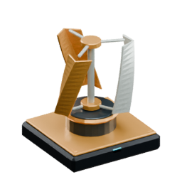

<!-- Generated by Tools/generate_wiki_items.py; edit .docs/wiki-data/item-notes.json. -->

# Wind Turbine

[All items](Items.md) · [Crafting guide](Crafting-Recipes.md) · [Home](Home.md)

[How to obtain](#how-to-obtain) · [Crafting and processing](#crafting-and-processing)

A compact vertical-axis turbine with gradually changing gusts: **40–140 W in clear weather, 240–360 W in rain and 400 W in storms**, by day or night.

## At a glance

| Property | Value |
|---|---|
| Stack size | 64 |
| Placement | Place from the hotbar |

## How to obtain

Make this item using the crafting or processing recipes below.

## Using it

Place outdoors with air directly above, connect Power Cable on any face, and add batteries to buffer changing output. The rotor follows wind strength and stops when it supplies no power. Battery charging counts as demand. See [Renewable power](Renewable-power.md).

## Crafting and processing

### Recipe 1

**Station:** <a href="Item-machinist-bench.md" title="Machinist&#x27;s Bench"> Machinist&#x27;s Bench</a> · 4×4

**Shapeless:** slot positions do not matter. Keep each pictured ingredient stack and its quantity; the layout below is only an example.

<table>
<tr>
<td align="center" width="72" height="64"> ×1</td>
<td align="center" width="72" height="64"> ×2</td>
<td align="center" width="72" height="64"> ×4</td>
<td align="center" width="72" height="64"> ×4</td>
</tr>
<tr>
<td align="center" width="72" height="64"> ×2</td>
<td align="center" width="72" height="64"> ×1</td>
<td align="center" width="72" height="64">&nbsp;</td>
<td align="center" width="72" height="64">&nbsp;</td>
</tr>
<tr>
<td align="center" width="72" height="64">&nbsp;</td>
<td align="center" width="72" height="64">&nbsp;</td>
<td align="center" width="72" height="64">&nbsp;</td>
<td align="center" width="72" height="64">&nbsp;</td>
</tr>
<tr>
<td align="center" width="72" height="64">&nbsp;</td>
<td align="center" width="72" height="64">&nbsp;</td>
<td align="center" width="72" height="64">&nbsp;</td>
<td align="center" width="72" height="64">&nbsp;</td>
</tr>
</table>

**Output:** <a href="Item-wind-turbine.md" title="Wind Turbine"> Wind Turbine</a> ×1

| Ingredient | Total per operation |
|---|---:|
|  [Diamond](Item-diamond.md) | 1 |
|  [Gold ingot](Item-gold-ingot.md) | 2 |
|  [Copper Wire](Item-copper-wire.md) | 4 |
|  [Iron Plate](Item-iron-plate.md) | 4 |
|  [Iron Cog](Item-cog.md) | 2 |
|  [Alternator](Item-alternator.md) | 1 |
