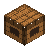
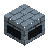
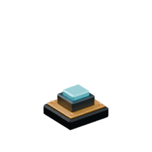
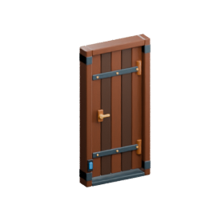
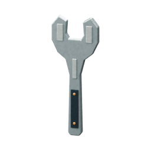

<!-- Generated by Tools/generate_wiki_items.py; edit .docs/wiki-data/item-notes.json. -->

# Workbench

[All items](Items.md) · [Crafting guide](Crafting-Recipes.md) · [Home](Home.md)

[How to obtain](#how-to-obtain) · [Crafting and processing](#crafting-and-processing) · [Uses](#used-to-make) · [Recipes made here](#recipes-made-here)

A placed crafting station with a **3×3 grid** for tools, armor, storage and the first Machinist’s Bench.

## At a glance

| Property | Value |
|---|---|
| Stack size | 64 |
| Placement | Place from the hotbar |

## How to obtain

Make this item using the crafting or processing recipes below.

## Using it

Place it, then press **E or right-click** to open it. The workbench can also make personal 2×2 recipes. See the [crafting guide](Crafting-Recipes.md) for the first steps.

A wooden carpenter’s bench with iron-bound trestles, a vise and hand tools.

Opening its controls shows a matching illustration and name in the left panel. See [Machine interfaces](Machine-interfaces.md).

## Crafting and processing

### Recipe 1

**Station:** [Personal crafting](Crafting-Recipes.md#personal-crafting--22) · 2×2

**Shaped:** keep the arrangement below. The pattern can move within a compatible grid.

<table>
<tr>
<td align="center" width="72" height="64"> ×1</td>
<td align="center" width="72" height="64"> ×1</td>
</tr>
<tr>
<td align="center" width="72" height="64"> ×1</td>
<td align="center" width="72" height="64"> ×1</td>
</tr>
</table>

**Output:** <a href="Item-workbench.md" title="Workbench"> Workbench</a> ×1

| Ingredient | Total per operation |
|---|---:|
|  [Planks](Item-planks.md) | 4 |

## Used to make

Follow a result to see its complete ingredients and recipe.

| Result | Station | Recipe |
|---|---|---|
|  ×1 [Machinist's Bench](Item-machinist-bench.md) | [Workbench](Item-workbench.md) | [View recipe](Item-machinist-bench.md#recipe-1) |

## Recipes made here

The station is reusable; it is not consumed by these recipes.

| Result | Station | Recipe |
|---|---|---|
|  ×1 [Furnace](Item-furnace.md) | [Workbench](Item-workbench.md) | [View recipe](Item-furnace.md#recipe-1) |
|  ×1 [Chest](Item-chest.md) | [Workbench](Item-workbench.md) | [View recipe](Item-chest.md#recipe-1) |
|  ×1 [Wood axe](Item-wood-axe.md) | [Workbench](Item-workbench.md) | [View recipe](Item-wood-axe.md#recipe-1) |
|  ×1 [Wood pickaxe](Item-wood-pickaxe.md) | [Workbench](Item-workbench.md) | [View recipe](Item-wood-pickaxe.md#recipe-1) |
|  ×1 [Wood sword](Item-wood-sword.md) | [Workbench](Item-workbench.md) | [View recipe](Item-wood-sword.md#recipe-1) |
|  ×1 [Wood shovel](Item-wood-shovel.md) | [Workbench](Item-workbench.md) | [View recipe](Item-wood-shovel.md#recipe-1) |
|  ×1 [Wood hoe](Item-wood-hoe.md) | [Workbench](Item-workbench.md) | [View recipe](Item-wood-hoe.md#recipe-1) |
|  ×1 [Stone axe](Item-stone-axe.md) | [Workbench](Item-workbench.md) | [View recipe](Item-stone-axe.md#recipe-1) |
|  ×1 [Stone pickaxe](Item-stone-pickaxe.md) | [Workbench](Item-workbench.md) | [View recipe](Item-stone-pickaxe.md#recipe-1) |
|  ×1 [Stone sword](Item-stone-sword.md) | [Workbench](Item-workbench.md) | [View recipe](Item-stone-sword.md#recipe-1) |
|  ×1 [Stone shovel](Item-stone-shovel.md) | [Workbench](Item-workbench.md) | [View recipe](Item-stone-shovel.md#recipe-1) |
|  ×1 [Stone hoe](Item-stone-hoe.md) | [Workbench](Item-workbench.md) | [View recipe](Item-stone-hoe.md#recipe-1) |
|  ×1 [Copper axe](Item-copper-axe.md) | [Workbench](Item-workbench.md) | [View recipe](Item-copper-axe.md#recipe-1) |
|  ×1 [Copper pickaxe](Item-copper-pickaxe.md) | [Workbench](Item-workbench.md) | [View recipe](Item-copper-pickaxe.md#recipe-1) |
|  ×1 [Copper sword](Item-copper-sword.md) | [Workbench](Item-workbench.md) | [View recipe](Item-copper-sword.md#recipe-1) |
|  ×1 [Copper shovel](Item-copper-shovel.md) | [Workbench](Item-workbench.md) | [View recipe](Item-copper-shovel.md#recipe-1) |
|  ×1 [Copper hoe](Item-copper-hoe.md) | [Workbench](Item-workbench.md) | [View recipe](Item-copper-hoe.md#recipe-1) |
|  ×1 [Iron axe](Item-iron-axe.md) | [Workbench](Item-workbench.md) | [View recipe](Item-iron-axe.md#recipe-1) |
|  ×1 [Iron pickaxe](Item-iron-pickaxe.md) | [Workbench](Item-workbench.md) | [View recipe](Item-iron-pickaxe.md#recipe-1) |
|  ×1 [Iron sword](Item-iron-sword.md) | [Workbench](Item-workbench.md) | [View recipe](Item-iron-sword.md#recipe-1) |
|  ×1 [Iron shovel](Item-iron-shovel.md) | [Workbench](Item-workbench.md) | [View recipe](Item-iron-shovel.md#recipe-1) |
|  ×1 [Iron hoe](Item-iron-hoe.md) | [Workbench](Item-workbench.md) | [View recipe](Item-iron-hoe.md#recipe-1) |
|  ×1 [Diamond axe](Item-diamond-axe.md) | [Workbench](Item-workbench.md) | [View recipe](Item-diamond-axe.md#recipe-1) |
|  ×1 [Diamond pickaxe](Item-diamond-pickaxe.md) | [Workbench](Item-workbench.md) | [View recipe](Item-diamond-pickaxe.md#recipe-1) |
|  ×1 [Diamond sword](Item-diamond-sword.md) | [Workbench](Item-workbench.md) | [View recipe](Item-diamond-sword.md#recipe-1) |
|  ×1 [Diamond shovel](Item-diamond-shovel.md) | [Workbench](Item-workbench.md) | [View recipe](Item-diamond-shovel.md#recipe-1) |
|  ×1 [Diamond hoe](Item-diamond-hoe.md) | [Workbench](Item-workbench.md) | [View recipe](Item-diamond-hoe.md#recipe-1) |
|  ×1 [Copper helmet](Item-copper-helmet.md) | [Workbench](Item-workbench.md) | [View recipe](Item-copper-helmet.md#recipe-1) |
|  ×1 [Copper chestplate](Item-copper-chestplate.md) | [Workbench](Item-workbench.md) | [View recipe](Item-copper-chestplate.md#recipe-1) |
|  ×1 [Copper leggings](Item-copper-leggings.md) | [Workbench](Item-workbench.md) | [View recipe](Item-copper-leggings.md#recipe-1) |
|  ×1 [Copper boots](Item-copper-boots.md) | [Workbench](Item-workbench.md) | [View recipe](Item-copper-boots.md#recipe-1) |
|  ×1 [Iron helmet](Item-iron-helmet.md) | [Workbench](Item-workbench.md) | [View recipe](Item-iron-helmet.md#recipe-1) |
|  ×1 [Iron chestplate](Item-iron-chestplate.md) | [Workbench](Item-workbench.md) | [View recipe](Item-iron-chestplate.md#recipe-1) |
|  ×1 [Iron leggings](Item-iron-leggings.md) | [Workbench](Item-workbench.md) | [View recipe](Item-iron-leggings.md#recipe-1) |
|  ×1 [Iron boots](Item-iron-boots.md) | [Workbench](Item-workbench.md) | [View recipe](Item-iron-boots.md#recipe-1) |
|  ×1 [Diamond helmet](Item-diamond-helmet.md) | [Workbench](Item-workbench.md) | [View recipe](Item-diamond-helmet.md#recipe-1) |
|  ×1 [Diamond chestplate](Item-diamond-chestplate.md) | [Workbench](Item-workbench.md) | [View recipe](Item-diamond-chestplate.md#recipe-1) |
|  ×1 [Diamond leggings](Item-diamond-leggings.md) | [Workbench](Item-workbench.md) | [View recipe](Item-diamond-leggings.md#recipe-1) |
|  ×1 [Diamond boots](Item-diamond-boots.md) | [Workbench](Item-workbench.md) | [View recipe](Item-diamond-boots.md#recipe-1) |
|  ×1 [Coal block](Item-coal-block.md) | [Workbench](Item-workbench.md) | [View recipe](Item-coal-block.md#recipe-1) |
|  ×1 [Iron block](Item-iron-block.md) | [Workbench](Item-workbench.md) | [View recipe](Item-iron-block.md#recipe-1) |
|  ×1 [Copper block](Item-copper-block.md) | [Workbench](Item-workbench.md) | [View recipe](Item-copper-block.md#recipe-1) |
|  ×1 [Gold block](Item-gold-block.md) | [Workbench](Item-workbench.md) | [View recipe](Item-gold-block.md#recipe-1) |
|  ×1 [Diamond block](Item-diamond-block.md) | [Workbench](Item-workbench.md) | [View recipe](Item-diamond-block.md#recipe-1) |
|  ×1 [Bucket](Item-bucket.md) | [Workbench](Item-workbench.md) | [View recipe](Item-bucket.md#recipe-1) |
|  ×1 [Machinist's Bench](Item-machinist-bench.md) | [Workbench](Item-workbench.md) | [View recipe](Item-machinist-bench.md#recipe-1) |
|  ×1 [Lever](Item-lever.md) | [Workbench](Item-workbench.md) | [View recipe](Item-lever.md#recipe-1) |
|  ×1 [Button](Item-button.md) | [Workbench](Item-workbench.md) | [View recipe](Item-button.md#recipe-1) |
|  ×1 [Hand Crank](Item-hand-crank.md) | [Workbench](Item-workbench.md) | [View recipe](Item-hand-crank.md#recipe-1) |
|  ×3 [Wooden Door](Item-wooden-door.md) | [Workbench](Item-workbench.md) | [View recipe](Item-wooden-door.md#recipe-1) |
|  ×1 [Wrench](Item-wrench.md) | [Workbench](Item-workbench.md) | [View recipe](Item-wrench.md#recipe-1) |
