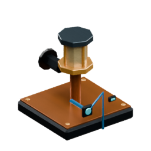
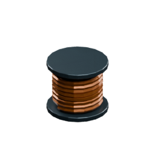

<!-- Generated by Tools/generate_wiki_items.py; edit .docs/wiki-data/item-notes.json. -->

# Workshop Lamp

[All items](Items.md) · [Crafting guide](Crafting-Recipes.md) · [Home](Home.md)

[How to obtain](#how-to-obtain) · [Crafting and processing](#crafting-and-processing)

Power at rear · optional signal at front.

## At a glance

| Property | Value |
|---|---|
| Stack size | 64 |
| Power demand | 20 W |
| Placement | Place from the hotbar |

## How to obtain

Make this item using the crafting or processing recipes below.

## Using it

See [Electricity and batteries](Electricity-and-batteries.md) for generator placement, power sockets and example circuits.

## Crafting and processing

### Recipe 1

**Station:** <a href="Item-machinist-bench.md" title="Machinist&#x27;s Bench"> Machinist&#x27;s Bench</a> · 4×4

**Shapeless:** slot positions do not matter. Keep each pictured ingredient stack and its quantity; the layout below is only an example.

<table>
<tr>
<td align="center" width="72" height="64"> ×2</td>
<td align="center" width="72" height="64"> ×1</td>
<td align="center" width="72" height="64"> ×2</td>
<td align="center" width="72" height="64">&nbsp;</td>
</tr>
<tr>
<td align="center" width="72" height="64">&nbsp;</td>
<td align="center" width="72" height="64">&nbsp;</td>
<td align="center" width="72" height="64">&nbsp;</td>
<td align="center" width="72" height="64">&nbsp;</td>
</tr>
<tr>
<td align="center" width="72" height="64">&nbsp;</td>
<td align="center" width="72" height="64">&nbsp;</td>
<td align="center" width="72" height="64">&nbsp;</td>
<td align="center" width="72" height="64">&nbsp;</td>
</tr>
<tr>
<td align="center" width="72" height="64">&nbsp;</td>
<td align="center" width="72" height="64">&nbsp;</td>
<td align="center" width="72" height="64">&nbsp;</td>
<td align="center" width="72" height="64">&nbsp;</td>
</tr>
</table>

**Output:** <a href="Item-workshop-lamp.md" title="Workshop Lamp"> Workshop Lamp</a> ×1

| Ingredient | Total per operation |
|---|---:|
|  [Copper Wire](Item-copper-wire.md) | 2 |
|  [Iron Plate](Item-iron-plate.md) | 1 |
|  [Glass](Item-glass.md) | 2 |
