<!-- Generated by Tools/generate_wiki_items.py; edit .docs/wiki-data/item-notes.json. -->

# Items

Click any icon or item name for what it does, how to obtain it, its recipes, and the things you can make with it.

[Crafting guide](Crafting-Recipes.md) · [Home](Home.md)

Includes all **132 registered items and world-block entries** in the current playable alpha. Ore blocks, crops, bedrock and legacy test equipment have pages even when they cannot be crafted or placed.

[Building blocks](#building-blocks) · [Ore deposits and bedrock](#ore-deposits-and-bedrock) · [Materials and components](#materials-and-components) · [Tools and weapons](#tools-and-weapons) · [Armor](#armor) · [Food and farming](#food-and-farming) · [Light and buckets](#light-and-buckets) · [Stations and machines](#stations-and-machines) · [Connections and controls](#connections-and-controls) · [Multiblock tanks and batteries](#multiblock-tanks-and-batteries) · [Legacy test equipment](#legacy-test-equipment)

## Building blocks

| | | | |
|:---:|:---:|:---:|:---:|
| <a href="Item-coal-block.md" title="Coal block"> Coal block</a> | <a href="Item-cobblestone.md" title="Cobblestone"> Cobblestone</a> | <a href="Item-copper-block.md" title="Copper block"> Copper block</a> | <a href="Item-diamond-block.md" title="Diamond block"> Diamond block</a> |
| <a href="Item-dirt.md" title="Dirt">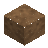 Dirt</a> | <a href="Item-gold-block.md" title="Gold block"> Gold block</a> | <a href="Item-grass.md" title="Grass">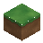 Grass</a> | <a href="Item-iron-block.md" title="Iron block"> Iron block</a> |
| <a href="Item-leaves.md" title="Leaves">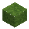 Leaves</a> | <a href="Item-log.md" title="Log"> Log</a> | <a href="Item-planks.md" title="Planks"> Planks</a> | <a href="Item-red-clay.md" title="Red clay">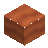 Red clay</a> |
| <a href="Item-sand.md" title="Sand">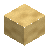 Sand</a> | <a href="Item-sandstone.md" title="Sandstone">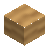 Sandstone</a> | <a href="Item-snow.md" title="Snow"> Snow</a> | <a href="Item-stone.md" title="Stone">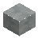 Stone</a> |

## Ore deposits and bedrock

| | | | |
|:---:|:---:|:---:|:---:|
| <a href="Item-azure-ore.md" title="Azure Ore">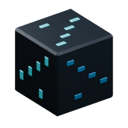 Azure Ore</a> | <a href="Item-bedrock.md" title="Bedrock">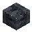 Bedrock</a> | <a href="Item-coal-ore.md" title="Coal ore">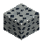 Coal ore</a> | <a href="Item-copper-ore.md" title="Copper ore"> Copper ore</a> |
| <a href="Item-diamond-ore.md" title="Diamond ore">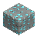 Diamond ore</a> | <a href="Item-gold-ore.md" title="Gold ore">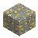 Gold ore</a> | <a href="Item-iron-ore.md" title="Iron ore">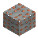 Iron ore</a> |  |

## Materials and components

| | | | |
|:---:|:---:|:---:|:---:|
| <a href="Item-azure-crystal.md" title="Azure Crystal"> Azure Crystal</a> | <a href="Item-charcoal.md" title="Charcoal"> Charcoal</a> | <a href="Item-coal.md" title="Coal"> Coal</a> | <a href="Item-copper-ingot.md" title="Copper ingot"> Copper ingot</a> |
| <a href="Item-copper-plate.md" title="Copper Plate"> Copper Plate</a> | <a href="Item-copper-wire.md" title="Copper Wire"> Copper Wire</a> | <a href="Item-crushed-copper.md" title="Crushed Copper"> Crushed Copper</a> | <a href="Item-crushed-gold.md" title="Crushed Gold"> Crushed Gold</a> |
| <a href="Item-crushed-iron.md" title="Crushed Iron">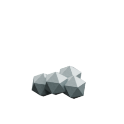 Crushed Iron</a> | <a href="Item-diamond.md" title="Diamond">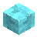 Diamond</a> | <a href="Item-glass.md" title="Glass"> Glass</a> | <a href="Item-gold-ingot.md" title="Gold ingot"> Gold ingot</a> |
| <a href="Item-cog.md" title="Iron Cog"> Iron Cog</a> | <a href="Item-iron-ingot.md" title="Iron ingot"> Iron ingot</a> | <a href="Item-iron-plate.md" title="Iron Plate"> Iron Plate</a> | <a href="Item-machine-casing.md" title="Machine Casing"> Machine Casing</a> |
| <a href="Item-raw-copper.md" title="Raw copper"> Raw copper</a> | <a href="Item-raw-gold.md" title="Raw gold"> Raw gold</a> | <a href="Item-raw-iron.md" title="Raw iron">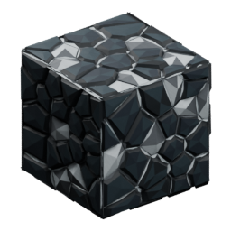 Raw iron</a> | <a href="Item-rivets.md" title="Rivets"> Rivets</a> |
| <a href="Item-stick.md" title="Stick"> Stick</a> |  |  |  |

## Tools and weapons

| | | | |
|:---:|:---:|:---:|:---:|
| <a href="Item-copper-axe.md" title="Copper axe"> Copper axe</a> | <a href="Item-copper-hoe.md" title="Copper hoe"> Copper hoe</a> | <a href="Item-copper-pickaxe.md" title="Copper pickaxe"> Copper pickaxe</a> | <a href="Item-copper-shovel.md" title="Copper shovel"> Copper shovel</a> |
| <a href="Item-copper-sword.md" title="Copper sword"> Copper sword</a> | <a href="Item-diamond-axe.md" title="Diamond axe"> Diamond axe</a> | <a href="Item-diamond-hoe.md" title="Diamond hoe"> Diamond hoe</a> | <a href="Item-diamond-pickaxe.md" title="Diamond pickaxe"> Diamond pickaxe</a> |
| <a href="Item-diamond-shovel.md" title="Diamond shovel"> Diamond shovel</a> | <a href="Item-diamond-sword.md" title="Diamond sword"> Diamond sword</a> | <a href="Item-iron-axe.md" title="Iron axe"> Iron axe</a> | <a href="Item-iron-hoe.md" title="Iron hoe"> Iron hoe</a> |
| <a href="Item-iron-pickaxe.md" title="Iron pickaxe"> Iron pickaxe</a> | <a href="Item-iron-shovel.md" title="Iron shovel"> Iron shovel</a> | <a href="Item-iron-sword.md" title="Iron sword"> Iron sword</a> | <a href="Item-stone-axe.md" title="Stone axe"> Stone axe</a> |
| <a href="Item-stone-hoe.md" title="Stone hoe"> Stone hoe</a> | <a href="Item-stone-pickaxe.md" title="Stone pickaxe"> Stone pickaxe</a> | <a href="Item-stone-shovel.md" title="Stone shovel"> Stone shovel</a> | <a href="Item-stone-sword.md" title="Stone sword"> Stone sword</a> |
| <a href="Item-wood-axe.md" title="Wood axe"> Wood axe</a> | <a href="Item-wood-hoe.md" title="Wood hoe"> Wood hoe</a> | <a href="Item-wood-pickaxe.md" title="Wood pickaxe"> Wood pickaxe</a> | <a href="Item-wood-shovel.md" title="Wood shovel"> Wood shovel</a> |
| <a href="Item-wood-sword.md" title="Wood sword"> Wood sword</a> | <a href="Item-wrench.md" title="Wrench"> Wrench</a> |  |  |

## Armor

| | | | |
|:---:|:---:|:---:|:---:|
| <a href="Item-copper-boots.md" title="Copper boots"> Copper boots</a> | <a href="Item-copper-chestplate.md" title="Copper chestplate"> Copper chestplate</a> | <a href="Item-copper-helmet.md" title="Copper helmet"> Copper helmet</a> | <a href="Item-copper-leggings.md" title="Copper leggings"> Copper leggings</a> |
| <a href="Item-diamond-boots.md" title="Diamond boots"> Diamond boots</a> | <a href="Item-diamond-chestplate.md" title="Diamond chestplate"> Diamond chestplate</a> | <a href="Item-diamond-helmet.md" title="Diamond helmet"> Diamond helmet</a> | <a href="Item-diamond-leggings.md" title="Diamond leggings"> Diamond leggings</a> |
| <a href="Item-iron-boots.md" title="Iron boots"> Iron boots</a> | <a href="Item-iron-chestplate.md" title="Iron chestplate"> Iron chestplate</a> | <a href="Item-iron-helmet.md" title="Iron helmet"> Iron helmet</a> | <a href="Item-iron-leggings.md" title="Iron leggings"> Iron leggings</a> |

## Food and farming

| | | | |
|:---:|:---:|:---:|:---:|
| <a href="Item-apple.md" title="Apple">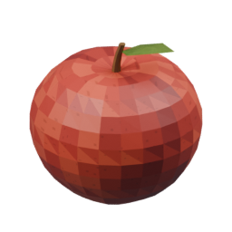 Apple</a> | <a href="Item-baked-potato.md" title="Baked potato">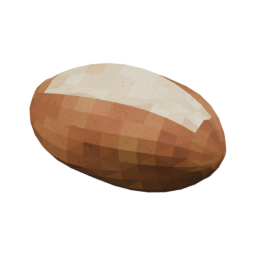 Baked potato</a> | <a href="Item-farmland.md" title="Farmland"> Farmland</a> | <a href="Item-potato-plant-2.md" title="Flowering potatoes"> Flowering potatoes</a> |
| <a href="Item-potato.md" title="Potato">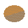 Potato</a> | <a href="Item-potato-plant-0.md" title="Potato seedlings"> Potato seedlings</a> | <a href="Item-potato-plant-3.md" title="Ripe potatoes">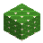 Ripe potatoes</a> | <a href="Item-sapling.md" title="Sapling"> Sapling</a> |
| <a href="Item-potato-plant-1.md" title="Young potatoes"> Young potatoes</a> |  |  |  |

## Light and buckets

| | | | |
|:---:|:---:|:---:|:---:|
| <a href="Item-bucket.md" title="Bucket"> Bucket</a> | <a href="Item-torch.md" title="Torch"> Torch</a> | <a href="Item-water-bucket.md" title="Water bucket"> Water bucket</a> |  |

## Stations and machines

| | | | |
|:---:|:---:|:---:|:---:|
| <a href="Item-alternator.md" title="Alternator">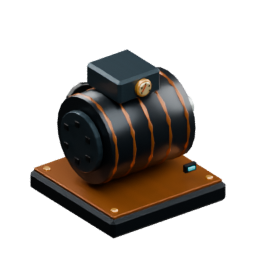 Alternator</a> | <a href="Item-boiler-engine.md" title="Boiler Engine"> Boiler Engine</a> | <a href="Item-chest.md" title="Chest"> Chest</a> | <a href="Item-crusher.md" title="Crusher">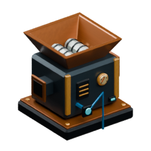 Crusher</a> |
| <a href="Item-drill.md" title="Drill">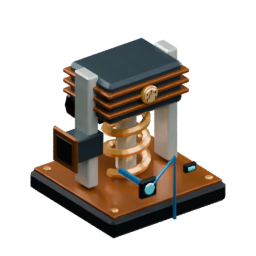 Drill</a> | <a href="Item-furnace.md" title="Furnace"> Furnace</a> | <a href="Item-machinist-bench.md" title="Machinist&#x27;s Bench"> Machinist&#x27;s Bench</a> | <a href="Item-pump.md" title="Pump"> Pump</a> |
| <a href="Item-water-tank.md" title="Water Tank"> Water Tank</a> | <a href="Item-workbench.md" title="Workbench"> Workbench</a> | <a href="Item-workshop-lamp.md" title="Workshop Lamp"> Workshop Lamp</a> |  |

## Connections and controls

| | | | |
|:---:|:---:|:---:|:---:|
| <a href="Item-button.md" title="Button"> Button</a> | <a href="Item-extractor.md" title="Extractor">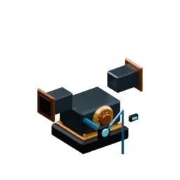 Extractor</a> | <a href="Item-fluid-pipe.md" title="Fluid Pipe"> Fluid Pipe</a> | <a href="Item-inventory-sensor.md" title="Inventory Sensor">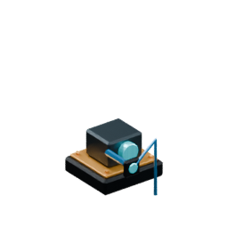 Inventory Sensor</a> |
| <a href="Item-item-pipe.md" title="Item Pipe">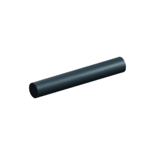 Item Pipe</a> | <a href="Item-lever.md" title="Lever"> Lever</a> | <a href="Item-power-cable.md" title="Power Cable">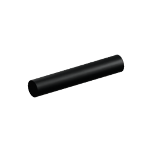 Power Cable</a> | <a href="Item-signal-conduit.md" title="Signal Conduit"> Signal Conduit</a> |
| <a href="Item-signal-indicator.md" title="Signal Indicator"> Signal Indicator</a> | <a href="Item-signal-relay.md" title="Signal Relay"> Signal Relay</a> | <a href="Item-signal-wire.md" title="Signal Wire"> Signal Wire</a> | <a href="Item-workshop-hatch.md" title="Workshop Hatch">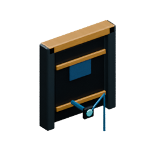 Workshop Hatch</a> |

## Multiblock tanks and batteries

| | | | |
|:---:|:---:|:---:|:---:|
| <a href="Item-battery-controller.md" title="Battery Bank Controller">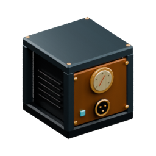 Battery Bank Controller</a> | <a href="Item-battery-block.md" title="Battery Block">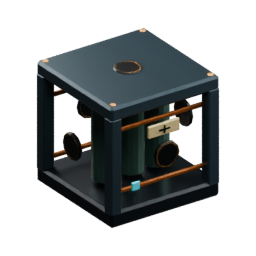 Battery Block</a> | <a href="Item-hand-crank.md" title="Hand Crank"> Hand Crank</a> | <a href="Item-tank-frame.md" title="Reinforced Tank Frame"> Reinforced Tank Frame</a> |
| <a href="Item-tank-glass.md" title="Reinforced Tank Glass"> Reinforced Tank Glass</a> | <a href="Item-tank-valve.md" title="Signal Valve Port"> Signal Valve Port</a> | <a href="Item-tank-hatch.md" title="Tank Access Hatch"> Tank Access Hatch</a> | <a href="Item-tank-controller.md" title="Tank Controller"> Tank Controller</a> |
| <a href="Item-tank-port.md" title="Tank Fluid Port"> Tank Fluid Port</a> | <a href="Item-tank-sensor.md" title="Tank Level Sensor"> Tank Level Sensor</a> | <a href="Item-tank-wall.md" title="Tank Wall"> Tank Wall</a> | <a href="Item-wooden-door.md" title="Wooden Door"> Wooden Door</a> |

## Legacy test equipment

Historical test items available in the Creative catalog. Ordinary expeditions start empty-handed; these tools have no active crafting recipes.

| | | | |
|:---:|:---:|:---:|:---:|
| <a href="Item-starter-axe.md" title="Starter axe">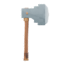 Starter axe</a> | <a href="Item-starter-dagger.md" title="Starter dagger">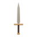 Starter dagger</a> | <a href="Item-starter-pickaxe.md" title="Starter pickaxe">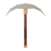 Starter pickaxe</a> |  |
