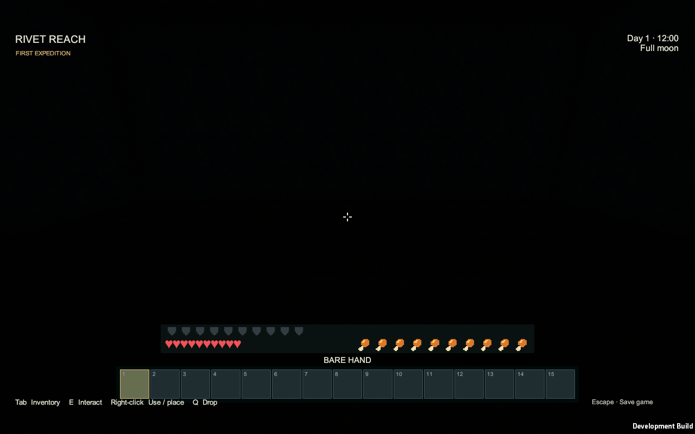
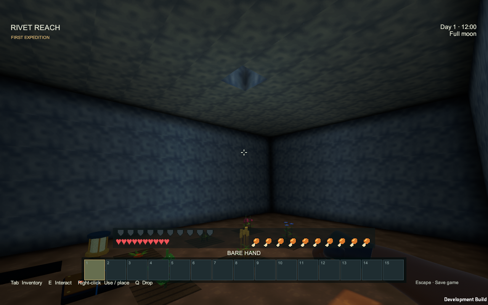
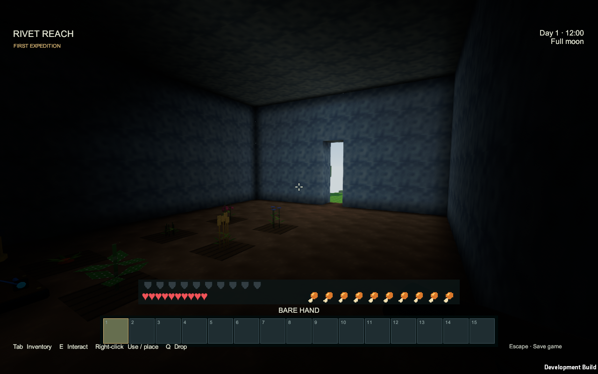
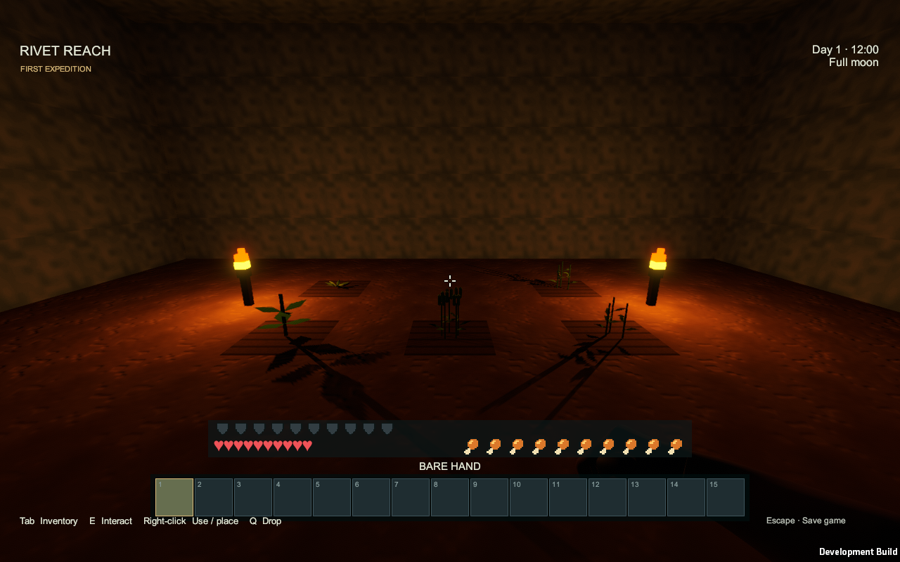
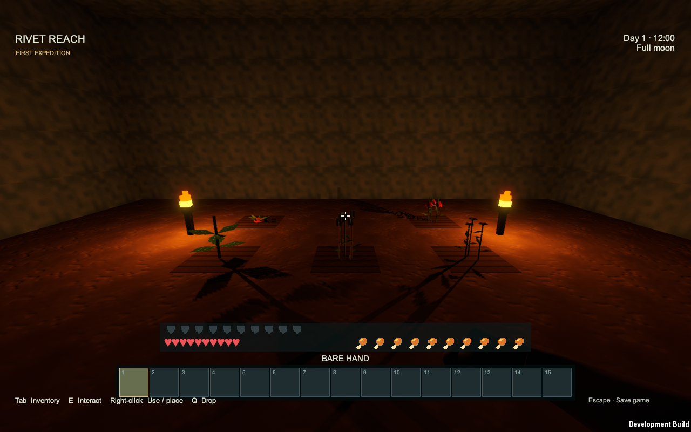

# Lighting and underground farms

Caves now depend on their access to the sky. A sealed cave stays dark. Open shafts and cave entrances admit daylight, which fades as it travels farther inside. Mining or replacing a roof or wall updates that access.

## Growing crops underground

1. Prepare dirt or grass with a hoe to make farmland.
2. Plant potatoes, wheat seeds, flax seeds, carrot seeds or berry seeds.
3. Place torches around the growing area. Keep each plant within five open-cell steps of a torch; walls block light and paths around corners are longer.
4. Stay nearby, or keep the area loaded with a chunk loader. Each stage normally takes one minute, with three stages to maturity. Darkness pauses growth; adding enough light lets it resume.

Powered [Workshop Lamps](Item-workshop-lamp.md) also support crops. The light continues to count when its source is outside the camera view. Holding a torch helps you see but does not replace placed farm lighting. Water is not required for crop growth.

[Compost](Compost.md) can accelerate a stage when the plant has enough light. See [Farming and cooking](Farming-and-cooking.md) for planting stock, harvests and meals, and [Torches](Item-torch.md) for the recipe.

Captures: Unity Windows player, 2026-09-13. These show the lighting fix in a constructed enclosed test farm.
