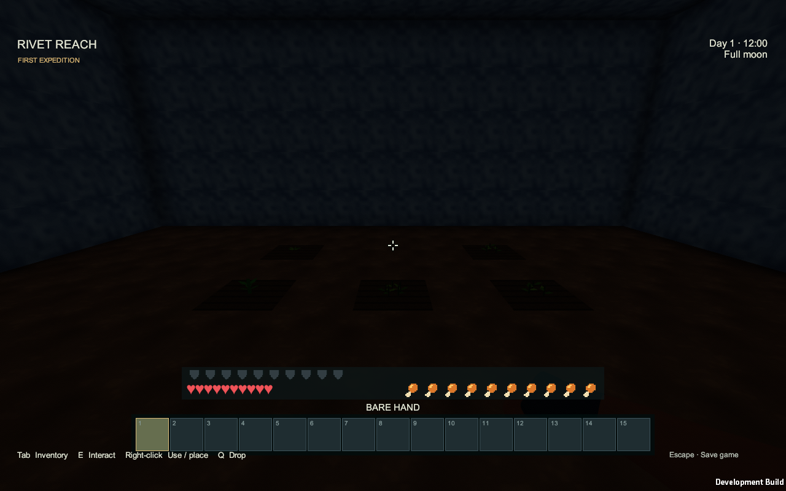
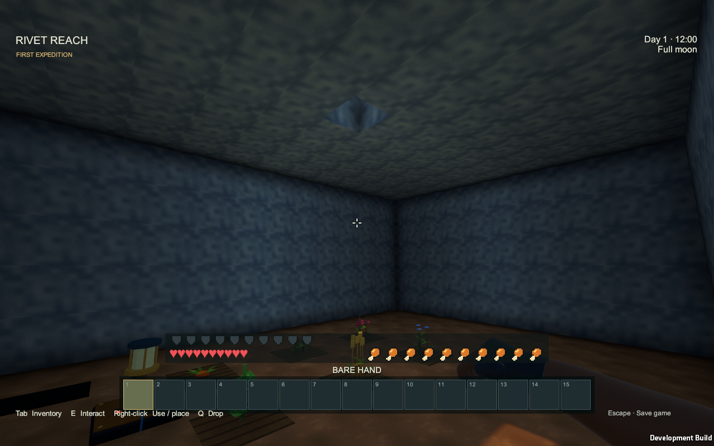
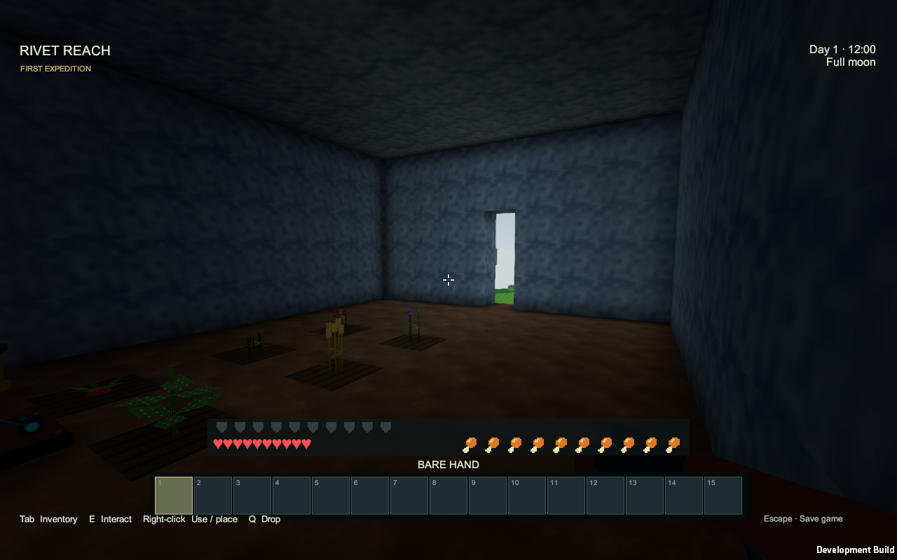
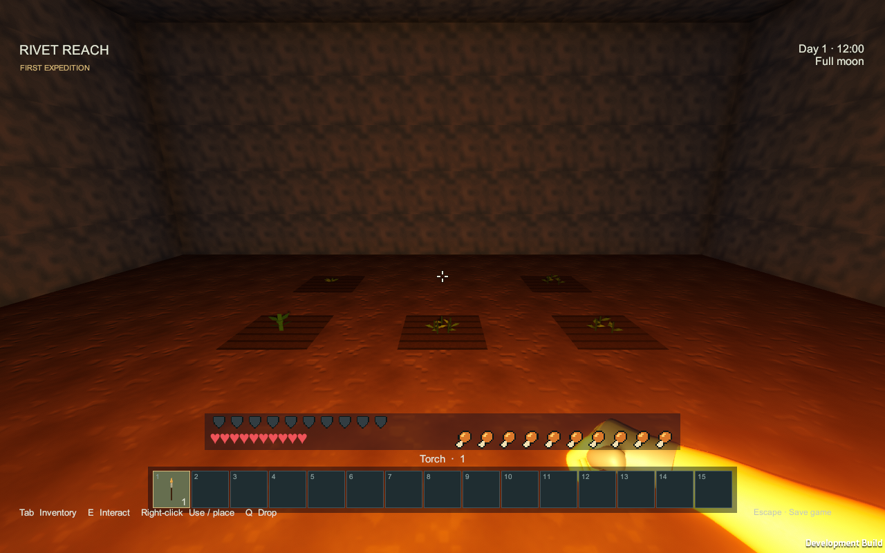
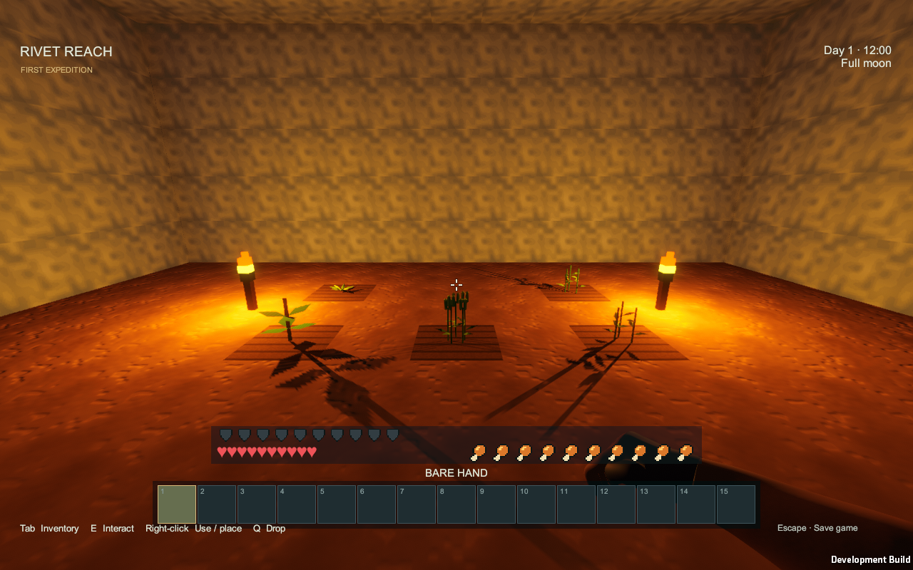
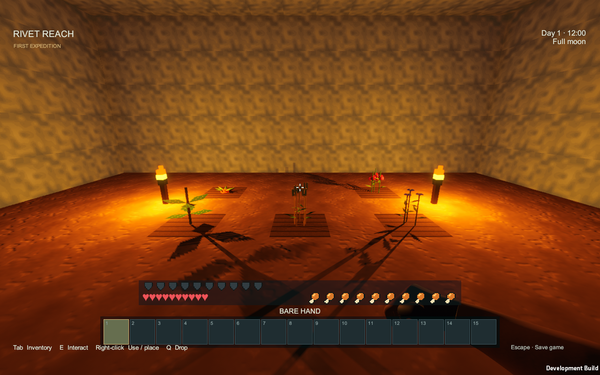
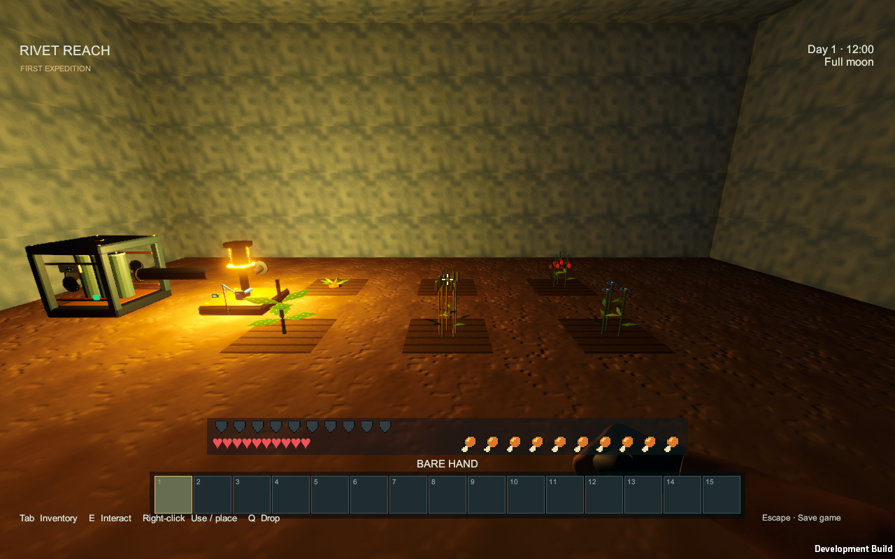
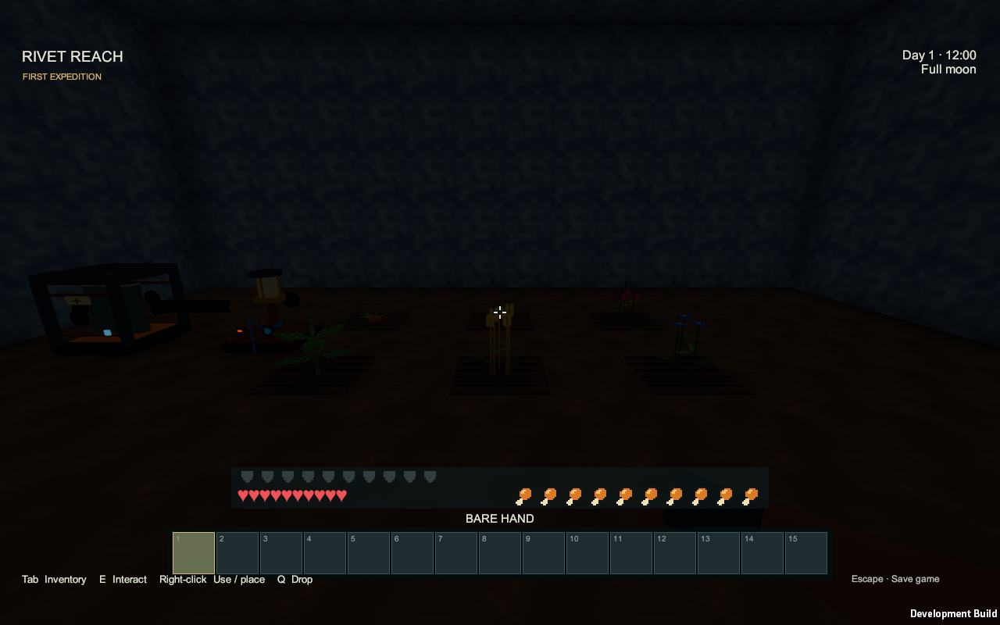

# Lighting and underground farms

Caves now depend on their access to the sky. A sealed cave receives no sunlight, but a faint, steady ambient glow lets you make out nearby surfaces even without a torch. Open terrain also keeps a very dim view at night, including moonless nights. Open shafts and cave entrances admit daylight, which fades as it travels farther inside. Mining or replacing a roof or wall updates that access.

Torches now cast a much stronger warm light up to fourteen blocks away, whether held or placed. Placed torch lighting fades into view farther away as you approach, avoiding the old nearby switch-on. A held torch also adds a soft warm glow around you to reveal nearby shadows. Place additional torches to cover larger rooms; solid walls still cast shadows.

## Growing crops underground

1. Prepare dirt or grass with a hoe to make farmland.
2. Plant potatoes, wheat seeds, flax seeds, carrot seeds or berry seeds.
3. Place torches around the growing area. Keep each plant within five open-cell steps of a torch; walls block light and paths around corners are longer.
4. Stay nearby, or keep the area loaded with a chunk loader. Each stage normally takes one minute, with three stages to maturity. Darkness pauses growth; adding enough light lets it resume.

Powered [Workshop Lamps](Item-workshop-lamp.md) light a wider area, up to twenty blocks away, and also support nearby crops. The light continues to count when its source is outside the camera view. Holding a torch helps you see but does not replace placed farm lighting. The faint ambient cave glow helps you see but is not enough to grow crops. Water is not required for crop growth.

Placed light also [prevents new hostile spawns](Mobs.md#lighting-prevents-new-hostile-spawns) where the gameplay light level is 8 or higher. Existing mobs remain. The dim visibility glow and held torch do not change spawning.

[Compost](Compost.md) can accelerate a stage when the plant has enough light. See [Farming and cooking](Farming-and-cooking.md) for planting stock, harvests and meals, and [Torches](Item-torch.md) for the recipe.

Captures: Unity Windows player, 2026-09-13. These show the current dim cave visibility, held glow, stronger torches and powered/unpowered lamp in a constructed enclosed test farm.
