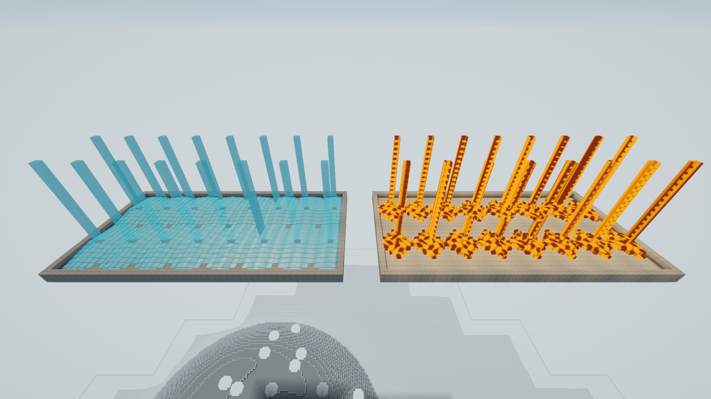

# Performance diagnostics

Press **F12** (or your rebound Diagnostics key) to show the timing overlay. Press it again to hide it. It works in the ordinary player as well as development builds.

Actual Windows player capture, October 3, 2026. This capture checks the display and controls; it is not a frame-rate benchmark.

The frame row shows average FPS, average frame time and the worst frame in the latest refresh window. The play targets are **under 16.67 ms** for 60 FPS and **under 22.22 ms** for the 45 FPS floor. A good average does not erase a visible hitch.

Each system row shows **average milliseconds per call | worst call milliseconds | calls per second**. Factory processing, electricity, item pipes and fluid pipes have separate rows. World fluid flow is separate from pipe transport. Creature simulation and animated views are separate too. The overlay refreshes four times per second; an idle row means that system had no completed calls during that window.

Main CPU, render CPU, GPU and present wait are shown separately when the graphics backend supplies them. **n/a** means unavailable or no fresh sample. Those timings overlap and may arrive late. Parent scopes also include their child work, so adding every row together would count some work twice.

Terrain and lighting workers show the duration of completed background jobs. A long worker job does not mean the main thread stopped for that long. Watch the chunk, lighting and fluid queues alongside the frame time when investigating travel or a busy factory.

The **light invalidations** row counts requests caused by light sources, opaque-block changes, light crossing chunk borders and chunk residency. These are cumulative requests for the session, including requests at unloaded boundaries, rather than completed lighting jobs. **Ticks frame/max** shows survival/factory ticks in the latest frame and the largest burst this session. Catch-up is limited to three ticks per frame; unfinished work stays queued.

## Frame pacing

Open **Settings** and click **Frame pacing** to cycle through **90 FPS cap → Display sync → 60 FPS cap → 120 FPS cap**. The choice is saved immediately and applies to later launches. The default remains 90 FPS.

Actual Windows player capture, October 3, 2026.

Display sync follows your monitor's refresh rate. The other choices set an upper frame-rate limit. A cap does not guarantee that the game reaches that rate. Choose the setting that feels best on your display; lower caps can reduce unnecessary rendering when the game is already running faster than you need.

The October 3 update reduces repeated world, factory, presentation and save-menu work while preserving production and save rules. New frame-rate measurements are deferred; the older results below retain their original dates and builds.

## Flowing-liquid stress scene

The September 22 review uses separate water and lava basins with 32 elevated emitters, source changes, draining and an unload/return check. This is a controlled test scene, not a new recipe or a change to liquid behavior. Machine pipe tests and world-flow tests exercise different systems.

Actual Windows player capture, September 22, 2026. Reusing route calculations reduced the worst measured water tick from about 243 ms to 28 ms in this scene. The complete final test still had six frames below the 45 FPS floor, with a worst frame near 40 ms. The 60/45 FPS target remains under review; the overlay itself does not certify performance.

## Large-factory optimization review

The September 22 optimization build keeps the same graphics settings, production rules and chunk-loader requirements. In the 45-second test on an i7-10750H / RTX 2060 laptop at 1080p, factory simulation used about **41% less time per tick**; the separate five-minute soak measured **37% less**. A separate comparison of the old and updated machinery shader reduced median GPU time by **14–15%**. Long frames still occur, including a 359 ms graphics/presentation-associated stall in the longer run, so the 45 FPS floor is not yet met.

The [refreshed factory gallery](Release-review-gallery.md) shows the actual test build in clear weather, moonlight and rain. The [full measurements](https://github.com/Starbugstone/Rivet-Reach/blob/main/.docs/verification/FACTORY_OPTIMIZATION_RESULTS.md) distinguish CPU work, GPU time, chunk hitches and the remaining limits. Faster code does not run unloaded factories: keep the required [chunks covered](Bridges-and-chunk-loaders.md#keep-the-remote-workshop-running).
